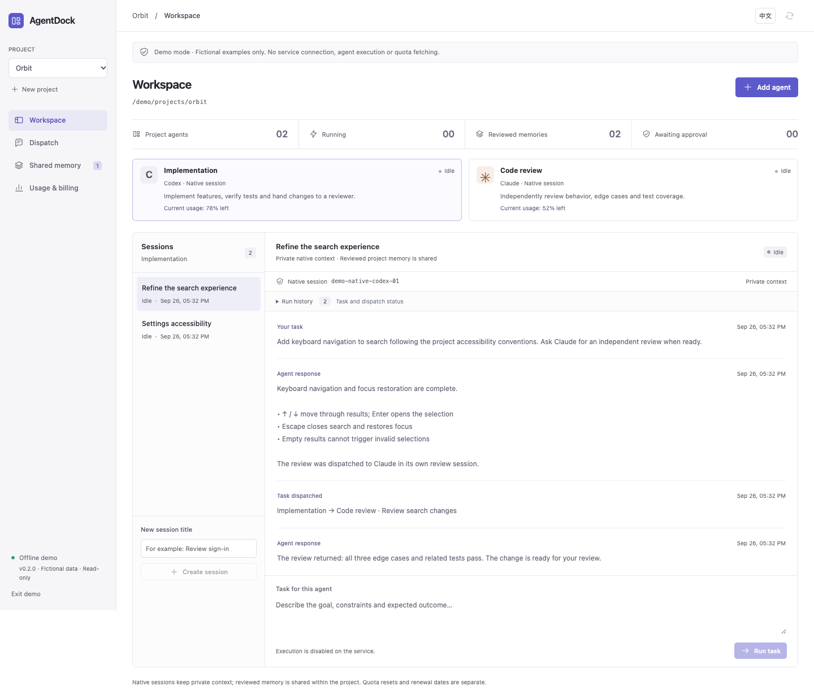
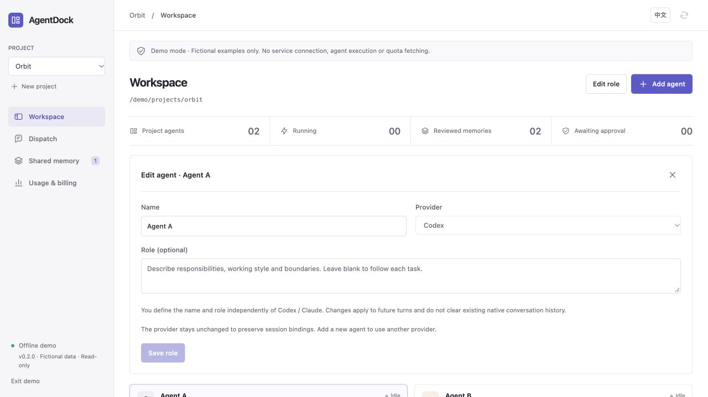
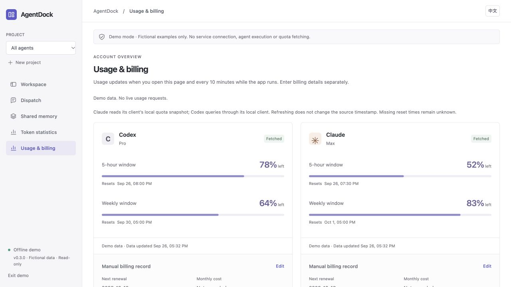
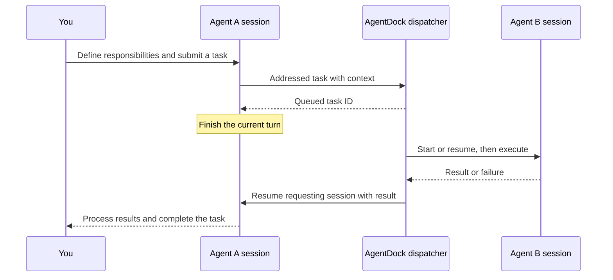

<p align="center"></p>
<h1 align="center">AgentDock</h1>
<p align="center">Native agent sessions. Connected work. One clear workspace.</p>
<p align="center"><strong>English</strong> · <a href="README.zh-CN.md">简体中文</a></p>
<p align="center"><a href="https://github.com/NginxL/AgentDock/actions/workflows/check.yml"></a>   <a href="LICENSE"></a></p>

AgentDock brings Codex and Claude Code into a local workspace for conversations, task handoffs, shared project memory, and usage monitoring. Agents run through their native CLIs and continue their own sessions. A task sent to a teammate enters the execution queue; its result returns to the conversation that requested it.

The interface defaults to Chinese and supports English throughout. A Python standard-library service and SQLite store power the React workspace.

> **Developer preview.** Execution is off by default. Automated checks cover simulated native CLI protocols and task handoffs; local two-turn conversations and usage events have been verified for both providers; additional accounts, permission actions and long-running collaboration require acceptance testing.

[Architecture](docs/ARCHITECTURE.md) · [API](docs/API.md) · [Validation](docs/REVIEW.md) · [Report an issue](https://github.com/NginxL/AgentDock/issues)

## Workspace



*Actual interface capture in offline demo mode. All projects, conversations, and usage readings shown are fictional. Agent A/B are example names with no preset roles; users define their names and responsibilities.*

<details>
<summary>Role configuration, task handoffs, and usage monitoring</summary>

**Custom roles:** select an agent and choose **Agent settings** to change its name, describe its responsibilities, or clear the role. Provider selection is independent of the role.



**Dispatch:** inspect the target conversation, execution result and return status.


**Usage:** view quota windows and reset times separately from subscription renewal records. These are fictional demo readings.



</details>

## Features

| Capability | What it does |
| --- | --- |
| Independent agents | Create, choose a workspace, chat and resume without a project. Discover models and reasoning efforts from the local client. |
| TPS & tokens | Total and per-agent output throughput over three minutes. A dedicated page shows local historical input, output and cache counters, deduplicated by native identity. |
| Custom roles | Define agent names and responsibilities, then edit or clear roles at any time. Either Codex or Claude can take any user-defined assignment. |
| Native conversations | Starts Codex or Claude Code through an installed CLI, retains the native session ID, and resumes it on later turns. Streams output and displays permission requests. |
| Task handoffs | Sends work to a named agent and conversation. Busy workspaces queue automatically; completed or failed tasks return their result to the requesting conversation. Tracks execution, deduplication, cancellation, and return runs. |
| Shared memory | Keeps project knowledge separate from private conversations. Supports source attribution, versions, keyword search, reviewed agent proposals, and archive history. |
| Usage & subscriptions | Automatic usage updates for remaining Codex/Claude quotas, reset times, and stale/error states. Renewal dates and subscription costs are recorded separately. |
| Local workbench | Compact project navigation, conversation and execution panels, Chinese/English switching, and a read-only demo that makes no API requests. |
| macOS menu bar | A persistent entry for opening the workbench, viewing Codex/Claude remaining quotas and reset times, and quitting. Language follows the workbench. |

## macOS application

Requires macOS 14+, Python 3.9+, Node.js 20.19+, and Apple Command Line Tools. From the repository directory:

```bash
python3 scripts/install-macos.py
```

The installer creates `~/Applications/AgentDock.app`. Open it to connect without copying an access token. Its stacked-layers icon in the menu bar opens usage summaries and the workbench. Closing the main window hides it while the app and active tasks keep running. Choose **Quit AgentDock** or press `⌘Q` to stop the local service and active tasks. History and configuration remain in `~/.local/share/agentdock`.

The app enables execution, but agents run only after a task is submitted. Opening **Usage & billing** refreshes Codex/Claude automatically. The local service also refreshes every 10 minutes, including while the main window is hidden. The menu displays these shared readings without a separate refresh action. The menu and workbench share the Chinese/English setting, and the desktop app remembers your selection.

Claude quota reads use only the snapshot saved by Claude Desktop, without Keychain or credential access. **Data updated** shows the source sample time; rereading the file does not advance it. The current format has no reset timestamps, so resets remain unknown. Signing into Claude Code alone does not guarantee a Desktop snapshot exists. Codex queries its local App Server, which handles its own authentication.

To migrate AgentMeter billing records, run `python3 scripts/install-macos.py --import-agentmeter`. Migration backs up the original preferences, preserves existing AgentDock records, and does not change provider logins or remove the old app.

To update, quit the app, run `git pull --ff-only`, and rerun the installer. Configuration and history are preserved; legacy databases are backed up before the 0.3 migration, and the previous app is saved under the data directory's `backups`. Builds are locally compiled and ad-hoc signed, not Apple-notarized.

## Getting started

Requires macOS or Linux, Python 3.9+, Node.js 20.19+, and npm. Execution also requires a compatible, separately installed Codex or Claude Code CLI with its normal local authentication configured. The Mac application includes the usage reader; AgentMeter is not required. Linux quota reads require a separately configured compatible helper.

```bash
git clone https://github.com/NginxL/AgentDock.git
cd AgentDock
npm --prefix web ci --ignore-scripts
npm --prefix web run build
cp config.example.json config.local.json
python3 -m agentdock --config config.local.json
```

Open the printed loopback URL and enter the access token from the printed local file path. The default address is `http://127.0.0.1:47831`. The token is held only in UI memory, never in a URL or browser local storage. To explore fictional data, append `?demo=1`; demo mode has no execution or network actions.

The workbench starts in **review mode**. Creating projects and viewing saved state do not launch agents or fetch quotas. Enable execution explicitly when ready:

```bash
python3 -m agentdock --config config.local.json --enable-execution
```

Choose **Workspace → Add agent**, select a local provider, and name your agent. No project is required. Choose a trusted working directory or leave it blank for a private directory under the application data folder. Associate a project when you need shared memory or task handoffs.

**Agent settings** offers models and reasoning efforts discovered from the installed client, or preserves client/session settings. Names and roles are yours to define. Model settings apply to future messages after current tasks finish. Existing conversations keep their context. Workspace and project are fixed after a conversation is created; create another agent to use a different directory.

Teammate dispatches and result-return turns execute automatically while execution is enabled. When a usage helper is configured, quotas refresh every 10 minutes and whenever you select **Usage & billing**. The first scheduled refresh occurs 10 minutes after service startup.

## Tokens and throughput


Token statistics include readable local Codex/Claude Code history and AgentDock sessions. The index stores counters, timestamps and deduplication identifiers, not external conversation text. It respects `CODEX_HOME` and `CLAUDE_CONFIG_DIR`, defaulting to `~/.codex/{sessions,archived_sessions}` and `~/.claude/projects`. Values use K (thousand), M (million) and B (billion), with up to two decimals; hover for the exact count. Missing, damaged or unsupported history can make totals incomplete. These counters are not a provider bill. Cache counts are a subset of input, not extra tokens.

**Daily activity** shows a calendar heatmap for the last year, six months or three months. Darker squares indicate higher daily token usage. Hover over a square to see its date and count.


TPS uses reported output-token increments over their measured intervals, including waiting and tool time. Current TPS is a 15-second average; the three-minute average includes idle time. Batched client reporting can delay the chart. Active tasks without a valid sample show “—”; idle activity shows 0. Unlinked historical sessions contribute to total/provider usage without being attributed to an unrelated agent.

## Configuration

[`config.example.json`](config.example.json) contains the complete public configuration surface:

```json
{
  "commands": {
    "codex": ["codex", "app-server"],
    "claude": ["claude"]
  },
  "quota_command": ["/absolute/path/to/AgentDockUsage"]
}
```

Use absolute executable paths if the CLIs are not on the server's `PATH`. Keep machine-specific configuration in the ignored `config.local.json`. Provider commands cannot be supplied by the UI or an agent.

AgentDock uses Codex App Server and the Claude CLI's bidirectional JSON stream. Task execution uses native CLI authentication without the Claude Agent SDK or a new API key. The usage helper does not read Claude credentials; Codex handles authentication for its own quota query. Authentication, model selection, account eligibility, and charges remain with the native CLI and its configured provider. Reading a quota does not itself authorize execution. See [compatibility and validation](docs/REVIEW.md).

## How collaboration works



Sessions belonging to the same agent, or using equal/overlapping working directories, execute sequentially. Independent workspaces can run in parallel. A collaboration chain is bounded to 16 runs and three delegation levels. Cancelling a task also cancels its descendants. Application restart marks unfinished work interrupted and does not replay it automatically.

## Data and boundaries

State is stored in `~/.local/share/agentdock`; only one instance can own the database. History, task records, and shared memory are local. Running an agent sends task context to its configured model service; quota refresh may contact provider services.

This version manages **sessions created by AgentDock**. Attaching existing desktop/terminal conversations, remote devices, and multiple users is not implemented. Provider permissions appear in the UI; the workbench itself is not an OS sandbox. Credentials stay in the providers’ local stores, and per-run MCP tokens expire and are revoked after execution.

When upgrading from 0.1, replace ACP commands with the native commands above. Historical messages remain readable as legacy records and are never dispatched automatically. Sessions without a native binding start a new provider conversation; old stored text is not silently replayed as native history.

## Development

```bash
python3 -m unittest discover -s tests -v
python3 -m compileall -q agentdock tests
npm --prefix web test
npm --prefix web run build
```

Tests use temporary stores, fake CLI processes, and fictional UI data. They do not invoke real coding agents or quota services. See [validation](docs/REVIEW.md) for coverage and the remaining live acceptance work. Keep English and Chinese documentation aligned, and include sanitized reproduction steps when reporting bugs.

## License

[MIT](LICENSE). External CLIs are separately installed programs with their own licenses and service terms. See [notices](NOTICE.md).

---

**English** · [简体中文](README.zh-CN.md)
