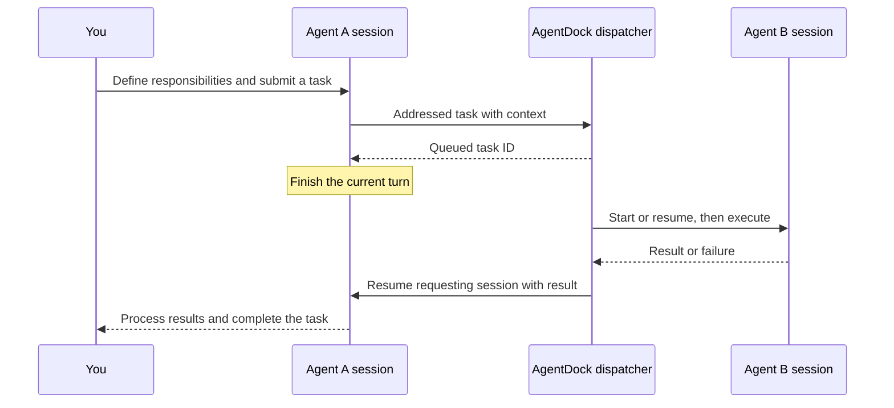

<p align="center"></p>
<h1 align="center">AgentDock</h1>
<p align="center">Native agent sessions. Connected work. One clear workspace.</p>
<p align="center"><strong>English</strong> · <a href="README.zh-CN.md">简体中文</a></p>
<p align="center"><a href="https://github.com/NginxL/AgentDock/actions/workflows/check.yml"></a>   <a href="LICENSE"></a></p>

AgentDock brings Codex and Claude Code into a local workspace for conversations, task handoffs, shared project memory, and usage monitoring. Agents run through their native CLIs and continue their own sessions. A task sent to a teammate enters the execution queue; its result returns to the conversation that requested it.

The interface defaults to Chinese and supports English throughout. A Python standard-library service and SQLite store power the React workspace.

> **Developer preview.** Execution is off by default. Automated checks cover simulated native CLI protocols and task handoffs; live model execution and account compatibility still require acceptance testing.

[Architecture](docs/ARCHITECTURE.md) · [API](docs/API.md) · [Validation](docs/REVIEW.md) · [Report an issue](https://github.com/NginxL/AgentDock/issues)

## Workspace


*Actual interface capture in offline demo mode. All projects, conversations, and usage readings shown are fictional. Agent A/B are example names with no preset roles; users define their names and responsibilities.*

<details>
<summary>Role configuration, task handoffs, and usage monitoring</summary>

**Custom roles:** select an agent and choose **Edit role** to change its name, describe its responsibilities, or clear the role. Provider selection is independent of the role.


**Dispatch:** inspect the target conversation, execution result and return status.


**Usage:** view quota windows and reset times separately from subscription renewal records. These are fictional demo readings.


</details>

## Features

| Capability | What it does |
| --- | --- |
| Custom roles | Define agent names and responsibilities, then edit or clear roles at any time. Either Codex or Claude can take any user-defined assignment. |
| Native conversations | Starts Codex or Claude Code through an installed CLI, retains the native session ID, and resumes it on later turns. Streams output and displays permission requests. |
| Task handoffs | Sends work to a named agent and conversation. Busy workspaces queue automatically; completed or failed tasks return their result to the requesting conversation. Tracks execution, deduplication, cancellation, and return runs. |
| Shared memory | Keeps project knowledge separate from private conversations. Supports source attribution, versions, keyword search, reviewed agent proposals, and archive history. |
| Usage & subscriptions | Integrates [AgentMeter](https://github.com/NginxL/AgentMeter) for remaining Codex/Claude quotas, reset times, and stale/error states. Renewal dates and subscription costs are recorded separately. |
| Local workbench | Compact project navigation, conversation and execution panels, Chinese/English switching, and a read-only demo that makes no API requests. |

## Getting started

Requires macOS or Linux, Python 3.9+, Node.js 20.19+, and npm. Execution also requires a compatible, separately installed Codex or Claude Code CLI with its normal local authentication configured. AgentMeter is optional.

```bash
git clone https://github.com/NginxL/AgentDock.git
cd AgentDock
npm --prefix web ci --ignore-scripts
npm --prefix web run build
cp config.example.json config.local.json
python3 -m agentdock --config config.local.json
```

Open the printed loopback URL and enter the access token from the printed local file path. The default address is `http://127.0.0.1:47831`. The token is held only in UI memory, never in a URL or browser local storage. To explore fictional data, append `?demo=1`; demo mode has no execution or network actions.

The workbench starts in **review mode**. Creating projects and viewing saved state do not launch agents or fetch quotas. Enable execution explicitly when ready:

```bash
python3 -m agentdock --config config.local.json --enable-execution
```

Select a trusted project directory and choose **Add agent** to select a provider, name the agent, and optionally describe its role. Leave the role blank to follow each task. To change an existing agent, select its card and choose **Edit role**. Changes apply to future turns without interrupting active tasks or clearing native conversation history. Create a new session when you need a fresh context.

Teammate dispatches and result-return turns execute automatically while execution is enabled. Quota refresh remains an explicit action.

## Configuration

[`config.example.json`](config.example.json) contains the complete public configuration surface:

```json
{
  "commands": {
    "codex": ["codex", "app-server"],
    "claude": ["claude"]
  },
  "agentmeter_command": ["/Applications/AgentMeter.app/Contents/MacOS/AgentMeter"]
}
```

Use absolute executable paths if the CLIs are not on the server's `PATH`. Keep machine-specific configuration in the ignored `config.local.json`. Provider commands cannot be supplied by the UI or an agent.

AgentDock uses Codex App Server and the Claude CLI's bidirectional JSON stream. It does not use the Claude Agent SDK, require a new API key, or read provider credential stores. Authentication, model selection, account eligibility, and charges remain with the native CLI and its configured provider. Reading a quota does not itself authorize execution. See [compatibility and validation](docs/REVIEW.md).

## How collaboration works



Sessions belonging to the same agent, or using equal/overlapping working directories, execute sequentially. Independent workspaces can run in parallel. A collaboration chain is bounded to 16 runs and three delegation levels. Cancelling a task also cancels its descendants. Application restart marks unfinished work interrupted and does not replay it automatically.

## Data and boundaries

State is stored in `~/.local/share/agentdock`; only one instance can own the database. History, task records, and shared memory are local. Running an agent sends task context to its configured model service; quota refresh may contact provider services.

This version manages **sessions created by AgentDock**. Attaching existing desktop/terminal conversations, remote devices, and multiple users is not implemented. Provider permissions appear in the UI; the workbench itself is not an OS sandbox. Credentials stay with the CLIs and AgentMeter, and per-run MCP tokens expire and are revoked after execution.

When upgrading from 0.1, replace ACP commands with the native commands above. Historical messages remain readable as legacy records and are never dispatched automatically. Sessions without a native binding start a new provider conversation; old stored text is not silently replayed as native history.

## Development

```bash
python3 -m unittest discover -s tests -v
python3 -m compileall -q agentdock tests
npm --prefix web test
npm --prefix web run build
```

Tests use temporary stores, fake CLI processes, and fictional UI data. They do not invoke real coding agents or quota services. See [validation](docs/REVIEW.md) for coverage and the remaining live acceptance work. Keep English and Chinese documentation aligned, and include sanitized reproduction steps when reporting bugs.

## License

[MIT](LICENSE). External CLIs and AgentMeter are separately installed programs with their own licenses and service terms. See [notices](NOTICE.md).

---

**English** · [简体中文](README.zh-CN.md)
