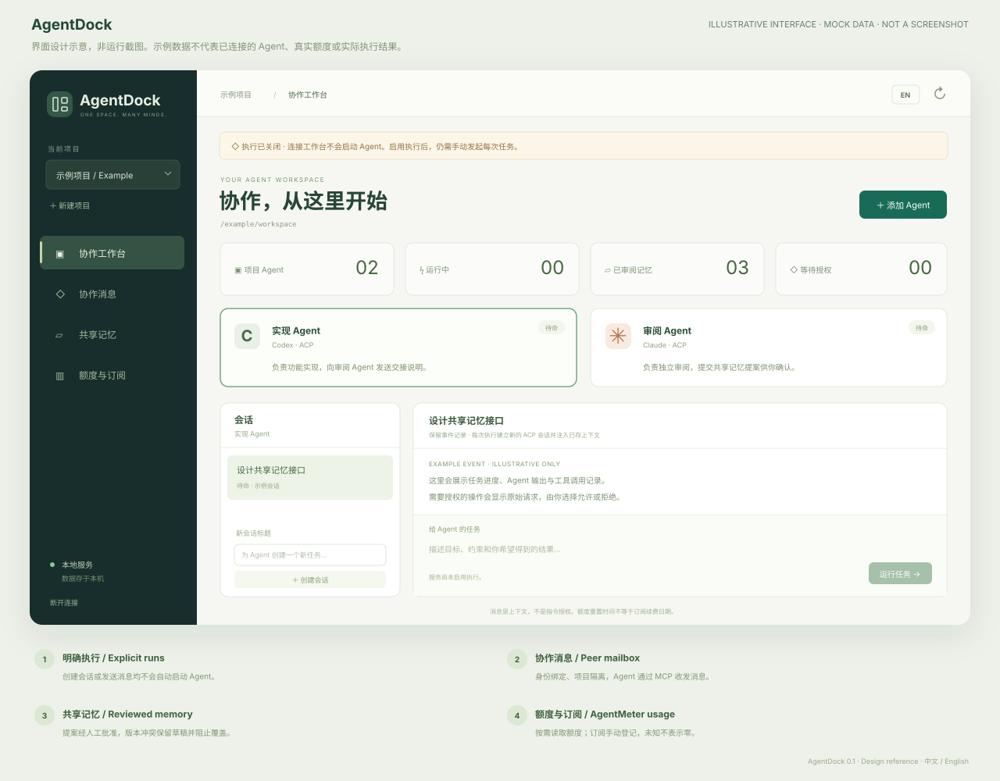

<p align="center"></p>
<h1 align="center">AgentDock</h1>
<p align="center">One workspace for your agents. Shared context, visible decisions.</p>
<p align="center"><strong>English</strong> · <a href="README.zh-CN.md">简体中文</a></p>
<p align="center"><a href="https://github.com/NginxL/AgentDock/actions/workflows/check.yml"></a>   <a href="LICENSE"></a></p>

AgentDock is a local web workbench for Codex and Claude ACP adapters, project-scoped messaging, reviewed shared memory, and [AgentMeter](https://github.com/NginxL/AgentMeter) quota readings. The interface starts in Chinese and switches to English. A Python standard-library backend stores state in SQLite; a React interface provides the workspace.

> **Developer preview.** Execution is disabled by default. Automated tests use simulated adapters; compatibility with live Codex and Claude adapters has not yet been verified.

[Architecture](docs/ARCHITECTURE.md) · [API](docs/API.md) · [Validation](docs/REVIEW.md) · [Report an issue](https://github.com/NginxL/AgentDock/issues)

## Interface

<p align="center"></p>

*Annotated design illustration with fictitious data, not a runtime screenshot.*

## What is included

| Capability | Preview behavior |
| --- | --- |
| Unified workbench | Projects, named Codex/Claude agents, roles, sessions, streamed events, explicit run/cancel and permission decisions. Uses configured ACP adapters. |
| Agent communication | Six MCP tools expose teammates, a persistent addressed mailbox, and memory. Messages wait for the recipient's next explicit run; acknowledgments and deduplication are stored. |
| Shared memory | Project-scoped, searchable entries with source, author, versions and archive history. Agents propose changes; humans approve them. Stale versions cannot overwrite newer facts. |
| Quotas & subscriptions | AgentMeter `--probe` integration for Codex/Claude, remaining percentages, reset and fetch times, stale/unknown/error states. Billing dates and amounts are manual and separate. |
| Local control | Loopback-only server, in-memory UI access token, per-run scoped MCP capabilities, bounded processes, approval expiry and restart recovery. No automatic execution loops. |

This preview manages **sessions created in AgentDock**. It does not take over existing desktop windows, import every provider's sessions, implement A2A, provide semantic/vector search, or automatically install adapters. More providers require capability-tested adapters, not just a new name in a dropdown.

## Build from source

Requirements: macOS or Linux, Python 3.9+, Node.js 20.19+ and npm. No Python runtime dependencies are required when working from this checkout.

```bash
git clone https://github.com/NginxL/AgentDock.git
cd AgentDock
python3 -m unittest discover -s tests -v
cd web
npm ci --ignore-scripts
npm test
npm run build
```

These commands run isolated tests and build static files. Tests use temporary databases and simulated ACP/probe subprocesses; they do not bind an application server or contact model/quota services. The frontend build is in `web/dist`.

## Configuration and usage

Adapter commands and the AgentMeter executable are configured in a local JSON file. See [`config.example.json`](config.example.json) for the supported fields.

1. Install and pin the official project releases of [`codex-acp`](https://github.com/agentclientprotocol/codex-acp) and [`claude-agent-acp`](https://github.com/agentclientprotocol/claude-agent-acp) yourself. Paths and arguments are server configuration, not editable executable commands from the web UI. Their versions have not yet been live-validated here.
2. Copy the example configuration to `config.local.json` (ignored by Git) and set the executable paths. To use quota refresh, point `agentmeter_command` at your existing AgentMeter executable.
3. Start the workbench: `python3 -m agentdock --config /absolute/path/to/config.local.json`. Agent and quota execution remain disabled by default. Open the printed loopback address and enter the token from the printed local file path. The token is not placed in a URL or browser local storage.
4. To enable agent runs and quota refresh, restart with `--enable-execution`. Select a trusted project directory and start a task explicitly. Quota refresh is also an explicit action.

The default address is `http://127.0.0.1:47831`. State lives in `~/.local/share/agentdock`; the directory is private to the current user. Only one instance may own a database. An interrupted run is recorded as interrupted and is never automatically replayed.

**Claude execution and subscription monitoring are separate.** The Claude ACP adapter uses the Agent SDK; this preview requires `ANTHROPIC_API_KEY` in the server's environment for Claude execution. It does not offer claude.ai sign-in or claim that a Pro/Max subscription authorizes SDK inference. Model-provider charges still apply. See the [official SDK authentication guidance](https://code.claude.com/docs/en/agent-sdk/overview). AgentMeter remains a separate read-only source for the subscription quota display.

## Operating boundaries

- Each run creates a fresh ACP session with bounded recent conversation, approved project memory and pending inbox context. Provider-native session resume is not implemented.
- Messages do not start agents. They are queued, read and acknowledged through MCP. A reply requires another explicit run.
- Runs sharing equal or overlapping working directories are serialized. Use separate, non-overlapping worktrees for parallel work. AgentDock does not create those worktrees or enforce an OS sandbox itself.
- Provider permission prompts appear in the UI. Unknown client capabilities are rejected; unanswered approvals expire. An approval applies to the option and run shown, not future runs.
- Quotas are cached for display, not guaranteed live. A reading older than 15 minutes is stale; an elapsed reset does not magically replenish the cache. Quota reset dates are never used as renewal dates.

## Privacy and trust

Prompts, events, messages and reviewed memory are stored locally in SQLite. Starting an agent sends the selected task/context to that agent and its configured model service. Reading quotas through AgentMeter can contact the provider. “Local workbench” does not mean offline inference.

AgentDock does not read provider OAuth credential stores. Agent authentication remains with the configured adapters; quota authentication remains with AgentMeter. The app provides no API-key input or storage interface. Run capabilities are hashed in the database, expire and are revoked when the run ends. Provider stderr is not persisted. The HTTP/MCP boundaries protect against cross-origin requests and accidental cross-project access; **processes running as the same OS user are not isolated from each other**. Treat project files and third-party MCP servers as trusted execution inputs.

## Development

See [architecture](docs/ARCHITECTURE.md) for protocol boundaries, [API](docs/API.md) for request fields and [validation](docs/REVIEW.md) for test coverage and compatibility limits. Submit issues with reproduction steps and sanitized fixtures; do not include credentials or private conversation logs. Keep the English and Chinese READMEs consistent.

## License

Released under the [MIT License](LICENSE).

---

**English** · [简体中文](README.zh-CN.md)
