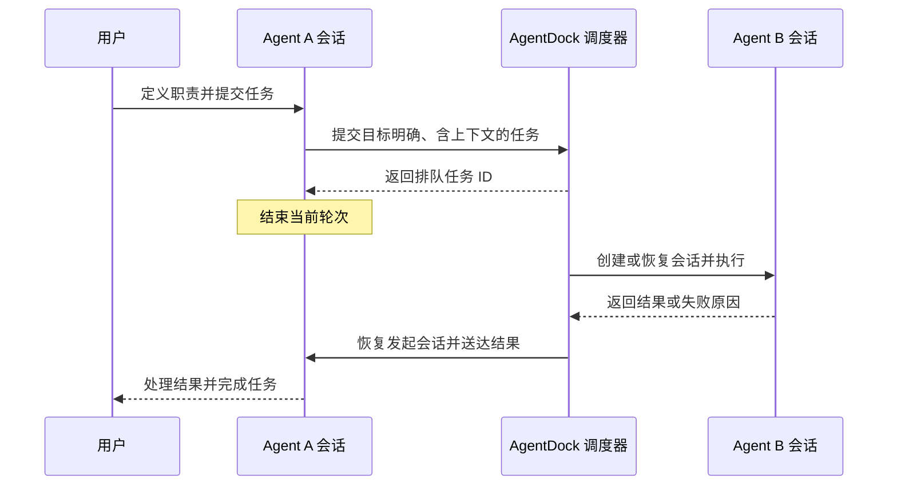

<p align="center"></p>
<h1 align="center">AgentDock</h1>
<p align="center">原生会话，任务协作，一个清晰的工作台。</p>
<p align="center"><a href="README.md">English</a> · <strong>简体中文</strong></p>
<p align="center"><a href="https://github.com/NginxL/AgentDock/actions/workflows/check.yml"></a>   <a href="LICENSE"></a></p>

AgentDock 是一个 AI Agent 管理器，将本机或 SSH 主机上已安装的 Agent CLI（例如 Codex、Claude Code）接入同一个工作台，统一管理会话、任务交接、项目共享记忆与可用额度。智能体通过原生 CLI 执行，后续对话沿用各自的原生会话。发送给同伴的任务会进入执行队列，结果自动回到发起任务的会话。

界面默认中文，支持完整切换为英文。后端采用 Python 标准库与 SQLite，前端使用 React。

> **开发者预览版。** 默认关闭执行。自动检查已覆盖模拟原生 CLI 协议和任务交接；本机已验证双提供方连续对话及用量事件，其他账号、权限操作和长时间协作仍需验收。

[SSH 配置](docs/SSH.zh-CN.md) · [架构设计](docs/ARCHITECTURE.zh-CN.md) · [接口说明](docs/API.zh-CN.md) · [验证与兼容性](docs/REVIEW.zh-CN.md) · [反馈问题](https://github.com/NginxL/AgentDock/issues)

## 工作台


*离线演示模式下的实际界面截图。图中的项目、对话和额度均为虚构数据。Agent A／B 为示例名称，未预设角色；名称与职责由用户定义。*

<details>
<summary>查看角色配置、任务派工与额度界面</summary>

**自定义角色：**选择 Agent 后点击“Agent 设置”，修改名称、职责或清空角色说明。服务选择与角色定义独立。


**任务派工：**查看目标会话、执行结果与回传状态。


**额度与订阅：**展示已配置 Agent 的额度窗口及重置时间，订阅续费记录单独呈现。图中数值均为虚构演示数据。


</details>

## 功能

| 能力 | 说明 |
| --- | --- |
| 本机与 SSH 连接 | 在添加 Agent 时选择本机 CLI、已有 SSH 连接或配置新连接；日常界面使用自定义名称，会话与额度按实际连接区分。 |
| 独立 Agent | 无需项目即可创建、指定工作目录、聊天与续接上下文；模型和思考强度从所选环境发现。 |
| TPS 与 Token | 总计及每个 Agent 的三分钟输出吞吐曲线；单独页面查看已配置 Agent 关联会话的累计 Token、输入、输出和缓存明细，按原生标识去重。 |
| 自定义角色 | 自行定义 Agent 名称和职责，支持创建后编辑或清空角色；Codex／Claude 均可承担任意用户定义的分工。 |
| 原生会话 | 调用已安装的 Codex 或 Claude Code CLI，保存原生会话 ID，后续轮次继续原会话；展示流式输出与权限请求。 |
| 任务交接 | 向指定智能体和会话派工；工作目录繁忙时自动排队，任务完成或失败后将结果送回发起会话；记录执行、去重、取消与回传任务。 |
| 共享记忆 | 项目知识与私有对话分开管理；支持来源、版本、关键词检索、智能体提议审核和归档历史。 |
| 额度与订阅 | 额度随已配置 Agent 联动，自动更新剩余额度、重置时间及过期或错误状态；续费日期与订阅费用单独记录。 |
| 本地工作台 | 紧凑项目导航、会话与执行记录面板、中英文切换，以及不发送接口请求的只读演示。 |
| macOS 菜单栏 | 常驻入口可打开工作台、按 Agent 名称查看剩余额度和重置时间，或退出应用；语言跟随工作台。 |

## macOS 应用

需要 macOS 14+、Python 3.9+、Node.js 20.19+ 和 Apple Command Line Tools。在仓库目录运行：

```bash
python3 scripts/install-macos.py
```

应用安装到 `~/Applications/AgentDock.app`。双击打开即可连接本机工作台，无需复制访问令牌。顶部菜单栏显示 AgentDock 的叠层图标，点击可查看额度摘要或打开工作台。关闭主窗口会隐藏窗口，应用与正在运行的任务继续保留；选择“退出 AgentDock”或按 `⌘Q` 才会停止本地服务及正在执行的任务。历史与配置保存在 `~/.local/share/agentdock`。

应用启用任务执行能力，但只有提交任务才会调用 Agent。每次点击“额度与订阅”时，只刷新已配置 Agent 使用的服务；未添加 Agent 时显示空状态，不发起额度查询。本地服务运行期间每 10 分钟也会更新一次，主窗口隐藏后仍会继续。菜单直接展示共用数据，无需单独刷新。菜单与工作台共用中英文设置，桌面版会记住语言选择。

Claude 额度只读取 Claude Desktop 保存的本地快照，不访问钥匙串或登录凭据。界面显示源数据的“数据更新于”时间；重新读取文件不会刷新该时间。当前快照没有重置时间，因此显示未知。仅登录 Claude Code 不保证存在 Desktop 快照。Codex 通过本机 App Server 查询账户额度，认证由 Codex 自己处理。

从 AgentMeter 迁移订阅记录可运行 `python3 scripts/install-macos.py --import-agentmeter`。迁移会备份原配置、保留已有 AgentDock 记录，不修改提供方登录或删除旧应用。

更新时退出应用，在仓库运行 `git pull --ff-only`，然后重新执行安装命令。配置和历史保留；旧数据库在 0.3 迁移前备份，原应用副本也保存到数据目录的 `backups`。当前安装包在本机构建并临时签名，未经过 Apple 公证。

## 快速开始

需要 macOS 或 Linux、Python 3.9+、Node.js 20.19+ 和 npm。执行任务还需要单独安装兼容的 Codex 或 Claude Code CLI，并完成其正常本地登录配置。Mac 安装版内置额度读取组件，不需要 AgentMeter。Linux 的额度读取需要另外配置兼容的本地查询命令。

```bash
git clone https://github.com/NginxL/AgentDock.git
cd AgentDock
npm --prefix web ci --ignore-scripts
npm --prefix web run build
cp config.example.json config.local.json
python3 -m agentdock --config config.local.json
```

打开终端显示的本机地址，读取终端提示的本地令牌文件并输入令牌。默认地址为 `http://127.0.0.1:47831`。令牌仅保存在界面内存中，不放入网址或浏览器本地存储。地址加上 `?demo=1` 可查看虚构数据，演示模式不执行任务、不请求接口。

工作台默认处于**评审模式**。创建项目、查看已有数据不会启动智能体或读取额度。准备就绪后，可显式开启执行：

```bash
python3 -m agentdock --config config.local.json --enable-execution
```

在**协作工作台 → 添加 Agent**中选择服务、填写名称，在**设备**中选择 **本机 CLI**、**新建 SSH / Devbox 连接…** 或自己保存的连接。新 SSH 地址为空，由你填写 `user@hostname` 或 SSH Host 别名；编辑已保存地址时会另建或复用连接，不改变原连接上的会话。点击工作目录旁的文件夹图标，可浏览所选设备的目录。SSH 会话的工作文件及原生记录保存在远端，本机会话保存在本机；留空则在对应设备上创建会话专属目录。工作台的配置、消息与统计仍保存在本机数据库中。需要项目共享记忆或派工时，再选择关联项目。


Agent 列表、会话标题和额度摘要使用自定义名称，不自动附加设备或服务标签。两个 Agent 可以使用相同的服务与名称；各自的会话仍按独立标识管理。同一连接可被多个 Agent 复用，共用账户额度的 Agent 会合并展示额度窗口。

点击工作台中的 **Agent 卡片**，进入该 Agent 的独立会话页。左侧切换或创建会话，右侧查看消息与执行过程，输入框保持在页面底部。顶部可返回 Agent 列表、打开设置或删除 Agent；支持浏览器后退与前进。在列表与会话页之间切换时，会保留各 Agent 的会话选择和未发送草稿，草稿仅保存在当前页面内存中。

创建会话后即可向 Agent 发送消息。**Enter** 发送，**Shift + Enter** 换行；中文输入法确认文字不会触发发送。你的消息显示在右侧气泡中，Agent 的最终回复显示在左侧。回复前自动展开实时思考摘要、进展和工具输出；最终回复到达后，过程自动收起，回复独立保留。点击任务状态可反复展开或收起过程，实时更新不会覆盖手动选择。失败、取消和等待授权分别显示对应状态。执行过程只展示 CLI 实际提供的内容，不生成额外的推理记录。


在会话输入框下方点击 **模型** 或 **推理等级**，从当前会话原运行位置返回的可用选项中选择。设置只影响当前会话的后续消息；已提交或排队的消息保留提交时的选择。切换模型会将推理等级恢复为自动，菜单中可选择 **使用 Agent 默认设置**。


**Agent 设置**可修改名称、角色、默认模型、思考强度和**设备**。从本机 CLI 切换到 Devbox，或从 Devbox 切回本机，选择新位置并保存即可，无需删除 Agent。新建会话使用新位置及其工作目录；已有会话保留原位置、原生历史、目录、模型默认值和权限，排队及执行中的任务不受影响。旧位置会话可通过**使用会话默认设置**重置模型覆盖。续聊或删除这些会话时，其原连接仍须可用。

任务旁显示客户端返回的模型标识与思考强度；模型在回复中的自我介绍不作为配置依据。

每个会话拥有独立的 Codex／Claude Code 记录、运行状态与缓存，不加入原客户端的会话列表。默认工作目录也按会话隔离；手动指定的项目目录保持共用。在会话列表点击 **删除会话**并确认，会清理其记录、专属目录及 SSH 运行文件。运行中的任务须先停止，共用项目、CLI 登录与其他会话保留。

点击 Agent 卡片进入会话页，在页面顶部点击 **Agent 设置**旁的 **删除 Agent**，核对名称和会话数量后确认，可删除该 Agent 及其全部会话和私有文件。共用项目文件、共享记忆、原生 CLI 配置和其他 Agent 保留。有未完成任务时阻止删除；远端会话须通过 SSH 完成清理。

添加 Agent 或打开 **Agent 设置 → 访问权限**，可为每个本机或 SSH Agent 独立选择权限：

| 访问权限 | 行为 |
| --- | --- |
| 需要确认（默认） | 沿用受控执行方式，需要授权的操作在工作台等待确认。未配置权限的已有 Agent 升级后使用此设置。 |
| 完全访问 | 取消 CLI 的常规权限确认，允许在所选环境中读写文件、执行命令和联网；仍受系统账户和组织策略限制。 |

权限变更用于仍继承 Agent 默认设置的会话后续消息，保留已有上下文；切换运行位置时保留下来的会话继续使用原权限。在同一位置修改权限须等待排队及运行任务结束；切换位置时可单独为新会话设置权限。


添加、设置和编辑面板均可再次点击原按钮收起，也可使用 × 关闭。收起执行过程不影响任务运行，最终回复仍会展示。

开启执行期间，同伴派工和结果回传轮次会自动执行；配置额度组件后，服务每 10 分钟自动刷新额度，首次定时刷新在启动 10 分钟后执行；点击“额度与订阅”会立即发起刷新。

## SSH 运行环境


打开 **协作工作台 → 添加 Agent → 设备 → 新建 SSH / Devbox 连接…**，填写系统 SSH Host 别名或 `user@host`，点击 **连接并使用**。可在 **高级连接设置**中指定远端 Python 命令。远端需要 Python 3.9+，以及已安装并登录的 Agent CLI。执行组件安装在远端用户的私有数据目录中，不安装系统服务，不传送本机登录凭据。

成功连接后继续设置 Agent 的模型、角色和权限，再点击 **创建 Agent**。其他 Agent 可直接复用已有连接；创建后可在 **Agent 设置**中查看连接信息并点击 **连接 / 检查**。任务执行时可展开查看过程，也可保持收起；最终回复独立显示。短暂断线后按事件游标接续，取消请求与 90 秒租约负责停止失去控制端的远端任务。详见 [SSH 配置与恢复](docs/SSH.zh-CN.md)。

## Token 与吞吐统计


Token 统计只包含已配置 Agent 关联的原生会话。总量、按服务、按 Agent、TPS 和每日活跃使用同一统计范围。索引只保存计数、时间及去重标识，不复制外部对话正文。读取 AgentDock 各会话的专属记录；兼容升级前绑定的原生历史目录，仍按会话归属过滤。数值按 K（千）、M（百万）、B（十亿）缩写，最多两位小数；悬停可查看完整计数。历史文件缺失、损坏或格式不支持时，累计值可能不完整；统计不是服务商账单。缓存属于输入的子集，不重复累加。

**每日活跃**以方块热力图展示最近一年、半年或三个月的用量，颜色越深表示当天 Token 用量越高。悬停方块可查看日期和计数。


TPS 使用真实输出 Token 增量及其采样区间，包含等待和工具耗时；当前值为最近 15 秒均值，三分钟均值包含空闲时间。原生客户端批量上报可能造成延迟。活跃任务尚未收到有效采样时显示“—”，空闲时显示 0。未关联的本机会话不参与统计；添加 Agent 不会导入该服务的全部历史。

## 配置

[`config.example.json`](config.example.json) 包含全部公开配置项：

```json
{
  "commands": {
    "codex": ["codex", "app-server"],
    "claude": ["claude"]
  },
  "quota_command": ["/absolute/path/to/AgentDockUsage"]
}
```

如果服务的 `PATH` 中没有相应 CLI，请使用可执行文件的绝对路径。机器专属配置保存在 Git 忽略的 `config.local.json` 中。界面和智能体均不能指定执行命令。

AgentDock 使用 Codex App Server 与 Claude CLI 的双向 JSON 流，执行认证沿用原生 CLI，无需 Claude Agent SDK 或新增 API Key；额度组件不读取 Claude 凭据，Codex 查询由本机 Codex 处理认证。登录、模型选择、账号资格和费用由原生 CLI 及其配置的服务决定。展示额度不等于授予执行权限。详见[兼容性与验证](docs/REVIEW.zh-CN.md)。

## 协作流程



同一智能体的会话，以及使用相同或父子目录的任务，按顺序执行；独立工作目录可以并行。每条协作链最多包含 16 个执行任务，派工深度最多三层。取消任务会同时取消其后续派生任务。应用重启将未完成任务标记为中断，不自动重放。

## 数据与边界

状态保存在 `~/.local/share/agentdock`，同一数据库只允许一个实例占用。历史、任务记录和共享记忆存储在本地。执行智能体会将任务上下文发送到其配置的模型服务；刷新额度也可能访问提供方服务。

当前版本管理**由 AgentDock 创建的本机和 SSH 会话**，尚未接入已有桌面或终端会话及多用户访问。“需要确认”模式下，提供方权限请求会显示在界面中；工作台本身不提供操作系统沙箱。凭据保留在所选设备上，每次执行的 MCP 令牌会过期，并在执行结束后撤销。

远端 Token 统计来自 AgentDock 托管任务的用量事件，不扫描远端其他历史会话。额度与订阅按环境和提供方分开保存；远端 Codex 查询自己的 App Server，远端 Claude 额度当前显示未知，不使用本机快照代替。

从 0.1 升级时，需要将 ACP 命令改为上述原生命令。历史消息保留为旧版记录，不会自动派发。尚无原生绑定的会话会建立新的提供方会话，旧存储文本不会被静默重放为原生历史。

## 开发与贡献

```bash
python3 -m unittest discover -s tests -v
python3 -m compileall -q agentdock tests
npm --prefix web test
npm --prefix web run build
```

测试使用临时数据库、模拟 CLI 进程和虚构界面数据，不调用真实编码智能体或额度服务。[验证文档](docs/REVIEW.zh-CN.md)列出了覆盖范围与真实环境待验收项。提交问题时请附脱敏复现步骤，并保持中英文文档一致。

## 许可证

采用 [MIT 许可证](LICENSE)。外部 CLI 需要单独安装，适用各自的许可证和服务条款，详见[声明](NOTICE.zh-CN.md)。

---

[English](README.md) · **简体中文**
