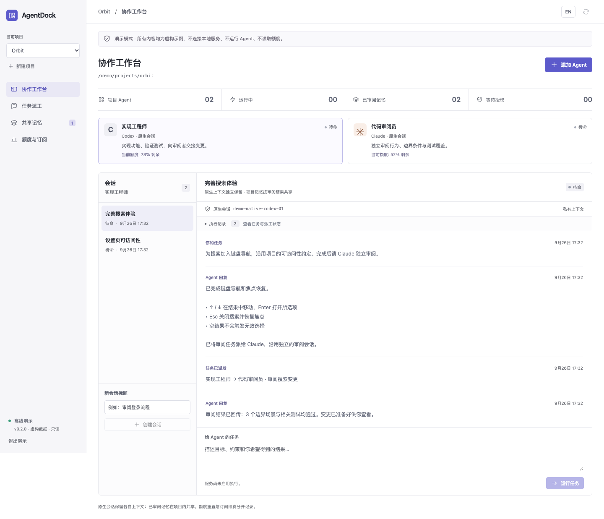
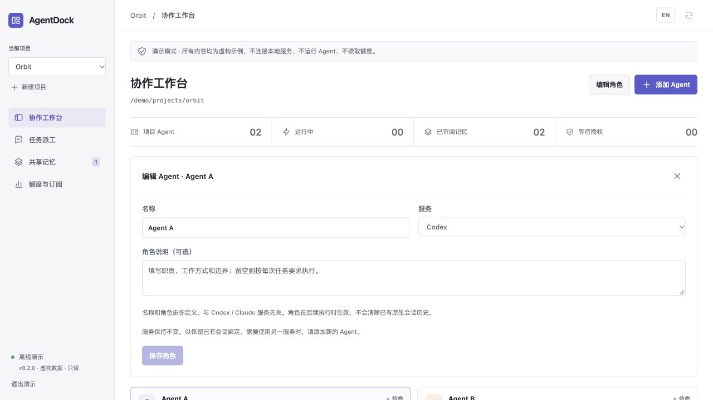
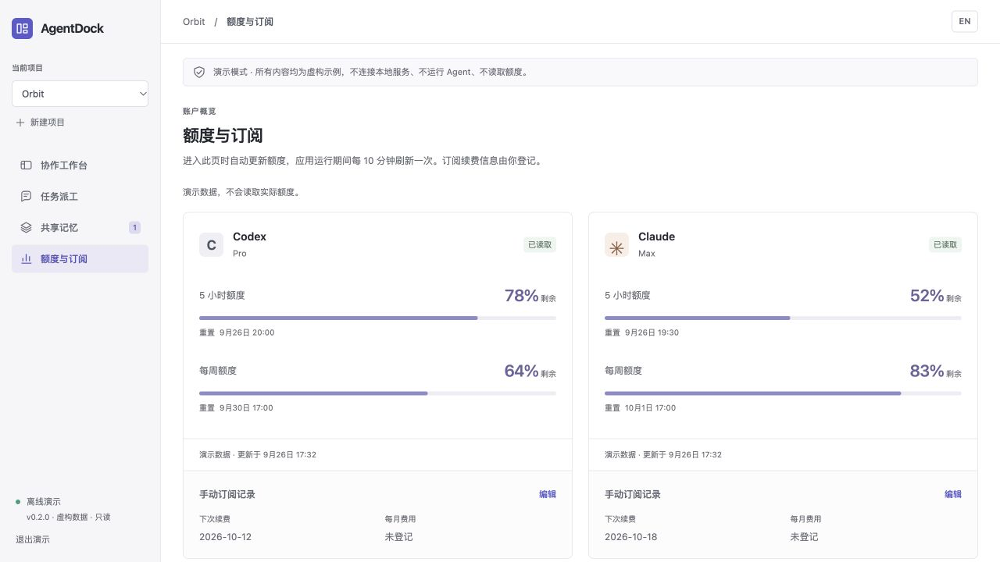
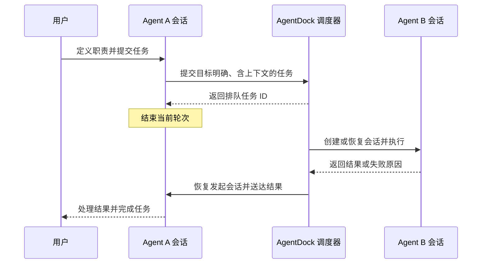

<p align="center"></p>
<h1 align="center">AgentDock</h1>
<p align="center">原生会话，任务协作，一个清晰的工作台。</p>
<p align="center"><a href="README.md">English</a> · <strong>简体中文</strong></p>
<p align="center"><a href="https://github.com/NginxL/AgentDock/actions/workflows/check.yml"></a>   <a href="LICENSE"></a></p>

AgentDock 将 Codex 和 Claude Code 接入同一个本地工作台，管理会话、任务交接、项目共享记忆与可用额度。智能体通过原生 CLI 执行，后续对话沿用各自的原生会话。发送给同伴的任务会进入执行队列，结果自动回到发起任务的会话。

界面默认中文，支持完整切换为英文。后端采用 Python 标准库与 SQLite，前端使用 React。

> **开发者预览版。** 默认关闭执行。自动检查已覆盖模拟原生 CLI 协议和任务交接；真实模型调用与账号兼容性仍需验收。

[架构设计](docs/ARCHITECTURE.zh-CN.md) · [接口说明](docs/API.zh-CN.md) · [验证与兼容性](docs/REVIEW.zh-CN.md) · [反馈问题](https://github.com/NginxL/AgentDock/issues)

## 工作台



*离线演示模式下的实际界面截图。图中的项目、对话和额度均为虚构数据。Agent A／B 为示例名称，未预设角色；名称与职责由用户定义。*

<details>
<summary>查看角色配置、任务派工与额度界面</summary>

**自定义角色：**选择 Agent 后点击“编辑角色”，修改名称、职责或清空角色说明。服务选择与角色定义独立。



**任务派工：**查看目标会话、执行结果与回传状态。


**额度与订阅：**额度窗口及重置时间与订阅续费记录分开展示。图中数值均为虚构演示数据。



</details>

## 功能

| 能力 | 说明 |
| --- | --- |
| 自定义角色 | 自行定义 Agent 名称和职责，支持创建后编辑或清空角色；Codex／Claude 均可承担任意用户定义的分工。 |
| 原生会话 | 调用已安装的 Codex 或 Claude Code CLI，保存原生会话 ID，后续轮次继续原会话；展示流式输出与权限请求。 |
| 任务交接 | 向指定智能体和会话派工；工作目录繁忙时自动排队，任务完成或失败后将结果送回发起会话；记录执行、去重、取消与回传任务。 |
| 共享记忆 | 项目知识与私有对话分开管理；支持来源、版本、关键词检索、智能体提议审核和归档历史。 |
| 额度与订阅 | 自动更新额度，展示 Codex／Claude 剩余额度、重置时间及过期或错误状态；续费日期与订阅费用单独记录。 |
| 本地工作台 | 紧凑项目导航、会话与执行记录面板、中英文切换，以及不发送接口请求的只读演示。 |
| macOS 菜单栏 | 常驻入口可打开工作台、查看 Codex／Claude 剩余额度和重置时间，或退出应用；语言跟随工作台。 |

## macOS 应用

需要 macOS 14+、Python 3.9+、Node.js 20.19+ 和 Apple Command Line Tools。在仓库目录运行：

```bash
python3 scripts/install-macos.py
```

应用安装到 `~/Applications/AgentDock.app`。双击打开即可连接本机工作台，无需复制访问令牌。顶部菜单栏显示 AgentDock 的叠层图标，点击可查看额度摘要或打开工作台。关闭主窗口会隐藏窗口，应用与正在运行的任务继续保留；选择“退出 AgentDock”或按 `⌘Q` 才会停止本地服务及正在执行的任务。历史与配置保存在 `~/.local/share/agentdock`。

应用启用任务执行能力，但只有提交任务才会调用 Agent。每次点击“额度与订阅”时自动刷新 Codex／Claude，本地服务运行期间每 10 分钟也会更新一次，主窗口隐藏后仍会继续。菜单直接展示共用数据，无需单独刷新。菜单与工作台共用中英文设置，桌面版会记住语言选择。

只有 Claude 确实需要钥匙串权限时才显示“连接 Claude”入口，点击后在 macOS 提示中自行授权。普通刷新不会弹出钥匙串授权框。

从 AgentMeter 迁移订阅记录可运行 `python3 scripts/install-macos.py --import-agentmeter`。迁移会备份原配置、保留已有 AgentDock 记录，不修改提供方登录或删除旧应用。

更新时退出应用，在仓库运行 `git pull --ff-only`，然后重新执行安装命令。配置和历史保留，原应用副本保存到数据目录的 `backups`。当前安装包在本机构建并临时签名，未经过 Apple 公证。

## 快速开始

需要 macOS 或 Linux、Python 3.9+、Node.js 20.19+ 和 npm。执行任务还需要单独安装兼容的 Codex 或 Claude Code CLI，并完成其正常本地登录配置。Mac 安装版内置额度读取组件，不需要 AgentMeter。Linux 的额度读取需要另外配置兼容的本地查询命令。

```bash
git clone https://github.com/NginxL/AgentDock.git
cd AgentDock
npm --prefix web ci --ignore-scripts
npm --prefix web run build
cp config.example.json config.local.json
python3 -m agentdock --config config.local.json
```

打开终端显示的本机地址，读取终端提示的本地令牌文件并输入令牌。默认地址为 `http://127.0.0.1:47831`。令牌仅保存在界面内存中，不放入网址或浏览器本地存储。地址加上 `?demo=1` 可查看虚构数据，演示模式不执行任务、不请求接口。

工作台默认处于**评审模式**。创建项目、查看已有数据不会启动智能体或读取额度。准备就绪后，可显式开启执行：

```bash
python3 -m agentdock --config config.local.json --enable-execution
```

选择可信项目目录，通过**添加 Agent**选择服务、填写名称和可选的角色说明。角色留空时按每次任务要求执行。已有 Agent 可先选中卡片，再点击**编辑角色**修改名称和职责；变更用于后续执行，不会中断当前任务，也不会清除原生会话历史。需要全新上下文时，创建新会话。

开启执行期间，同伴派工和结果回传轮次会自动执行；配置额度组件后，服务每 10 分钟自动刷新额度，首次定时刷新在启动 10 分钟后执行；点击“额度与订阅”会立即发起刷新。

## 配置

[`config.example.json`](config.example.json) 包含全部公开配置项：

```json
{
  "commands": {
    "codex": ["codex", "app-server"],
    "claude": ["claude"]
  },
  "quota_command": ["/absolute/path/to/AgentDockUsage"]
}
```

如果服务的 `PATH` 中没有相应 CLI，请使用可执行文件的绝对路径。机器专属配置保存在 Git 忽略的 `config.local.json` 中。界面和智能体均不能指定执行命令。

AgentDock 使用 Codex App Server 与 Claude CLI 的双向 JSON 流，执行认证沿用原生 CLI，无需 Claude Agent SDK 或新增 API Key；内置额度组件按需读取现有本机登录。登录、模型选择、账号资格和费用由原生 CLI 及其配置的服务决定。展示额度不等于授予执行权限。详见[兼容性与验证](docs/REVIEW.zh-CN.md)。

## 协作流程



同一智能体的会话，以及使用相同或父子目录的任务，按顺序执行；独立工作目录可以并行。每条协作链最多包含 16 个执行任务，派工深度最多三层。取消任务会同时取消其后续派生任务。应用重启将未完成任务标记为中断，不自动重放。

## 数据与边界

状态保存在 `~/.local/share/agentdock`，同一数据库只允许一个实例占用。历史、任务记录和共享记忆存储在本地。执行智能体会将任务上下文发送到其配置的模型服务；刷新额度也可能访问提供方服务。

当前版本管理**由 AgentDock 创建的会话**，尚未接入已有桌面或终端会话、远程设备及多用户访问。提供方权限请求会显示在界面中；工作台本身不提供操作系统沙箱。凭据仍由原生 CLI 管理，额度组件只在本机按需读取，每次执行的 MCP 令牌会过期，并在执行结束后撤销。

从 0.1 升级时，需要将 ACP 命令改为上述原生命令。历史消息保留为旧版记录，不会自动派发。尚无原生绑定的会话会建立新的提供方会话，旧存储文本不会被静默重放为原生历史。

## 开发与贡献

```bash
python3 -m unittest discover -s tests -v
python3 -m compileall -q agentdock tests
npm --prefix web test
npm --prefix web run build
```

测试使用临时数据库、模拟 CLI 进程和虚构界面数据，不调用真实编码智能体或额度服务。[验证文档](docs/REVIEW.zh-CN.md)列出了覆盖范围与真实环境待验收项。提交问题时请附脱敏复现步骤，并保持中英文文档一致。

## 许可证

采用 [MIT 许可证](LICENSE)。外部 CLI 需要单独安装，适用各自的许可证和服务条款，详见[声明](NOTICE.zh-CN.md)。

---

[English](README.md) · **简体中文**
