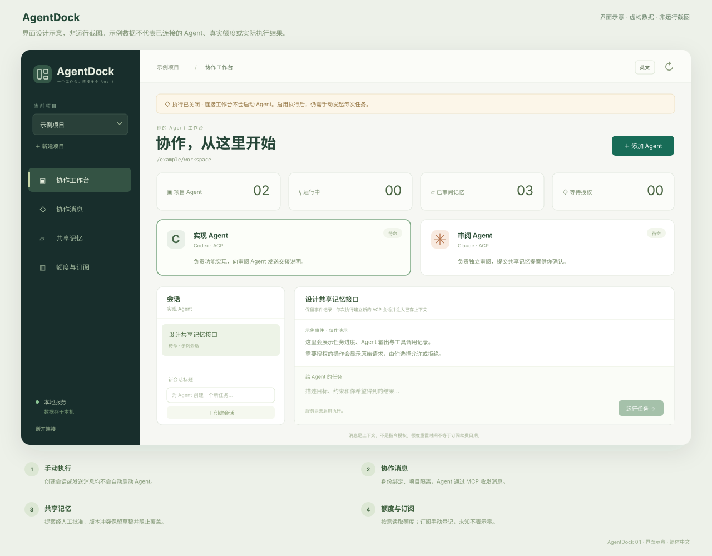

<p align="center"></p>
<h1 align="center">AgentDock</h1>
<p align="center">一个工作台，连接多个 Agent、共享上下文、看清每次决策。</p>
<p align="center"><a href="README.md">English</a> · <strong>简体中文</strong></p>
<p align="center"><a href="https://github.com/NginxL/AgentDock/actions/workflows/check.yml"></a>   <a href="LICENSE"></a></p>

AgentDock 是本地 Web 工作台，接入 Codex、Claude 的 ACP 适配器，提供项目内通信、可审核的共享记忆，以及 [AgentMeter](https://github.com/NginxL/AgentMeter/blob/main/README.zh-CN.md) 额度展示。界面默认中文，支持英语切换。后端使用 Python 标准库与 SQLite，前端使用 React。

> **开发预览版。** 执行默认关闭。自动化测试使用模拟适配器，真实 Codex 和 Claude 适配器的兼容性尚未验证。

[架构设计](docs/ARCHITECTURE.zh-CN.md) · [接口说明](docs/API.zh-CN.md) · [验证说明](docs/REVIEW.zh-CN.md) · [反馈问题](https://github.com/NginxL/AgentDock/issues)

## 界面说明

<p align="center"></p>

*带标注的设计示意图，使用虚构示例数据，并非运行截图。*

## 已实现范围

| 能力 | 预览版行为 |
| --- | --- |
| 统一工作台 | 项目、Codex / Claude Agent、角色、会话、流式事件、显式运行/取消、权限审批。通过配置的 ACP 适配器连接。 |
| Agent 通信 | 6 个 MCP 工具提供队友列表、持久邮箱和记忆操作。消息等待接收者下一次显式运行，记录去重标识与确认状态。 |
| 共享记忆 | 按项目隔离、关键词查询、来源/作者/版本、归档与历史。Agent 提议更新，人审核；旧版本不能覆盖新事实。 |
| 额度与订阅 | 通过 AgentMeter `--probe` 读取 Codex / Claude 剩余额度、重置和采集时间，区分过期、未知和错误。订阅日期与金额单独手动记录。 |
| 本地控制 | 仅监听本机、界面访问令牌仅存内存、每次运行的 MCP 权限受限、进程超时/取消、审批过期、重启恢复。无自动无限互聊。 |

本版管理的是 **AgentDock 内创建的会话**，不接管已有桌面窗口，不导入所有厂商的历史会话，不实现 A2A、向量语义检索或自动安装适配器。新增厂商需要实现并验证适配器能力，不能只增加一个名称。

## 从源码构建

需要 macOS 或 Linux、Python 3.9+、Node.js 20.19+ 和 npm。从源码目录使用时，无额外 Python 运行时依赖。

```bash
git clone https://github.com/NginxL/AgentDock.git
cd AgentDock
python3 -m unittest discover -s tests -v
cd web
npm ci --ignore-scripts
npm test
npm run build
```

以上只运行隔离测试并生成静态文件。测试使用临时数据库和模拟 ACP / 额度子进程，不监听应用端口，不请求模型或真实额度。前端产物位于 `web/dist`。

## 配置与使用

适配器命令和 AgentMeter 可执行文件通过本地 JSON 文件配置，支持的字段见 [`config.example.json`](config.example.json)。

1. 自行安装并固定 [`codex-acp`](https://github.com/agentclientprotocol/codex-acp)、[`claude-agent-acp`](https://github.com/agentclientprotocol/claude-agent-acp) 的上游发布版本。可执行路径与参数由服务端配置，Web 界面不能填写任意执行命令。本版尚未完成具体适配器版本的实机验收。
2. 将示例配置复制到 `config.local.json`（已被 Git 忽略），填写可执行文件路径。需要额度刷新时，把 `agentmeter_command` 指向已有 AgentMeter 可执行文件。
3. 启动工作台：`python3 -m agentdock --config /绝对路径/config.local.json`。Agent 与额度执行默认关闭。手动打开终端显示的本机地址，从终端提示的本地文件读取访问令牌，填入界面；令牌不放进 URL 或浏览器本地存储。
4. 需要启用 Agent 运行与额度刷新时，使用 `--enable-execution` 重新启动。选择可信的项目目录，显式开始任务；额度刷新同样需要点击触发。

默认地址为 `http://127.0.0.1:47831`，数据位于当前用户私有的 `~/.local/share/agentdock`。同一数据库只允许一个实例占用；中断的任务会记录为中断，不会自动重放。

**Claude 执行认证与订阅额度监控分开。** Claude ACP 适配器使用 Agent SDK，本版要求服务端环境中存在 `ANTHROPIC_API_KEY` 才允许 Claude 执行；不提供 claude.ai 登录，也不承诺 Pro / Max 订阅可用于 SDK 推理。实际模型调用仍按提供商规则计费，详见[官方 SDK 认证说明](https://code.claude.com/docs/zh-CN/agent-sdk/overview)。AgentMeter 仍是独立的只读订阅额度来源。

## 行为边界

- 每次运行建立新 ACP 会话，并附带有长度上限的近期对话、已审核项目记忆和待收消息；未实现提供商原生会话恢复。
- 消息只入队，由 Agent 通过 MCP 读取与确认，不自动启动接收方。回复需要另一次显式运行。
- 相同或父子重叠的目录不能并发运行。并行工作应选择独立且不重叠的 Git 工作树；本版不自动创建工作树，也不是操作系统级沙箱。
- 提供商权限请求进入界面审批；不支持的客户端能力会拒绝，超时未答的审批会失效。审批只对应展示的选项与运行。
- 额度是带时间的缓存。超过 15 分钟标为过期；重置时间经过后不会假定额度自动补满，更不会将其作为订阅续费日期。

## 隐私与信任

提示词、事件、消息和共享记忆保存在本地 SQLite。开始任务时，选中的任务与上下文会交给对应 Agent 及其模型服务。AgentMeter 额度刷新也可能请求提供商；本地工作台不等于离线推理。

AgentDock 不读取提供商 OAuth 凭据库；执行认证由配置的适配器管理，额度认证由 AgentMeter 管理。应用不提供 API 密钥输入或保存接口。运行能力令牌在数据库中仅保存哈希，过期或运行结束后失效；不持久化提供商的标准错误输出。HTTP 与 MCP 边界防止跨站请求和意外跨项目访问，但**同一系统用户下的进程并不互相隔离**。项目文件和第三方 MCP 服务应视为可信执行输入。

## 开发与贡献

协议分层见[架构设计](docs/ARCHITECTURE.zh-CN.md)，接口字段见[接口说明](docs/API.zh-CN.md)，测试覆盖与兼容性限制见[验证说明](docs/REVIEW.zh-CN.md)。反馈请使用可复现步骤和去除敏感数据的测试样本，不上传凭据或私人会话日志。文档修改应保持中英文 README 一致。

## 许可证

项目采用 [MIT 许可证](LICENSE)。

---

[English](README.md) · **简体中文**
