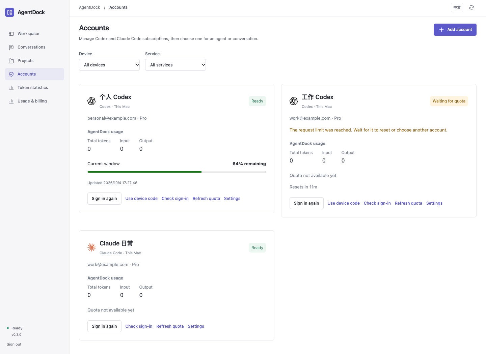

# Subscription accounts

**English** · [简体中文](ACCOUNTS.zh-CN.md) · [README](../README.md) · [API](API.md)

AgentDock can manage multiple **Codex / ChatGPT** and **Claude Code / Claude.ai** subscription logins on this computer and on configured SSH devices. Authorize each account separately through its official CLI. Managed profiles do not import or replace the default desktop or terminal login.

*Actual interface preview with isolated fictional data; no real accounts or authorization were used.*

Native Codex switching and automatic failover remain default-off experiments; their removal is tracked by [C2 and C3](DEVELOPMENT-PLAN.md). Claude native switching and direct quota queries are no longer available. Remaining credential mechanisms are described in [credential protection](CREDENTIALS.md) and [experimental boundaries](EXPERIMENTS.md); the development plan takes precedence for the target boundary.

## Add and use an account

1. Open **Accounts → Add account**. Choose Codex or Claude Code, select the device, and enter a name you can recognize. An SSH device must already be configured; install the CLI on that device first.
2. Choose **Sign in** and open the official authorization page. Local Codex supports browser or device-code login; Codex on SSH uses device-code login. Claude Code uses its browser authorization flow. Enter a confirmation code only when the official flow provides one.
3. After authorization, use **Check sign-in** if the status has not updated. Closing the sign-in panel leaves the login running; **Cancel sign-in** cancels it. An expired or failed login can be started again after the account's queued and running tasks have finished or been cancelled.
4. In **Add agent / Agent settings**, choose **Subscription account** and **Account selection**. A new conversation can override these defaults. In an idle conversation, open its account control to change the account or policy.

Each account belongs to one service and device. A local Codex account cannot be assigned to a remote Claude agent. The same subscription used in two profiles or devices still shares the provider's allowance; AgentDock does not deduplicate identities or create extra quota.

**Use device login** keeps the existing CLI configuration, including a configured Relay. It is the default for existing agents. Managed subscription accounts have their own authentication and official-provider configuration. Proxy and certificate environment settings are retained, while API-key and Relay endpoint overrides are removed from managed-account child processes. These changes do not alter the device's global settings. Codex keyring-only login (`keyring`, or `auto` with credentials only in the keyring) cannot be reused directly in an isolated conversation home. Add and sign in to a separate AgentDock account in this case; the original CLI credential-storage setting is not changed.

## Choose a policy

| Account selection | Behavior |
| --- | --- |
| **Fixed account** (`manual`) | Use the selected account. With **Use device login**, continue using the device's existing CLI login. No automatic account replacement occurs. |
| **Automatic selection** (`auto`) | Choose an eligible account for the first run, then keep that conversation on the chosen account. If it is cooling down, wait for its known reset; an expired login requires sign-in. |
| **Switch on quota or sign-in failure** (`failover`) | Prefer the conversation's current healthy account. Choose another allowed account when it is unavailable before execution, or retry after a definite native authentication/quota rejection before any work was observed. |

**Allowed accounts** limits automatic selection to the checked accounts. Leaving it empty uses eligible accounts of the same service on the same device. An explicit pool preserves its order. Selection prefers the current healthy account, then pool order, priority, reported remaining quota and least recent use. Higher priority values are preferred. Unknown quota remains eligible for manual use or fallback. With equal pool order and priority, a fresh known remaining quota ranks ahead of unknown. Unknown, stale and positive observations older than 15 minutes are never treated as 100%; known exhaustion still blocks until reset.

Agent defaults are copied when a conversation is created. Changing an agent's defaults does not rebind existing conversations. Submitted turns retain their selected account and login generation; when no account was available at submission, the frozen pool is resolved before execution. Different accounts and separate workspaces can run concurrently. Turns sharing an account, an agent, or overlapping workspaces queue in sequence.

## Continuation and safe retries

Switching an idle conversation starts a **new native conversation branch**. Earlier messages remain visible, and recent questions, final replies and relevant recorded activity are passed as bounded handover context. The other account's native session ID is not resumed. This preserves visible continuity, rather than promising identical hidden model context across accounts. Queued and active conversations cannot be switched manually.

An automatic fallback requires a structured native rejection such as an expired login, rate limit or exhausted quota, and no observed output, thinking summary, tool execution, approval request or collaboration action. Error-like words in an answer do not trigger a switch. Once activity was observed, AgentDock stops and asks the user to decide how to continue; it does not repeat potentially completed work on another account.

A logical run has at most **three distinct account attempts**, recorded with their account, generation, status and error code. A busy backup account is awaited without consuming an attempt. For automatic selection/failover, if no eligible account is available and a reset time is known, the run remains queued until that time and can be cancelled. No known reset or usable login produces an actionable failure. Application restart marks unfinished work interrupted and requires an explicit new submission; it does not replay it automatically.

## Status, quota and usage

| Account status | Meaning / next action |
| --- | --- |
| **Not signed in** (`pending`) | Finish or restart the official login flow. |
| **Signed in** (`ready`) | Native login was confirmed. Availability remains subject to provider policy and quota. |
| **Sign in again** (`expired`) | Reauthorize this account after its unfinished tasks have stopped. |
| **Waiting for quota** (`cooldown`) | Inspect the reset countdown; an automatic policy can wait for a known reset. |
| **Disabled** (`disabled`) | Excluded from selection until enabled and checked again. |
| **Removed** (`removed`) | Managed credentials were deleted. A historical metadata record remains for attribution. |

The Accounts page shows the CLI-reported email and plan when available, quota windows, reset countdowns, and measured tokens from AgentDock conversations. **Check sign-in** uses Claude Code's `auth status --json` or Codex App Server. It does not parse tokens to identify an account. **Refresh quota** is available for Codex; pending login checks remain separate from quota observations.

Codex reads account and rate-limit metadata through its native App Server. Claude quota is collected passively from `rate_limit_event` during actual CLI runs, for both managed accounts and device login, locally and over SSH. It is labeled **Source: last run** with the observation time. The UI does not query an OAuth endpoint, launch a quota-only Claude run, read a Claude desktop snapshot, or ask for Keychain access to read quota. Missing percentages and reset times stay unknown. A local temporary cooldown is not presented as a provider reset time.

Concurrent Codex reads are coalesced; normal background refresh is every ten minutes with error backoff. Claude has no active quota refresh. Opening or refreshing the page preserves the saved observation time. Historical pre-upgrade Claude samples retain their values and timestamps and are labeled **Source: pre-upgrade record**, not misrepresented as CLI events. Without data, quota is unknown. Provider allowance and measured AgentDock tokens are distinct.

## Switch native CLI and desktop accounts

For Codex only, open **Accounts → Native clients**. Manage Claude Code and Claude desktop sign-in inside their official clients. Ordinary conversation account selection does not modify a native login. Removal of the remaining Codex switching panel is tracked by C2.

| Client | Saved sign-in and switch scope |
| --- | --- |
| Codex CLI / macOS | Shared login in default `~/.codex`, affecting newly opened CLI instances and the desktop app. Supports `file` and direct-Keychain `keyring`/`auto`. Custom `CODEX_HOME` and other Keychain backends are rejected. |

1. Sign in to the account in AgentDock and separately in the target native client.
2. Finish its CLI and desktop tasks. On the matching account card open **Native clients → Save current sign-in**. macOS may request Keychain access. The capture verifies email and records native identity.
3. Register other accounts the same way once, then use **Switch to this account**. Saving and switching gracefully quit and reopen the related desktop app if it was running. A surviving CLI stops the operation; processes are never force-killed.
4. Confirm the account in the reopened client. Storage verification proves the saved login was restored, not that the server still accepts it. Revocation or client changes may require a new native sign-in and capture.

Native snapshots and managed task credentials are never copied into each other, avoiding independent clients racing to rotate the same refresh token. Before a switch, the current native login is preserved with its latest credentials. Failed writes roll back; interrupted operations retain **Recover previous sign-in**. If reopening fails, open the app manually. No task is automatically replayed. This is a macOS developer preview: filesystem, recovery and simulated clients are tested; real account switching and reauthorization remain **pending user acceptance**.

## Inherit the existing proxy

There is no per-account proxy configuration. Local managed Claude accounts continue to inherit the CLI's existing proxy, certificate and DNS environment settings. Literal network exports in existing shell launchers are preserved; dynamic expressions are left to the CLI launcher and are not evaluated by AgentDock. Removing direct quota requests does not change those sources.

Claude network requests, including official CLI identity checks, are made by the CLI using its existing network setup. AgentDock does not make separate Claude quota or profile requests and does not change system proxies, routing rules, nodes or exit IPs.

## Storage and deletion

Managed account credentials and native authentication operations stay on the selected device:

- Local account profiles: `<AgentDock data directory>/accounts/<account-id>/<provider>/`.
- SSH profiles: `~/.local/share/agentdock/ssh/controllers/<controller-id>/accounts/<account-id>/<provider>/` on the remote device.
- Conversation records: separate private session directories, with additional branches after an account change.

SQLite stores identifiers, labels, optional email/plan, status, quota and attempt history; it does not store access/refresh tokens. The original Codex/Claude settings and desktop/terminal conversation directories are not used as managed-account storage. Codex uses its account-specific file credential store; Claude uses the account-specific native storage namespace. The native CLI owns login and refresh behavior. Account leases serialize refreshes; private temporary credential copies are reconciled back to the account store and removed, with a recovery journal for interrupted handoffs. Before deleting a conversation, all historical account branches are locked and pending credentials are recovered before removing directories. A surviving native process holding the lease blocks deletion and retains the records for retry.

Click **Delete account** on the account card and confirm to remove that managed login, its saved native snapshots and the last recovery backup after active/queued use stops. The currently active native client login is not changed or logged out. Accounts that have not signed in can also be deleted. Existing messages and account attribution remain. Agents still referring to the deleted account must choose another; they never silently fall back to the device login. A connection or cleanup failure keeps the account available for retry. **Delete conversation** removes its records and private directories while preserving managed account logins and shared project files.

This is a developer-preview feature. Automated tests cover isolated configuration, simulated native login, account routing, refresh recovery and retry guards. Actual authorization, subscription eligibility and storage behavior still need acceptance on the user's installed CLI versions and accounts, especially Claude's macOS credential namespace and SSH login flows. Complete real authorization yourself; do not put passwords, API keys or OAuth tokens into a conversation.
