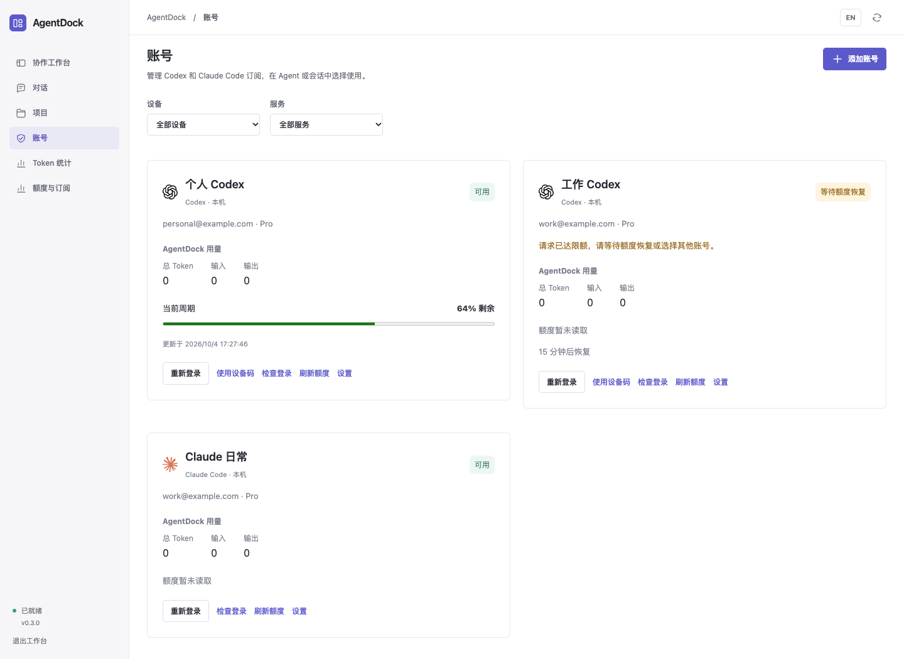

# 订阅账号

[English](ACCOUNTS.md) · **简体中文** · [README](../README.zh-CN.md) · [接口说明](API.zh-CN.md)

AgentDock 支持在本机和已配置的 SSH 设备上管理多个 **Codex／ChatGPT**、**Claude Code／Claude.ai** 订阅登录。每个账号由用户通过官方 CLI 独立授权；托管配置不导入或替换桌面版、终端的默认登录。

*独立虚构数据下的实际界面预览，未使用真实账号或发起授权。*

## 添加与使用

1. 进入 **账号 → 添加账号**，选择 Codex 或 Claude Code、运行设备，并填写容易识别的名称。SSH 设备需先配置连接，并在设备上安装对应 CLI。
2. 点击 **登录**，打开官方授权页面。本机 Codex 支持浏览器或设备码登录，SSH 上的 Codex 使用设备码登录；Claude Code 使用浏览器授权。只有官方流程提供确认码时才填写。
3. 授权后若状态尚未更新，可点击 **检查登录**。关闭登录面板不会终止登录；**取消登录**会停止登录流程。登录失败或过期后，先完成或取消该账号的排队与运行任务，再重新登录。
4. 在 **添加 Agent／Agent 设置**中选择 **订阅账号**和 **账号使用方式**。创建会话时可以覆盖这些默认值；会话空闲时，也可展开会话的账号控件修改账号或策略。

账号归属于一个服务和设备。本机 Codex 账号不能用于远端 Claude Agent。同一订阅在不同配置或设备上登录，仍共用服务商额度；AgentDock 不会自动合并同身份配置，也不会增加额度。

**沿用设备登录**保留现有 CLI 配置，包括已经配置的 Relay；已有 Agent 默认继续使用此模式。托管订阅账号使用独立认证及官方服务配置，保留代理和证书环境设置，并从托管账号子进程中移除 API Key、Relay 地址等覆盖。设备的全局配置不会因此改变。

## 选择使用方式

| 账号使用方式 | 行为 |
| --- | --- |
| **固定账号**（`manual`） | 使用指定账号；选择“沿用设备登录”则继续使用设备原有 CLI 登录。不自动替换账号。 |
| **自动选择**（`auto`） | 首次运行选择可用账号，之后会话保持使用该账号。已知冷却结束时间时等待恢复；登录过期则需重新授权。 |
| **限额或登录失效时切换**（`failover`） | 优先保持当前健康账号；执行前已不可用，或原生 CLI 明确拒绝认证／额度且尚未观察到任何工作时，才选择允许使用的其他账号。 |

**可使用的账号**限定自动选择范围。不勾选时，使用同一设备、同一服务下的可用账号；明确勾选的账号池保留顺序。选择顺序为当前健康账号、账号池顺序、优先级、已报告剩余额度、最近使用时间。优先级数值越大越优先。额度未知的账号仍可被选择，未知不代表无限额度。

创建会话时会复制 Agent 的账号默认值，以后修改 Agent 不会重新绑定已有会话。已提交轮次保留选定账号和登录版本；若提交时尚无可用账号，则固定账号池，在执行前选择。不同账号、互不重叠的工作目录可以并行；同一账号、同一 Agent 或重叠工作目录的任务会顺序执行。

## 会话续接与安全重试

在空闲会话中切换账号，会创建**新的原生会话分支**。旧消息仍然可见，近期问题、最终回复及相关执行记录作为有长度限制的交接上下文传入；不会直接使用另一个账号的原生会话 ID 续跑。可见对话可以衔接，但不同账号之间不保证隐藏模型上下文完全一致。排队或运行中的会话不能手动切换。

自动切换必须来自原生 CLI 的结构化拒绝，例如登录失效、限流或额度耗尽，并且尚未观察到回复、思考摘要、工具执行、授权请求或协作动作。回复正文中出现类似错误的词语不会触发切换。只要已经出现执行活动，AgentDock 就停止并提示用户决定如何继续，不在另一个账号下重放可能已经完成的工作。

每个运行最多使用 **3 个不同账号**，分别记录账号、登录版本、状态和错误码。备用账号繁忙时等待，不消耗尝试次数。自动选择／切换策略暂无可用账号但存在已知恢复时间时，任务保持排队并等待，期间可以取消；没有可用登录或已知恢复时间时，返回需要用户处理的失败。应用重启会将未完成任务标为中断，必须重新明确提交，不自动重放。

## 状态、额度与用量

| 账号状态 | 含义／操作 |
| --- | --- |
| **待登录**（`pending`） | 完成或重新发起官方登录。 |
| **可用**（`ready`） | 已确认原生登录，仍受服务商资格与额度限制。 |
| **需重新登录**（`expired`） | 停止未完成任务后，重新授权此账号。 |
| **等待额度恢复**（`cooldown`） | 查看恢复倒计时；自动策略可等待已知恢复时间。 |
| **已停用**（`disabled`） | 不参与选择，重新启用后需要检查登录。 |
| **已删除**（`removed`） | 托管凭据已删除，保留历史元数据用于归属展示。 |

账号页展示 CLI 报告的邮箱和套餐（如有）、额度窗口、恢复倒计时，以及使用该账号的 AgentDock 会话实测 Token。**刷新额度**通过原生 CLI 读取状态，不发送任务。启用执行时，服务会检查待完成登录，并定期更新可用／冷却账号；关闭面板后仍会继续。

Codex 使用原生 App Server 读取账号和限额。当前实现没有 Claude Code 独立订阅额度读取器：兼容 CLI 可以在正常运行中报告限额，否则保持**未知**。刷新没有新额度样本时，已有观察值保留并标记为**过期**。不会为了读取额度额外发送模型提示词，也不使用其他设备或 Claude Desktop 账号的快照代替。服务商额度、实测 Token、手工记录的续费日期／费用是不同数据。

## 存储与删除

托管账号凭据和原生认证操作保留在所选设备：

- 本机账号配置：`<AgentDock 数据目录>/accounts/<account-id>/<provider>/`。
- SSH 账号配置：远端 `~/.local/share/agentdock/ssh/controllers/<controller-id>/accounts/<account-id>/<provider>/`。
- 会话记录：独立的私有会话目录，账号变化后使用额外分支。

SQLite 只记录标识、名称、可选邮箱／套餐、状态、额度和尝试历史，不存储访问令牌或刷新令牌。托管账号不使用原 Codex／Claude 的设置和桌面／终端会话目录作为存储。Codex 使用账号专属文件凭据，Claude 使用账号专属原生存储命名空间；登录和刷新由原生 CLI 负责。账号锁将刷新操作串行化；私有临时凭据副本会回写账号存储后删除，交接中断时通过恢复记录处理。

在账号卡片点击**删除账号**，确认后清理其所在设备的托管登录；该账号的排队和运行任务须先停止。未登录的账号也可以删除。已有消息和账号归属记录保留。仍引用已删除账号的 Agent 需要选择其他账号，不会静默退回设备登录。连接或清理失败时保留账号，允许重试。**删除会话**清理记录和私有目录，保留托管账号登录及共享项目文件。

此功能属于开发者预览。自动测试覆盖配置隔离、模拟原生登录、账号路由、刷新恢复和重试约束；真实授权、订阅资格及存储行为仍需在用户实际 CLI 版本和账号上验收，尤其是 Claude 的 macOS 凭据命名空间和 SSH 登录流程。真实授权由用户完成，不要在对话中提供密码、API Key 或 OAuth 令牌。
