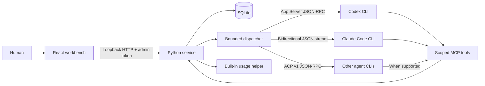
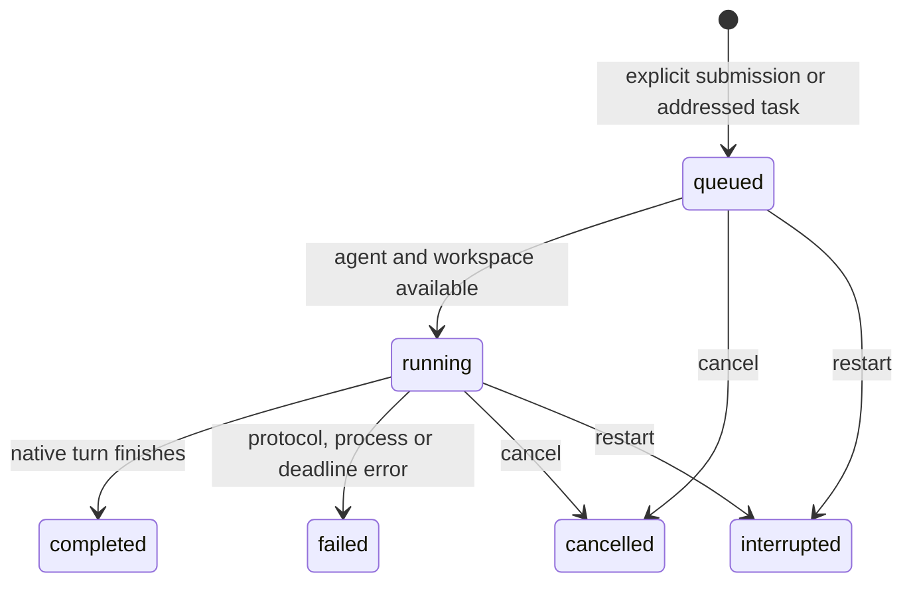

# Architecture

**English** · [简体中文](ARCHITECTURE.zh-CN.md) · [Back to README](../README.md)

AgentDock 0.3 is a local, single-user workbench. It manages native sessions created through its own runtime. Automated verification uses simulated CLI processes; live provider interoperability remains an acceptance item.

## Components



| Component | Code | Responsibility |
| --- | --- | --- |
| Workbench | `web/src/` | Projects, agents, conversations, execution queue, task handoffs, reviewed memory, quotas and permission prompts. Chinese is the default; English is selectable. |
| HTTP boundary | `agentdock/server.py`, `routes.py`, `loopback_server.py` | Host/Origin and bearer validation; declared execution guards; loopback binding without DNS. |
| Durable state | `agentdock/store.py`, `*_store.py`, `deletions.py` | Shared transactional facade with session, run, event, message, connection, permission, memory, account and task domains. |
| Dispatcher | `agentdock/runtime.py` | Explicit submission, automatic dispatch and result return, task settlement, approval deadlines and cancellation. |
| Native transports | `providers.py`, `codex_protocol.py`, `claude_protocol.py`, `acp.py`, `native_io.py` | Provider protocols share native transport, initialization and bounded text/stream buffers. `turn.py` describes one turn; `executors.py` handles local/SSH execution. |
| Agent tools | `agentdock/mcp.py` | Project collaboration, task context/history, questions, delivery, independent review and memory proposals. |
| Quota observations | `agentdock/quota.py`, `quota_events.py` | Scheduled and page-entry Codex probes; passive Claude CLI events; sanitized snapshots and freshness rules. |

The browser's `?demo=1` mode reads fictional fixtures and makes no API requests. It cannot execute agents, dispatch tasks or refresh quotas.

CLI entry points live in `agentdock/registry.py`. `agentdock/acp.py` handles ACP capabilities, native continuation, model settings, permissions and streaming events. `agentdock/acp_home.py` provides private HOME/XDG state and selected configuration snapshots. SSH workers reuse these modules; provider discovery submits no model requests. See [CLI support](PROVIDERS.md) for capability and live-validation boundaries.


## State, responsiveness and diagnostics

`state_sync.py` maintains an instance epoch and domain revisions. Global SSE publishes changes; clients request only changed domains. The first load and service restart still return a full snapshot. Per-row pagination is not implemented. Disk databases use independent read-only WAL connections for snapshot/statistics reads; writes retain one transactional connection. Session event streams wake only for their own changes. Numbered migrations also upgrade existing databases.

Deletion first persists a tombstone, performs CLI/SSH cleanup without holding database or dispatcher locks, then removes records. Tombstones reject new work and survive failures/restarts for retry. Completed turns compact redundant deltas only where an authoritative message exists; incomplete output and event cursors remain valid.

Progress is coalesced at roughly 100 ms. Display limits truncate progress, leaving final replies, approval events and settlement available. Per-agent run timeouts override the service default; approval waits have a separate bound. Cancellation remains available.

`diagnostics.py` writes private rolling metadata logs and associates unexpected failures with an error ID. Export contains versions, counts and sanitized error locations, excluding request/exception text and credentials. `errors.py` defines stable public codes; the interface translates codes independently of English messages.

The interface uses TanStack Query for state/model/statistics requests. Account generations and epoch checks remain business-level safeguards. Workspace/task forms, lists and conversation panes are separate components; styles preserve their original cascade, and fixed bilingual copy lives in `messages.ts`. Account, usage and token pages load lazily.

[Native credential protection](CREDENTIALS.md), [experimental feature gates](EXPERIMENTS.md) and [runtime/distribution](DISTRIBUTION.md) specify their separate boundaries.

## Reusable agents and project members

`POST /api/projects/{id}/agents` creates a new agent execution identity with the target `project_id` and a nullable `source_agent_id` reference. It snapshots the selected agent's provider, device, model, effort and permissions, with project-local name and role. It never copies sessions, native identifiers, events or the source workspace. Same-device members use the target project path; cross-device members require an explicit project path on the selected device. Legacy project agents can also be selected as a source.

The source link records provenance, not live inheritance. Editing or deleting a member does not update its source or siblings. Source deletion sets links to null while retaining members and their conversations. The migration only adds a nullable column; existing IDs, sessions and roles remain intact. Each member is a separate scheduler identity, while overlapping directories still serialize. Memory and dispatch capabilities continue to use the run's project scope. Independent conversations retain null project ownership and receive no project memory or teammates. Native accounts and provider quota are shared when the same CLI login is reused.

`Conversations.tsx` indexes the existing sessions without moving them. Routes use `#/conversations?session=<id>`; selection, search and project/everyday filters do not alter ownership. The detail pane reuses the existing stream, task timeline, approvals and composer with an explicit session ID; a missing ID never falls back to another session.

## Durable project tasks

`task_store.py` stores `tasks`, `task_inputs`, `task_questions`, `task_reviews`, `task_deliveries` and `task_journal` independently of native histories. `runs.work_task_id` and `sessions.work_task_id` bind execution to a task; `task_role` distinguishes owner, worker and reviewer. Existing `task_run_id` still identifies a dispatch chain, not a project task.

`task_runtime.py` reuses the queue, account selection, native isolation and result return. Only the owner delegates or delivers; delegated conversations remain task-scoped. Discussion cannot delegate, deliver or propose memory; reviewers cannot edit files or propose memory. Acceptance checks current revision, per-criterion evidence, questions and dispatch settlement, plus optional independent review. New requirements invalidate delivery. Native completion ends only that turn.

Recovery checks inherited native file locks through `execution_lease.py`. SSH `recovery_status` verifies worker and native locks; uncertainty blocks replacement execution. A new owner uses a fresh session with durable facts. `task_workspace.py` optionally pins a clean repository commit and creates member worktrees; reviewers inspect the owner workspace. See [project tasks](TASKS.md) for lifecycle, retention and live-validation boundaries.

## Sessions and turns

A session belongs to one agent and optionally a project. Its working directory is fixed when created. Its `native_session_id` is initially empty and is bound only by that session's active run. Once bound, a different native ID is rejected. IDs belonging to another managed session cannot be rebound.

Codex starts or resumes a thread through `codex app-server`. Claude starts with a generated session UUID or resumes the saved UUID through the native CLI. Each turn launches a bounded subprocess and closes it afterwards; conversation continuity comes from the provider's native persisted session, not a long-running process or replayed UI history.

Each conversation stores native history, indexes and caches in `sessions/<session-id>/codex` or `sessions/<session-id>/claude`, under the local AgentDock data directory or the remote SSH controller’s private directory. Codex isolates both `CODEX_HOME` and SQLite storage, snapshots settings and links existing file credentials for the native CLI to use. Claude uses a private `CLAUDE_CONFIG_DIR` and retains the original credential-store location through `CLAUDE_SECURESTORAGE_CONFIG_DIR`, with copied settings. Child processes do not inherit the Codex desktop control pipe or session identifiers. Native clients remain responsible for credential refresh.

Automatic workspaces live in the conversation’s `workspace` subdirectory; explicit project directories stay shared. Deletion requires the entire collaboration chain involving this session to settle, including result-consumption turns and gaps before a result is returned, before removing private files and records. Remote conversations with no submitted runs or native binding only need local cleanup. Other remote deletion requests carry the current private runtime bundle so an app upgrade cannot leave cleanup code missing. Records are removed only after an explicit cleanup acknowledgment; failure keeps them available for retry. Upgrades migrate only AgentDock-owned native histories. Codex successfully resumes the private copy before removing its legacy duplicate through the native API; unrelated desktop and terminal sessions are not imported.

Agent deletion checks all owned sessions and unresolved deliveries before cleanup. It uses the same private-directory cleanup for each session, then removes the agent and session records in one database transaction. Cleanup failure keeps all database records for an explicit retry; already removed private files cannot be restored. Shared project files, approved memory, connections and other agents are retained.

Agent names and optional roles are defined by the user, independently of the CLI provider. Each turn reads the latest saved role when building its prompt. Role edits preserve existing native bindings and history; they do not rewrite a prompt already sent to a provider.

The prompt contains the current task and a bounded reference block with the agent role and approved project memory. Private conversation history remains with the native CLI. Shared memories and teammate results are marked as reference data, not authority; this labeling does not guarantee resistance to prompt injection.

Authentication and model selection follow the locally installed CLI's configuration. Execution uses the CLI’s authentication; the quota helper queries the Codex-owned App Server, while Claude quota arrives in execution events. Compatibility depends on the installed CLI and its provider/account configuration. Existing desktop or terminal conversations cannot currently be attached.

## Queue and task settlement

Human submission creates a `queued` run. The dispatcher claims work transactionally and starts at most four workers. Runs belonging to the same agent, or using equal or parent/child overlapping canonical workspace paths, execute sequentially. Independent workspaces can execute in parallel. This prevents concurrent managed writes; it is not a filesystem sandbox.



A run represents **one native turn**, not necessarily a complete delegated task. `root_run_id` groups the collaboration chain; `parent_run_id` records causality. `task_run_id` groups a task's initial turn and later result-consumption turns.

An agent calls `message_send` with the target agent, task body and optional target session. Identity is derived from the active run capability. Both agents must belong to the same project. The service atomically creates a delivery and queued run; the returned ID tracks real work. If no target session is given, the target's most recently updated managed session is used, or a new session is created.

```mermaid
sequenceDiagram
  participant A as Agent A
  participant Q as Dispatcher
  participant B as Agent B
  participant C as Agent C
  A->>Q: Delegate task to B
  Note over A: Finish current turn
  Q->>B: Start or resume native session
  B->>Q: Delegate subtask to C
  Note over B: Finish turn; task is waiting
  Q->>C: Execute subtask
  C-->>Q: Result
  Q->>B: Resume with C result
  B-->>Q: Final combined result
  Q->>A: Resume with B result
```

Completed initial turns with outstanding child results leave their delivery in `waiting`. Settlement waits for child deliveries and their result-return turns before publishing the final task result. A return run resumes the exact requesting session and belongs to that sender's logical task. The message's `reply_run_id` makes scheduling idempotent. Human-addressed tasks have no automatic return session.

Dispatch depth is limited to three and each chain to 16 runs, including reserved result-return capacity. A conflicting idempotency key is rejected. These bounds constrain automation; they do not estimate or cap provider billing. Agents are instructed to finish their current turn after dispatch so that a shared workspace can become available.

Cancellation stops queued/running descendants, revokes scoped tools, and terminates active process groups. A cancelled child can report cancellation to a still-active parent task. Failure or cancellation prevents a stopped task from being resumed by a late result. Workbench restart marks unfinished runs/deliveries interrupted, invalidates approvals and capabilities, and never replays them automatically.

## Permission handling and process limits

Each agent stores `permission_mode`: `ask` by default (including migrated records), or `full_access`. The authenticated human API validates the enum; queued/running tasks prevent changes. The dispatcher passes the setting to the local adapter or remote worker on every turn, including native resumes. Model output and MCP capabilities cannot change it.

| Mode | Codex | Claude Code |
| --- | --- | --- |
| `ask` | `approvalPolicy: untrusted`, `sandbox: workspace-write`, user review | `--permission-mode manual`, stdio permission requests |
| `full_access` | `approvalPolicy: never`, `sandbox: danger-full-access` | `--permission-mode bypassPermissions` |

Invalid values are rejected before starting a native CLI. Full access removes routine CLI approval prompts, subject to system account permissions and upstream managed policies; it does not widen AgentDock MCP capabilities. The Claude child process receives `CLAUDE_CODE_DISABLE_BACKGROUND_TASKS=1`, so shell and subagent work stays in the foreground and finishes within the managed turn; user-wide settings are unchanged. Permissions appear as human-only, single-use options in the UI. Unknown control requests are rejected; Codex's unsupported elicitation forms are declined. The provider's own permission behavior still applies; the UI does not guarantee every upstream action will prompt.

The default run deadline is 15 minutes and is configurable per service/Agent up to 24 hours. Approval waits do not consume this time; unanswered requests expire after at most 120 seconds. JSON lines remain bounded to 512 KiB and permission/control requests to 64. Lifetime byte/message counts no longer terminate turns. Progress display is bounded to 5,000 events / 8 MiB with an explicit truncation marker; final replies and settlement remain available. Stderr is drained but not persisted. Process-group cleanup handles native CLIs and quota probes.

## SSH execution environments

`environments` stores local and SSH connections. Agents, projects and sessions carry `environment_id`, defaulting existing records to `local`. The migration backs up existing databases before adding environment ownership. An agent's environment is the default for new conversations. Existing sessions retain their environment, workspace and native identity when the agent moves; inherited model, effort and permission defaults are frozen in `agent_defaults`. Runs snapshot model, effort and permissions at submission. Execution, model discovery and cleanup route by session environment; automatic dispatch selects a conversation on the agent's current environment. Active runs remain serialized per agent across environments, while workspace exclusion is scoped by environment. Environments referenced by retained sessions cannot be removed. Quota snapshots are grouped by each agent default and session-bound account/environment, with device login shown separately; historical usage remains attributed by session identity.

`remote.py` submits turns over one persistent system-SSH channel per environment. `ssh_transport.py` multiplexes bounded request and subscription frames; `ssh_bridge.py` serves requests and tails durable run events without launching SSH for every read. Model discovery runs separately from cancellation and approval responses. Closing a channel cancels transient model, account and quota reads and waits for native process groups and account locks to be released. Durable tasks and login workers remain governed by their own leases or deadlines. `server.py` pushes committed events through authenticated SSE; the UI replays history by cursor and batches incremental rendering. `ssh_worker.py` installs under a content-addressed private directory and runs the existing remote CLI. Run requests are persisted with a fingerprint before acknowledgment; retrying the same Run ID does not launch another worker. Ordered events carry progress and control requests. Final state is returned only after prior events have been consumed. The SSH transport does not expose the local API or forward local credentials.

Permission and MCP requests return to the local controller with a request ID. Responses return to the same remote worker; terminal replies are stored separately from progress. Short disconnections resume from an event cursor. A 90-second lease, explicit cancellation and process-group cleanup bound unattended execution. Controller restart does not replay unfinished work. Remote records currently have no automatic retention cleanup. See [SSH lifecycle and identity](SSH.md).

The local history scanner excludes remote bindings. Remote token/TPS counters come from managed live events and use environment-prefixed identities. Remote Codex quota reads use its own App Server; remote Claude quota comes from execution events and stays unknown without them. Remote readings never fall back to local accounts.

## Shared memory

Approved memory is keyed by `(project_id, key)` and records content, version, author, source, archive state and timestamps. Every accepted change creates a history row. `expected_version` provides transactional compare-and-swap semantics.

Human writes update approved entries. Agents can only create proposals; a human reviews each proposal against its base version. Conflicts remain pending. Archived entries are excluded from search and task context. Search is literal, parameterized keyword matching. Automatic extraction, semantic embeddings and cross-project memory sharing are not implemented.

The UI presents versions, provenance and proposal review. Full revision browsing/export and retention controls are not available; history remains in SQLite.

## Quotas and subscriptions

With execution enabled and a helper configured, the local service owns one 600-second Codex refresh loop, starting 10 minutes after startup. For device-login cards, selecting Usage & billing also invokes `configured quota_command + --probe + codex`; overlapping page requests are coalesced. Managed-account cards use `/api/accounts/{id}/refresh` and their own stored quota instead of the device snapshot. Claude refresh returns saved execution observations only. Codex probes share the 35-second timeout and 60-second throttle. Hidden windows and multiple tabs do not create extra timers. Missed ticks do not produce a catch-up burst, and shutdown stops the timer and drains owned probes. Import, cache reads, demo mode and review mode never launch probes. Automatic reads never request interactive Keychain authorization.

Snapshots retain provider, plan, remaining percentages, reset timestamps, source sample time and status. Unknown values stay null. Readings older than 15 minutes become stale. After a reset time passes, its percentage becomes unknown until refreshed. A failed refresh preserves old readings with an error/stale state. Account identifiers and raw stderr are discarded.

Renewal dates and amounts are manual subscription records, distinct from quota resets and model-call costs. The bundled helper queries the Codex-owned App Server; Claude quota is observed during execution. Quota visibility grants no execution permission.

## Trust and persistence

The server binds to `127.0.0.1`, checks exact Host/Origin values and provides no CORS or remote binding. A human access token is atomically written to a mode-0600 file in the private data directory and kept only in browser memory. Per-run MCP capabilities are hashed in SQLite, have a finite lifetime covering configured execution/approval waits (at least one hour), and are revoked when execution ends. They cannot access human approval routes.

A file lock prevents concurrent service instances from corrupting restart recovery. It does not isolate hostile processes running as the same OS user. Native CLIs may have that user's filesystem/network access; stronger isolation requires a separate user, container or VM.

AgentDock has no external backend or analytics. Agent execution and quota reads can contact configured providers. Local databases, tokens, environment files and `config.local*.json` are ignored by Git. Keep configuration under other names outside the repository or explicitly ignore it.

Upgrading a 0.1 store preserves historical messages as `legacy` records without dispatching them. Old sessions without native bindings start new native sessions when explicitly run. The former ACP command configuration must be replaced with native CLI commands. See [validation](REVIEW.md) and the [API contract](API.md).

## macOS installation and connection

`native/Sources/AgentDockDesktop` provides a native window and nonpersistent WebView. The app owns a local Python child process. After that child reports readiness, the access token is injected only into the same-origin main page’s memory, never URLs, logs or browser storage. Quitting stops the service. External links open in the system browser.

An `NSStatusItem` and native `NSMenu` keep a menu-bar entry available while the main window is hidden. Closing the window does not stop tasks; explicit quit drains the owned backend. The menu reads the authenticated, cache-only `GET /api/quotas` endpoint without separate provider-refresh controls. The service owns the automatic refresh schedule. Its ephemeral HTTP client rejects redirects. A same-origin main-frame bridge shares the interface language with the native menus; only that preference is persisted.

`quota_command` points to bundled `AgentDockUsage`; legacy `agentmeter_command` remains compatible for Codex. Codex queries its native App Server, which handles authentication. Claude quota comes only from `rate_limit_event` emitted by running Claude Code sessions. Local and SSH device-login observations are stored by environment; managed observations are stored by account and guarded by login generation. Refresh reads the existing sample without probing a helper, desktop snapshot, credential store or provider endpoint. Missing percentages and reset times remain unknown. Pre-upgrade samples retain their timestamp and a distinct legacy source.

## Independent agents, models and metering

An agent may have no project. Conversations without an explicit workspace receive a private `sessions/<session-id>/workspace` directory; explicitly selected project directories remain shared. Session ownership and workspace freeze at creation. Workspace exclusion applies equally to independent agents. Their MCP tools cannot read project memories or dispatch project tasks.

`catalog.py` discovers model and effort capabilities through Codex `model/list` and the Claude control handshake, omits account fields and caches local results for five minutes. The composer queries the agent's environment. Conversations inherit agent defaults while `sessions.model_override=0`; a selection stores conversation `model` and `effort` overrides, and restoring defaults clears them.

Enqueueing captures the effective `model` and `effort` in `runs`. Local adapters and SSH requests use that snapshot, so later edits cannot change submitted tasks. Reply turns retain the original requesting task's settings. Codex receives `model/effort` on `turn/start`; Claude receives `--model/--effort`. Omitted values preserve native client/session behavior without changing global configuration.

The scanner and all usage aggregates are scoped to native sessions bound to registered agents. With no bindings, the scanner skips source files. Quotas and menu entries follow the distinct providers of configured agents, and unconfigured providers are never probed. Existing unlinked records and CLI files are preserved but excluded.

`metrics.py` indexes local token logs and accepts live usage events from `providers.py`. Codex stores cumulative native-thread counters; Claude merges repeated blocks by session and message ID. Live events, log scans and archived copies share deduplication keys. Cache counters are not added to input twice. The index stores counters, times and identifiers, not log text. Codex reads bounded cumulative tails; Claude scans incrementally by file offset. Missing log history cannot be reconstructed.

Daily activity groups usage by the server’s local calendar date. Codex maintains cumulative high-water marks per session/day, then takes positive differences against the previous checkpoint, including baselines before the visible year. Claude aggregates deduplicated message counters. A separate persisted file cursor backfills Codex history in 16 MiB chunks, with a 64 MiB budget per pass, without blocking fast totals/TPS updates. Only dates, counters, timestamps and identifiers enter the activity index.

The three-minute chart spreads measured output increments over their reported interval in three-second buckets; current TPS averages the last fifteen seconds. Batched reports and missing measurements cannot establish token-by-token generation speed. Token statistics and quota snapshots are independent datasets, not billing estimates.

---

**English** · [简体中文](ARCHITECTURE.zh-CN.md) · [Back to README](../README.md)
