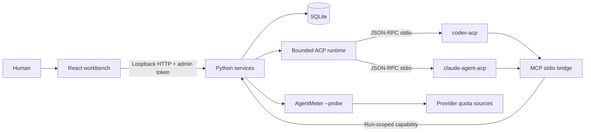
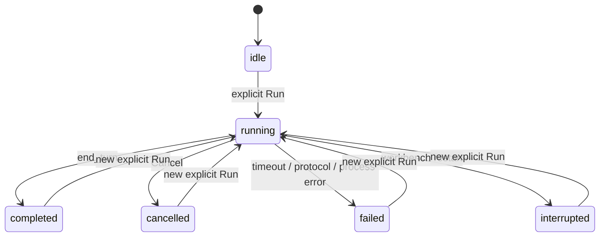

# Architecture

**English** · [简体中文](ARCHITECTURE.zh-CN.md) · [Back to README](../README.md)

AgentDock 0.1 is a local, single-user review preview. The implemented boundaries are described below; live provider interoperability is not yet verified.

## Layers



ACP connects the client to an agent. MCP exposes application tools to that agent. The mailbox and memory semantics are AgentDock services, not features implicitly supplied by either protocol. A2A remote federation is not implemented.

| Layer | Code | Responsibility |
| --- | --- | --- |
| UI | `web/src/` | Projects, agents, sessions, messages, memory review, quotas and human approvals; Chinese/English. |
| HTTP boundary | `agentdock/server.py` | Exact loopback Host/Origin, bearer authentication, request size/type validation, admin routes distinct from scoped tools. |
| Durable state | `agentdock/store.py` | Transactions, entity ownership, active-run constraints, inbox acknowledgments, memory CAS/history, scoped token hashes and approval state. |
| Agent runtime | `agentdock/runtime.py` | ACP negotiation, explicit run, streaming, permission requests, timeouts, cancellation and process-group cleanup. |
| Agent tools | `agentdock/mcp.py` | Six MCP tools using newline JSON-RPC; current-run identity is supplied by the server, not by tool arguments. |
| Quota bridge | `agentdock/quota.py` | Fixed Codex/Claude probes through a separately configured AgentMeter executable; sanitized, time-aware snapshots. |

## Task lifecycle

A human selects a project and agent, creates a session, and explicitly submits a prompt. `begin_run` atomically reserves the agent and its canonical workspace. Equal or parent/child overlapping directories cannot run concurrently, including aliases registered as separate projects. Independent worktrees can run in parallel. This is a coordination guard, not an OS filesystem sandbox.

Each run creates a new ACP process and native session. It receives a bounded context containing approved project memories, pending inbox items and recent stored conversation. Provider-native resume is not implemented. The context is labeled reference data; the label is not a guarantee against prompt injection. An agent's role is also context, not a privilege grant.



ACP permission requests are stored with the run and exact offered options. Only an authenticated human route can resolve them. The runtime checks the request is still pending and unexpired before returning the selection to the adapter. Requests expire after 120 seconds; the run then stops. Missing/unknown client capabilities are rejected. This does not force every upstream tool to request approval; the adapter's own permission/sandbox policy also applies.

Runs have a 15-minute deadline, 8 MiB total output bound, 512 KiB line bound and event/approval count limits. Provider stderr is drained without being stored. Cancellation revokes MCP access and terminates the process group. Service shutdown stops active runs and quota probes, drains request handlers and then closes the database. Restart recovery marks unfinished runs interrupted and never automatically replays them.

## Communication

A message has a project, authenticated sender, recipient, body, optional correlation/deduplication identifiers and acknowledgment state. Both endpoints must belong to the same project. Agent identity is bound to the run capability; a tool cannot select a different sender. A deduplication key with different content is a conflict.

```mermaid
sequenceDiagram
  participant A as Codex run
  participant MCP as Scoped MCP
  participant DB as Project mailbox
  participant H as Human
  participant B as Claude run
  A->>MCP: message_send(recipient, body)
  MCP->>DB: validate identity; persist queued message
  H->>B: explicit Run
  B->>MCP: inbox_read
  MCP->>DB: read recipient's messages
  DB-->>B: message + provenance
  B->>MCP: inbox_ack(message_id)
```

Message delivery does not dispatch a model call. A recipient can read while running or on its next explicit run. There is no automatic team loop, unbounded recursion or inferred completion acknowledgment.

## Shared memory

Approved memory is keyed by `(project_id, key)`. It records content, version, author, source, archive state and timestamps; every accepted update/archive adds a history row. SQLite transactions provide compare-and-swap semantics through `expected_version`.

Human writes can create/update approved entries. Agent writes create pending proposals. A human approval preserves the agent/proposal source and checks the proposed base version; conflicting proposals remain pending for review. An archived entry is excluded from tool search and run context. Search uses parameterized literal keyword matching, not semantic embeddings. No automatic extraction or cross-project sharing is implied.

The UI shows entry versions, sources and proposal review. Full revision browsing/export and retention controls are not implemented in this preview; history is retained in SQLite.

## Quota & billing

AgentDock invokes only `configured AgentMeter command + --probe + codex|claude`, with a 35-second timeout and 60-second refresh throttle. The command is private server configuration, never supplied by MCP or an agent response. No probe runs on import, startup, `GET /api/state`, or while execution is disabled.

Quota snapshots retain provider, plan label, remaining percentage, reset time, fetch time and status. Unknown percentages stay null. Cached data older than 15 minutes is stale. Once a window's reset passes, its remaining percentage becomes unknown until refreshed. Failed refreshes preserve prior readings with an explicit stale/error label. Provider account identifiers and raw probe stderr are discarded.

Renewal dates and monthly amounts are manual records. They are neither quota reset dates nor model-call cost estimates. The separately installed AgentMeter owns authentication and any provider network request; displaying its quota does not grant execution access to that provider.

## Trust boundary

The server binds only to `127.0.0.1` and rejects unexpected Host/Origin values. It has no remote binding option or CORS. An admin token is generated on manual launch and written to a mode-0600 file in the private data directory; the UI keeps it only in memory. Run tool tokens are separate, hashed in SQLite, expire after one hour and are revoked when the run ends. Tokens cannot approve permissions or memories through admin endpoints.

A file lock prevents two instances from opening the same database and corrupting recovery state. This protects operational correctness, not hostile processes running as the same OS user. Agents and adapters may have that user's filesystem/network access. Stronger isolation requires a separate user, container or VM and is not provided here.

AgentDock has no external backend or analytics. Real agent runs and quota reads can send data to configured providers. Private database/token files, `.env` files, `config.local*.json` and `web/dist` are excluded from version control. Configuration saved under another filename must be kept outside the repository or explicitly ignored.

---

**English** · [简体中文](ARCHITECTURE.zh-CN.md) · [Back to README](../README.md)
