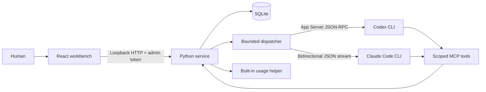
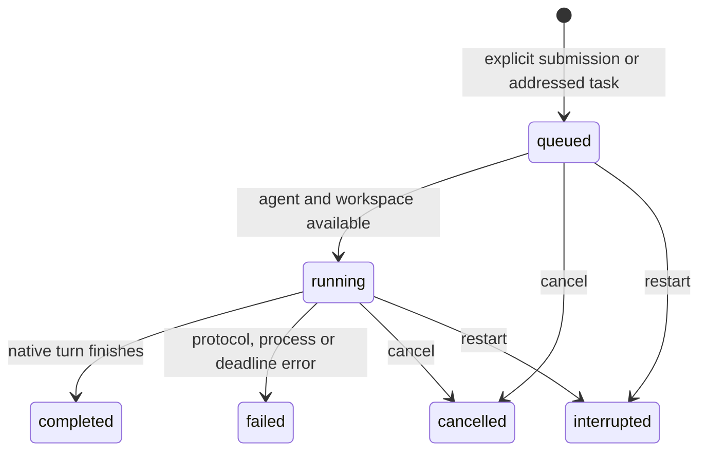

# Architecture

**English** · [简体中文](ARCHITECTURE.zh-CN.md) · [Back to README](../README.md)

AgentDock 0.2 is a local, single-user workbench. It manages native sessions created through its own runtime. Automated verification uses simulated CLI processes; live provider interoperability remains an acceptance item.

## Components



| Component | Code | Responsibility |
| --- | --- | --- |
| Workbench | `web/src/` | Projects, agents, conversations, execution queue, task handoffs, reviewed memory, quotas and permission prompts. Chinese is the default; English is selectable. |
| HTTP boundary | `agentdock/server.py` | Loopback Host/Origin validation, bearer authentication, bounded requests, and separate human/tool routes. |
| Durable state | `agentdock/store.py` | Native bindings, task ownership, transactional queue claims, delivery/result links, memory history, token hashes and approvals. |
| Dispatcher | `agentdock/runtime.py` | Explicit submission, automatic dispatch and result return, task settlement, approval deadlines and cancellation. |
| Native transports | `agentdock/providers.py` | Codex App Server and Claude stream-json protocols, stream parsing, session identity checks, bounded output and process cleanup. |
| Agent tools | `agentdock/mcp.py` | Five tools: agent discovery, addressed dispatch, task status, memory search and memory proposals. |
| Quota bridge | `agentdock/quota.py` | Explicit Codex/Claude probes through the built-in macOS helper, sanitized snapshots and freshness rules. |

The browser's `?demo=1` mode reads fictional fixtures and makes no API requests. It cannot execute agents, dispatch tasks or refresh quotas.

## Sessions and turns

A session belongs to one project and agent. Its `native_session_id` is initially empty and is bound only by that session's active run. Once bound, a different native ID is rejected. IDs belonging to another managed session cannot be rebound.

Codex starts or resumes a thread through `codex app-server`. Claude starts with a generated session UUID or resumes the saved UUID through the native CLI. Each turn launches a bounded subprocess and closes it afterwards; conversation continuity comes from the provider's native persisted session, not a long-running process or replayed UI history.

Agent names and optional roles are defined by the user, independently of the CLI provider. Each turn reads the latest saved role when building its prompt. Role edits preserve existing native bindings and history; they do not rewrite a prompt already sent to a provider.

The prompt contains the current task and a bounded reference block with the agent role and approved project memory. Private conversation history remains with the native CLI. Shared memories and teammate results are marked as reference data, not authority; this labeling does not guarantee resistance to prompt injection.

Authentication and model selection follow the locally installed CLI's configuration. Execution uses the CLI’s authentication; the built-in usage helper reads existing local credentials on demand and never exports them to the workbench. Compatibility depends on the installed CLI and its provider/account configuration. Existing desktop or terminal conversations cannot currently be attached.

## Queue and task settlement

Human submission creates a `queued` run. The dispatcher claims work transactionally and starts at most four workers. Runs belonging to the same agent, or using equal or parent/child overlapping canonical workspace paths, execute sequentially. Independent workspaces can execute in parallel. This prevents concurrent managed writes; it is not a filesystem sandbox.



A run represents **one native turn**, not necessarily a complete delegated task. `root_run_id` groups the collaboration chain; `parent_run_id` records causality. `task_run_id` groups a task's initial turn and later result-consumption turns.

An agent calls `message_send` with the target agent, task body and optional target session. Identity is derived from the active run capability. Both agents must belong to the same project. The service atomically creates a delivery and queued run; the returned ID tracks real work. If no target session is given, the target's most recently updated managed session is used, or a new session is created.

```mermaid
sequenceDiagram
  participant A as Agent A
  participant Q as Dispatcher
  participant B as Agent B
  participant C as Agent C
  A->>Q: Delegate task to B
  Note over A: Finish current turn
  Q->>B: Start or resume native session
  B->>Q: Delegate subtask to C
  Note over B: Finish turn; task is waiting
  Q->>C: Execute subtask
  C-->>Q: Result
  Q->>B: Resume with C result
  B-->>Q: Final combined result
  Q->>A: Resume with B result
```

Completed initial turns with outstanding child results leave their delivery in `waiting`. Settlement waits for child deliveries and their result-return turns before publishing the final task result. A return run resumes the exact requesting session and belongs to that sender's logical task. The message's `reply_run_id` makes scheduling idempotent. Human-addressed tasks have no automatic return session.

Dispatch depth is limited to three and each chain to 16 runs, including reserved result-return capacity. A conflicting idempotency key is rejected. These bounds constrain automation; they do not estimate or cap provider billing. Agents are instructed to finish their current turn after dispatch so that a shared workspace can become available.

Cancellation stops queued/running descendants, revokes scoped tools, and terminates active process groups. A cancelled child can report cancellation to a still-active parent task. Failure or cancellation prevents a stopped task from being resumed by a late result. Workbench restart marks unfinished runs/deliveries interrupted, invalidates approvals and capabilities, and never replays them automatically.

## Permission handling and process limits

Codex uses `untrusted` approval policy and `workspace-write` sandbox requests, with human approval review. Claude uses manual permission mode and stdio control requests. Its child process receives `CLAUDE_CODE_DISABLE_BACKGROUND_TASKS=1`, so shell and subagent work stays in the foreground and finishes within the managed turn; user-wide settings are unchanged. Permissions appear as human-only, single-use options in the UI. Unknown control requests are rejected; Codex's unsupported elicitation forms are declined. The provider's own permission behavior still applies; the UI does not guarantee every upstream action will prompt.

Runs have a 15-minute deadline. An unanswered permission request expires after 120 seconds. The native transport bounds stdout/stderr to 8 MiB combined, each JSON line to 512 KiB, protocol messages to 10,000 and permission/control requests to 64. The dispatcher separately caps stored events to 5,000 and 8 MiB per run. Stderr is drained but not persisted; stable errors omit raw provider details. Shared process-group cleanup handles native CLIs and quota probes.

## Shared memory

Approved memory is keyed by `(project_id, key)` and records content, version, author, source, archive state and timestamps. Every accepted change creates a history row. `expected_version` provides transactional compare-and-swap semantics.

Human writes update approved entries. Agents can only create proposals; a human reviews each proposal against its base version. Conflicts remain pending. Archived entries are excluded from search and task context. Search is literal, parameterized keyword matching. Automatic extraction, semantic embeddings and cross-project memory sharing are not implemented.

The UI presents versions, provenance and proposal review. Full revision browsing/export and retention controls are not available; history remains in SQLite.

## Quotas and subscriptions

Only an explicit refresh invokes `configured quota_command + --probe + codex|claude`. Probes have a 35-second timeout and a 60-second throttle. No probe runs on import, startup, state reads, demo mode or while execution is disabled.

Snapshots retain provider, plan, remaining percentages, reset timestamps, fetch time and status. Unknown values stay null. Readings older than 15 minutes become stale. After a reset time passes, its percentage becomes unknown until refreshed. A failed refresh preserves old readings with an error/stale state. Account identifiers and raw stderr are discarded.

Renewal dates and amounts are manual subscription records, distinct from quota resets and model-call costs. The bundled helper owns credential reads and usage requests; provider accounts are unchanged. Quota visibility grants no execution permission.

## Trust and persistence

The server binds to `127.0.0.1`, checks exact Host/Origin values and provides no CORS or remote binding. A human access token is written to a mode-0600 file in the private data directory and kept only in browser memory. Per-run MCP capabilities are hashed in SQLite, expire after one hour and are revoked when execution ends. They cannot access human approval routes.

A file lock prevents concurrent service instances from corrupting restart recovery. It does not isolate hostile processes running as the same OS user. Native CLIs may have that user's filesystem/network access; stronger isolation requires a separate user, container or VM.

AgentDock has no external backend or analytics. Agent execution and quota reads can contact configured providers. Local databases, tokens, environment files and `config.local*.json` are ignored by Git. Keep configuration under other names outside the repository or explicitly ignore it.

Upgrading a 0.1 store preserves historical messages as `legacy` records without dispatching them. Old sessions without native bindings start new native sessions when explicitly run. The former ACP command configuration must be replaced with native CLI commands. See [validation](REVIEW.md) and the [API contract](API.md).

---

**English** · [简体中文](ARCHITECTURE.zh-CN.md) · [Back to README](../README.md)

## macOS installation and connection

`native/Sources/AgentDockDesktop` provides a native window and nonpersistent WebView. The app owns a local Python child process. After that child reports readiness, the access token is injected only into the same-origin main page’s memory, never URLs, logs or browser storage. Quitting stops the service. External links open in the system browser.

`quota_command` selects the bundled `AgentDockUsage`; legacy `agentmeter_command` remains supported. Ordinary reads prohibit Keychain interaction; only an explicit administrator authorization request allows a prompt. Codex queries its native app server. Claude reads existing local credentials for the official usage endpoint; the helper does not refresh, copy or persist credentials.
