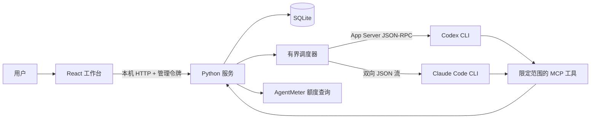
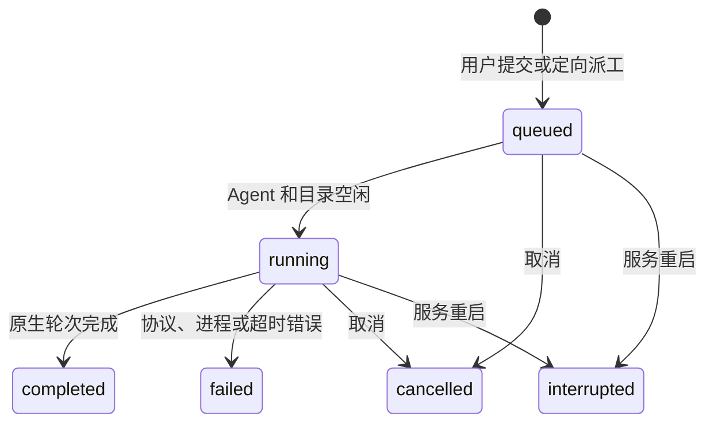
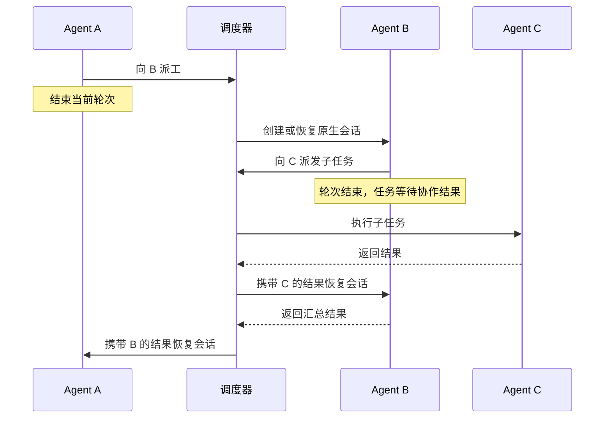

# 架构

[English](ARCHITECTURE.md) · **简体中文** · [返回说明](../README.zh-CN.md)

AgentDock 0.2 是本地单用户工作台，管理由自身运行时创建的原生会话。自动化验证使用模拟 CLI 进程；真实服务兼容性仍需验收。

## 组件

| 组件 | 代码 | 职责 |
| --- | --- | --- |
| 工作台 | `web/src/` | 项目、Agent、会话、执行队列、派工、记忆审核、额度和权限提示；默认中文，可切换英语。 |
| HTTP 边界 | `agentdock/server.py` | 本机 Host/Origin 校验、令牌认证、请求大小限制以及用户与工具接口隔离。 |
| 持久状态 | `agentdock/store.py` | 原生会话绑定、任务归属、事务式队列领取、派工与回传关联、记忆历史、令牌哈希和审批。 |
| 调度器 | `agentdock/runtime.py` | 显式提交、自动派工和结果回传、任务结算、审批超时与取消。 |
| 原生通信 | `agentdock/providers.py` | Codex App Server 和 Claude stream-json 协议、流解析、会话身份检查、输出限制和进程清理。 |
| Agent 工具 | `agentdock/mcp.py` | 五项工具：成员发现、定向派工、任务状态、记忆搜索和记忆提案。 |
| 额度桥接 | `agentdock/quota.py` | 通过独立安装的 AgentMeter 显式查询 Codex/Claude，过滤快照字段并判断时效。 |

浏览器 `?demo=1` 模式读取虚构样例，不发起 API 请求，也不能执行 Agent、派工或刷新额度。

## 会话与轮次

会话归属于一个项目和 Agent。`native_session_id` 初始为空，只能由该会话正在执行的任务绑定。绑定后不能更换原生 ID，也不能绑定其他受管会话已经占用的 ID。

Codex 通过 `codex app-server` 创建或恢复会话。Claude 使用生成的会话 UUID 创建会话，或通过原生 CLI 恢复已保存的 UUID。每轮都启动有时限的子进程，结束后关闭；上下文连续性来自原生 CLI 保存的会话，而不是常驻进程或工作台重放历史文本。

Agent 名称和可选的角色说明由用户定义，与 CLI 服务独立。每轮构建提示词时读取最新保存的角色。编辑角色保留已有原生会话绑定和历史，不会改写已经发送给提供商的提示词。

提示词包含当前任务，以及有长度限制的 Agent 角色和已批准项目记忆。私人会话历史由原生 CLI 管理。共享记忆和队友结果会标为参考资料，不具有指令授权效力；这种标记不能保证抵御提示词注入。

认证和模型选择沿用本机 CLI 配置。AgentDock 不读取凭据库、不导出登录令牌，也不要求新增 API 密钥。兼容性取决于 CLI 版本、服务商和账号配置。当前不能接管已有桌面端或终端会话。

## 队列与任务结算

用户提交后创建 `queued` 运行记录。调度器通过事务领取任务，最多启动四个执行线程。同一 Agent，或使用相同、父子重叠规范路径的任务串行执行；独立工作目录可并行。这能避免受管任务同时修改重叠目录，但不是文件系统沙箱。

运行记录表示**一次原生执行轮次**，不一定代表整个委派任务已经完成。`root_run_id` 关联完整协作链，`parent_run_id` 记录因果关系，`task_run_id` 将任务首次执行及其后续结果处理轮次归为一组。

Agent 调用 `message_send`，指定接收方、任务内容和可选目标会话。发送方身份来自当前运行的授权令牌，双方必须属于同一项目。服务在一个事务中创建派工记录和排队任务，返回的 ID 对应实际工作。未指定目标会话时，使用接收方最近更新的受管会话，没有会话则新建。

首次轮次完成但还有子任务结果未处理时，派工保持 `waiting`。结算会等待子任务结束且对应结果回传轮次处理完成，再发布最终任务结果。回传任务恢复准确的发起会话，并归属于发送方的逻辑任务。派工中的 `reply_run_id` 保证回传调度幂等。由用户直接派发的任务没有自动回传会话。

委派深度最多三层，每条协作链最多 16 次执行，包含为结果回传预留的容量。幂等键对应内容不一致时拒绝请求。这些限制约束自动化范围，不代表费用估算或服务商账单上限。Agent 会收到结束当前轮次的提示，以便释放共享工作目录供队友执行。

取消会停止排队和运行中的后代任务、撤销工具令牌，并终止活动进程组。被取消的子任务可向仍有效的上游任务回传取消状态。已经失败或取消的任务不会因迟到的结果重新启动。工作台重启后，未结束的运行和派工标为中断，审批与令牌失效，不自动重放。

## 权限处理与进程限制

Codex 请求 `untrusted` 审批策略、`workspace-write` 沙箱和人工审批。Claude 使用手动权限模式，通过标准输入输出交换控制请求。仅为该子进程设置 `CLAUDE_CODE_DISABLE_BACKGROUND_TASKS=1`，使命令与子 Agent 在受管轮次内以前台方式完成，不修改用户全局设置。界面提供仅用户可处理的一次性权限选项。未知控制请求会被拒绝，暂不支持的 Codex 交互表单会被拒绝提交。上游 CLI 自身的权限行为仍然生效，不能保证每个上游动作都会弹出审批。

每轮最多执行 15 分钟。未处理的审批在 120 秒后过期。原生通信层限制标准输出和错误输出合计 8 MiB、单条 JSON 行 512 KiB、协议消息 10,000 条、权限或控制请求 64 次。调度器另将持久事件限制为每轮 5,000 条及 8 MiB。错误输出持续排空但不保存；稳定错误提示不包含服务商原始详情。原生 CLI 和额度查询共用进程组清理逻辑。

## 共享记忆

已批准记忆以 `(project_id, key)` 为键，记录内容、版本、作者、来源、归档状态和时间。每次接受更新都会写入历史版本；`expected_version` 提供事务式版本比较更新。

用户可以直接修改已批准记忆。Agent 只能创建提案，由用户核对基准版本后审核。冲突提案保持待审核。归档内容不进入搜索和任务上下文。搜索使用参数化的字面关键词匹配，尚未实现自动提取、向量检索或跨项目共享。

界面展示版本、来源和提案审核。完整历史浏览、导出及保留策略尚未提供，历史记录保存在 SQLite 中。

## 额度与订阅

只有显式刷新才调用 `已配置 AgentMeter 命令 + --probe + codex|claude`。查询超时为 35 秒，节流间隔为 60 秒。导入模块、启动服务、读取状态、样例模式或未开启执行时，均不会查询额度。

快照保留服务商、套餐、剩余比例、重置时间、读取时间和状态。未知数值保持空值；超过 15 分钟的数据标为过期；窗口重置时间已过，则剩余比例变为未知，直到再次刷新。刷新失败会保留旧值并标明错误或过期。账号标识和原始错误输出会被丢弃。

续费日期和金额是手动订阅记录，与额度重置和模型调用费用分开。认证和服务商请求由 AgentMeter 负责，查看额度不会授予 Agent 执行权限。

## 信任与持久化

服务仅绑定 `127.0.0.1`，严格检查 Host/Origin，不提供跨域访问或远程绑定。用户访问令牌写入私有数据目录中权限为 0600 的文件，浏览器仅在内存保存。每轮 MCP 令牌以哈希形式存入 SQLite，一小时后过期，运行结束立即撤销；它们不能访问用户审批接口。

文件锁阻止多个实例同时打开数据库、破坏恢复状态，但无法隔离以相同系统用户身份运行的恶意进程。原生 CLI 可能拥有该用户的文件和网络访问能力，更强隔离需要独立用户、容器或虚拟机。

AgentDock 没有外部后端或遥测。Agent 执行和额度查询可能联系已配置服务商。本地数据库、令牌、环境文件和 `config.local*.json` 均被 Git 忽略；其他名称的私有配置应放在仓库之外或显式加入忽略规则。

升级 0.1 数据库时，历史消息以 `legacy` 记录保留，不触发派工。没有原生绑定的旧会话在用户显式执行时创建新的原生会话。原 ACP 命令配置需要改为原生 CLI 命令。详见[验证说明](REVIEW.zh-CN.md)和[接口约定](API.zh-CN.md)。

---

[English](ARCHITECTURE.md) · **简体中文** · [返回说明](../README.zh-CN.md)
