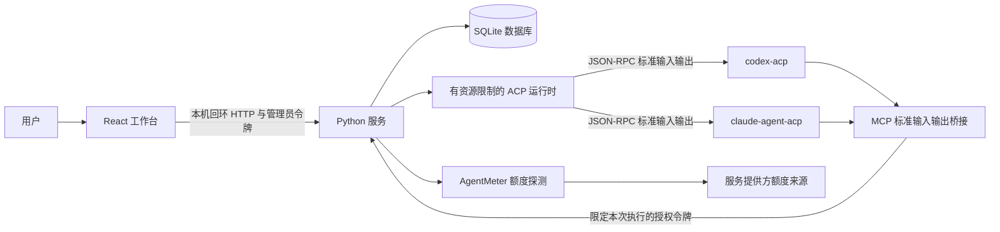
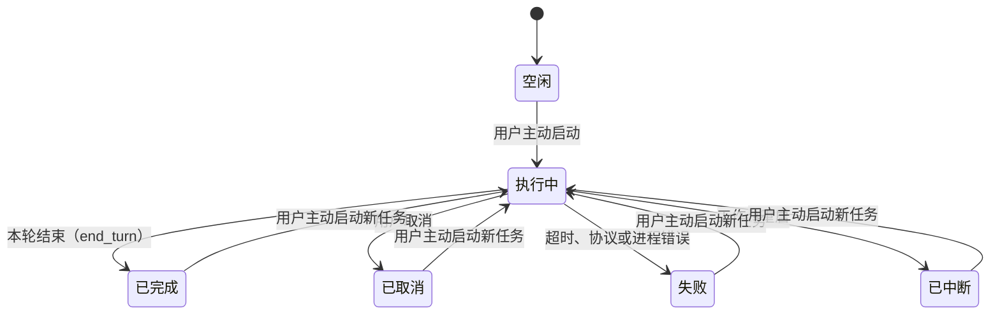
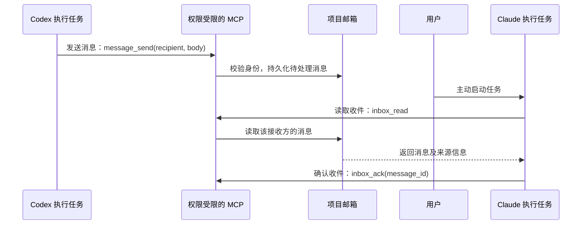

# 架构设计

[English](ARCHITECTURE.md) · **简体中文** · [返回中文 README](../README.zh-CN.md)

AgentDock 0.1 是供评审的本地单用户预览版。下文说明已实现的能力与边界；尚未验证与真实服务适配器的互操作性。

## 分层结构

ACP 负责连接客户端与智能体，MCP 负责向智能体提供应用工具。邮箱和记忆的行为由 AgentDock 服务实现，并非这两个协议自动提供的功能。当前未实现基于 A2A 的远程智能体协作。

| 层次 | 代码 | 职责 |
| --- | --- | --- |
| 用户界面 | `web/src/` | 管理项目、智能体、会话、消息、记忆审核、额度和人工审批；支持中文与英文。 |
| HTTP 边界 | `agentdock/server.py` | 严格校验本机回环 Host/Origin、Bearer 身份认证、请求大小与类型；区分管理员路由与受限工具路由。 |
| 持久化状态 | `agentdock/store.py` | 管理事务、实体归属、执行并发约束、收件确认、记忆版本比较与交换及历史、受限令牌哈希和审批状态。 |
| 智能体运行时 | `agentdock/runtime.py` | 处理 ACP 协商、显式启动任务、流式输出、权限请求、超时、取消和进程组清理。 |
| 智能体工具 | `agentdock/mcp.py` | 通过按行传输的 JSON-RPC 提供六个 MCP 工具；当前执行身份由服务端提供，不能通过工具参数指定。 |
| 额度桥接 | `agentdock/quota.py` | 通过单独配置的 AgentMeter 可执行文件，固定探测 Codex 与 Claude；清理返回数据，并根据时间判断快照是否有效。 |

## 任务生命周期

用户选择项目和智能体，创建会话，然后主动提交任务提示词。`begin_run` 以原子操作为智能体及其规范化后的工作目录保留执行位置。相同目录或存在父子关系的重叠目录不能同时执行任务，包括以不同项目名称登记的同一目录。独立工作树可以并行执行。这是协作层的并发保护，并非操作系统层的文件系统沙箱。

每次任务执行都会创建新的 ACP 进程和原生会话，并接收有大小限制的上下文，包括已审核的项目记忆、待处理收件和近期存储的会话内容。当前未实现服务提供方的原生会话恢复。上下文会被标注为参考数据，但该标注不能保证防御提示词注入。智能体的角色说明也属于上下文，不代表额外权限。

ACP 权限请求与任务一同存储，并保留适配器提供的完整选项。只有经过身份认证的人工审批接口可以处理请求。运行时会在向适配器返回选择前，检查请求是否仍待处理且未过期。权限请求在 120 秒后过期，随后任务停止。对于客户端未声明支持的能力或未知能力，请求会被拒绝。这并不强制上游的所有工具都申请审批；适配器自身的权限和沙箱策略同样生效。

任务的最长执行时间为 15 分钟，总输出上限为 8 MiB，单行上限为 512 KiB，并设有事件数和审批数上限。运行时持续读取进程的标准错误输出，但不保存其内容。取消任务会撤销 MCP 访问权并终止进程组。服务关闭时，会停止正在执行的任务和额度探测，等待请求处理结束，再关闭数据库。重启恢复会将未完成任务标记为已中断，且不会自动重新执行。

## 相互通信

每条消息记录所属项目、经过身份认证的发送方、接收方、正文、可选的关联标识与去重标识，以及收件确认状态。发送方和接收方必须属于同一项目。智能体身份绑定在本次执行的授权令牌上，工具不能另选发送方。如果相同去重标识对应不同内容，则视为冲突。

消息投递不会触发模型调用。接收方可以在任务执行期间，或下次由用户主动启动任务后读取消息。当前没有自动团队循环、无限递归调用，也不会推断并自动确认任务已完成。

## 共享记忆

已审核记忆以 `(project_id, key)` 为唯一标识，记录内容、版本、作者、来源、归档状态和时间戳。每次接受更新或归档，都会新增一条历史记录。SQLite 事务通过 `expected_version` 实现版本比较与交换。

用户可以直接创建或更新已审核记忆；智能体写入则生成待审核提议。人工批准时会保留智能体及提议的来源信息，并检查提议所依据的版本。发生版本冲突的提议会保持待审核状态，供用户重新检查。归档后的记忆不会出现在工具搜索和任务上下文中。搜索采用参数化的字面关键词匹配，不使用语义向量。当前不提供自动记忆提取或跨项目共享。

界面展示记忆版本、来源及提议审核。预览版尚未实现完整历史版本浏览、导出和保留期限管理；历史记录仍保存在 SQLite 中。

## 额度与账期

AgentDock 只执行固定形式的额度探测命令：已配置的 AgentMeter 命令，加上 `--probe` 和 `codex` 或 `claude`。探测超时为 35 秒，刷新间隔至少为 60 秒。命令保存在服务端私有配置中，不能由 MCP 或智能体响应提供。模块导入、服务启动、`GET /api/state` 请求，以及任务执行功能被禁用时，均不会触发探测。

额度快照保留服务提供方、套餐名称、剩余百分比、重置时间、获取时间和状态。未知百分比保持为 `null`。缓存超过 15 分钟会被标记为过期。某个额度窗口的重置时间到达后，其剩余百分比会变为未知，直到再次刷新。刷新失败时会保留先前读数，并明确标注过期或错误。服务提供方的账号标识和探测进程的原始标准错误输出会被丢弃。

续费日期和月费金额由用户手动记录。它们分别不同于额度重置日期和模型调用成本估算。身份认证及对服务提供方的网络请求由单独安装的 AgentMeter 处理；展示某服务的额度，并不授予该服务的任务执行权限。

## 信任边界

服务仅绑定 `127.0.0.1`，拒绝不符合预期的 Host/Origin，不提供远程地址绑定选项，也不启用跨域资源共享（CORS）。手动启动服务时会生成管理员令牌，并将其写入私有数据目录中权限为 `0600` 的文件；界面仅在内存中保存该令牌。任务工具令牌与管理员令牌分开，经过哈希后存入 SQLite，一小时后过期，并在任务结束时撤销。任务工具令牌不能通过管理员接口批准权限请求或记忆提议。

文件锁可防止两个实例同时打开同一数据库，破坏任务恢复状态。这保障的是运行正确性，不能防范以同一操作系统用户身份运行的恶意进程。智能体和适配器可能拥有该用户的文件系统与网络访问权。更强的隔离需要独立用户、容器或虚拟机，当前并未提供。

AgentDock 没有外部后端或使用情况分析功能。真实任务执行和额度读取可能向已配置的服务提供方发送数据。私有数据库与令牌文件、`.env` 文件、`config.local*.json` 和 `web/dist` 均已排除在版本控制之外。使用其他文件名保存的配置，必须放在仓库外，或明确加入忽略规则。

---

[English](ARCHITECTURE.md) · **简体中文** · [返回中文 README](../README.zh-CN.md)
