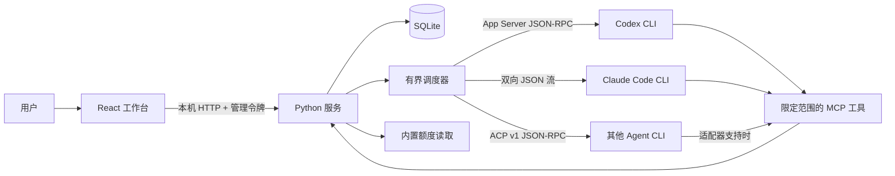
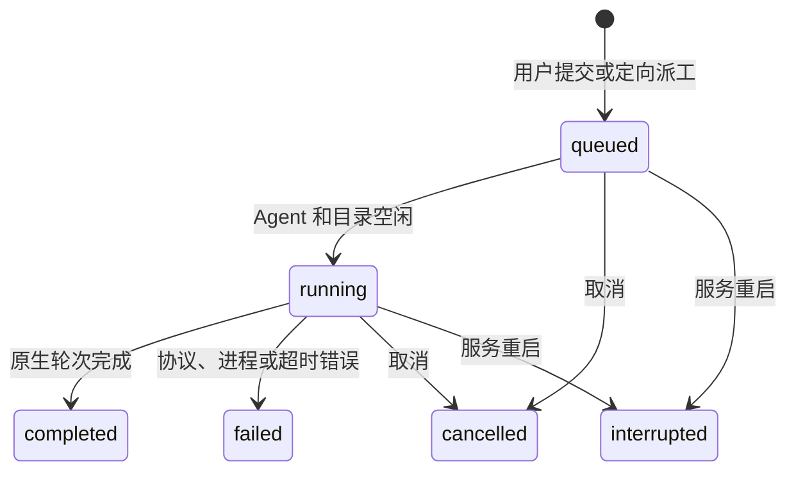
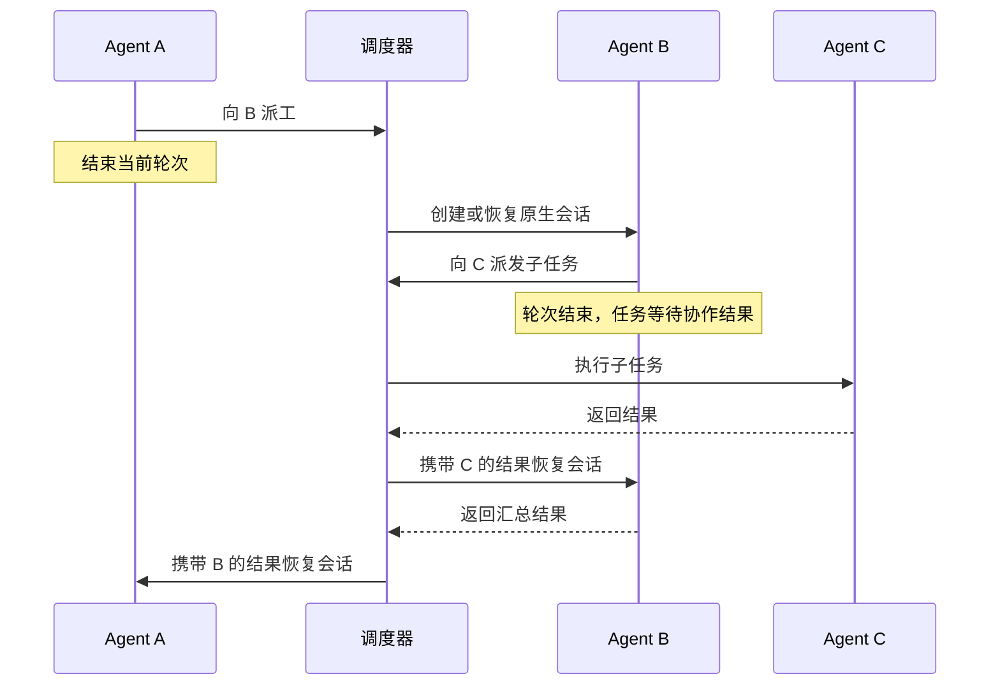

# 架构

[English](ARCHITECTURE.md) · **简体中文** · [返回说明](../README.zh-CN.md)

AgentDock 0.3 是本地单用户工作台，管理由自身运行时创建的原生会话。自动化验证使用模拟 CLI 进程；真实服务兼容性仍需验收。

## 组件

| 组件 | 代码 | 职责 |
| --- | --- | --- |
| 工作台 | `web/src/` | 项目、Agent、会话、执行队列、派工、记忆审核、额度和权限提示；默认中文，可切换英语。 |
| HTTP 边界 | `agentdock/server.py`、`routes.py`、`loopback_server.py` | Host/Origin 与令牌认证、声明式执行权限；本机端口绑定不依赖 DNS。 |
| 持久状态 | `agentdock/store.py`、`*_store.py`、`deletions.py` | 共用事务入口，按会话、运行、事件、消息、连接、权限、记忆、账号及任务拆分职责。 |
| 调度器 | `agentdock/runtime.py` | 显式提交、自动派工和结果回传、任务结算、审批超时与取消。 |
| 原生通信 | `providers.py`、`codex_protocol.py`、`claude_protocol.py`、`acp.py`、`native_io.py` | 协议实现共用通信、初始化及有界文本缓冲。`turn.py` 描述单轮参数，`executors.py` 封装本机/SSH 执行。 |
| Agent 工具 | `agentdock/mcp.py` | 项目协作、任务上下文与历史、问题、交付、独立审查和记忆提案。 |
| 额度采集 | `agentdock/quota.py`、`quota_events.py` | 定时或进入页面时查询 Codex，被动记录 Claude CLI 额度事件，过滤快照字段并判断时效。 |

浏览器 `?demo=1` 模式读取虚构样例，不发起 API 请求，也不能执行 Agent、派工或刷新额度。

服务入口统一登记在 `agentdock/registry.py`；`agentdock/acp.py` 负责 ACP 能力握手、原生续聊、模型配置、权限请求和流式事件。`agentdock/acp_home.py` 为新增服务设置私有 HOME/XDG 并复制选定配置。SSH worker 复用这些模块；服务检测不发起模型请求。能力及实机验证边界见[CLI 支持](PROVIDERS.zh-CN.md)。

## 状态、响应速度与诊断

`state_sync.py` 维护服务实例及数据集合版本。全局 SSE 通知变更，客户端仅拉取变化的集合；初次加载和服务重启仍返回完整快照，尚未实现逐行分页。磁盘数据库的状态/统计查询使用独立只读 WAL 连接；写入共用事务连接。会话事件只唤醒相关连接；编号迁移同时覆盖已有数据库。

删除先持久化标记，再释放数据库与调度锁执行 CLI/SSH 清理，最后删除记录。删除标记阻止新任务，失败或重启后可重试。完成轮次仅在有最终完整消息时压缩对应增量，保留未完成输出及事件游标。

进度约每 100ms 合并一次；显示超限时截断进度，最终回复、审批与结算继续保留。Agent 的执行超时覆盖服务默认值，审批等待单独计时，取消始终可用。

`diagnostics.py` 写入私有滚动元数据日志，以错误 ID 关联异常；诊断包仅包含版本、数量和脱敏错误位置，排除请求/异常原文及凭据。`errors.py` 定义稳定错误码，界面按 code 翻译。

界面用 TanStack Query 管理状态、模型与统计请求，账号代际和服务版本仍保留业务校验。工作台、任务表单、列表及会话面板拆为独立组件；样式保持原级联顺序，固定双语文案位于 `messages.ts`。账号、用量和 Token 页面按需加载。

[凭据保护](CREDENTIALS.md)、[实验功能](EXPERIMENTS.md)和[运行时/分发](DISTRIBUTION.md)分别说明对应边界。

## Agent 复用与项目成员

`POST /api/projects/{id}/agents` 创建独立的 Agent 执行身份，记录目标 `project_id` 和可空的 `source_agent_id` 来源引用。加入时复制提供方、设备、模型、思考强度和权限，以项目内名称与职责保存。不复制原会话、原生标识、事件或源工作目录。同设备成员使用目标项目路径；跨设备成员必须填写该项目在所选设备上的目录。旧版直接绑定项目的 Agent 也可作为来源复用。

来源引用仅记录关系，不做动态继承。修改或删除项目成员不会更新来源或其他成员；删除来源将引用置空，保留已加入项目的成员与会话。迁移只增加可空字段，保留原有标识、会话和角色。每个成员独立调度，目录重叠仍串行。记忆与派工能力沿用当前运行的项目作用域。日常会话保持空项目归属，不获得项目记忆或队友。复用同一 CLI 登录时，账号与服务商额度仍共用。

`Conversations.tsx` 汇集已有会话，不迁移记录。路由为 `#/conversations?session=<id>`；搜索、选择及项目／日常筛选不改变归属。详情复用已有事件流、任务时间线、授权和输入框，并明确指定会话 ID；失效 ID 不回退到另一会话。

## 持久项目任务

`task_store.py` 以 `tasks` 为主记录，将 `task_inputs`、`task_questions`、`task_reviews`、`task_deliveries` 和 `task_journal` 与执行会话分开保存。`runs.work_task_id` / `sessions.work_task_id` 指向所属任务，`task_role` 区分负责人、执行者和审查者。原 `task_run_id` 继续表达派工链，不与项目任务 ID 混用。

`task_runtime.py` 复用队列、账号选择、原生隔离和结果回传。只有负责人可以派工或交付；所有派工使用任务专属会话，讨论禁止派工、交付和记忆写入，审查禁止修改文件及记忆。验收同时校验版本、逐项证据、问题与协作结算，以及可选独立审查。新要求使旧交付失效，原生轮次结束只表示这一轮完成。

任务恢复使用 `execution_lease.py` 的继承式文件锁核对旧进程停止；SSH 通过 `recovery_status` 核对 worker 和原生锁，无法确认则阻止恢复。新负责人使用新会话读取持久事实。`task_workspace.py` 可从干净 Git 根目录固定任务起点，为成员建立独立 worktree；审查者使用负责人工作区。完整生命周期、保留规则与实机验证边界见[项目任务](TASKS.zh-CN.md)。

## 会话与轮次

会话归属于一个项目和 Agent。`native_session_id` 初始为空，只能由该会话正在执行的任务绑定。绑定后不能更换原生 ID，也不能绑定其他受管会话已经占用的 ID。

Codex 通过 `codex app-server` 创建或恢复会话。Claude 使用生成的会话 UUID 创建会话，或通过原生 CLI 恢复已保存的 UUID。每轮都启动有时限的子进程，结束后关闭；上下文连续性来自原生 CLI 保存的会话，而不是常驻进程或工作台重放历史文本。

每个会话使用 `sessions/<session-id>/codex` 或 `sessions/<session-id>/claude` 保存原生历史、索引与缓存。本机根目录位于 AgentDock 数据目录；远端位于对应 SSH 控制端的私有目录。Codex 的 `CODEX_HOME` 与 SQLite 路径同时隔离；用户配置使用副本，文件登录凭据由原生 CLI 通过链接复用。Claude 使用独立 `CLAUDE_CONFIG_DIR`，以 `CLAUDE_SECURESTORAGE_CONFIG_DIR` 保留原凭据存储定位，配置使用副本。子进程不继承 Codex 桌面版控制管道及会话标识。原生凭据刷新仍由客户端负责。

自动工作目录位于会话的 `workspace` 子目录；显式项目目录保持共用。删除前检查本会话涉及的完整协作链均已结束，包括队友返回结果后的处理轮次及等待返回的间隙，再清理专属目录和记录；从未提交运行且无原生绑定的远端会话只清理本机记录。其余远端删除请求携带当前版本的私有程序包，避免应用升级后的版本缺失；只有明确收到清理成功应答才删除记录，失败则保留记录供重试。升级仅迁移 AgentDock 已绑定的原生历史；Codex 先成功恢复私有副本，再由原生 API 移除旧存储中的重复会话，不导入其他桌面或终端会话。

删除 Agent 前检查其全部会话及未结束的协作任务，复用会话专属目录清理流程，再通过一次数据库事务移除 Agent 和会话记录。清理失败时保留全部数据库记录供用户重试；已移除的私有文件无法恢复。共用项目文件、已审阅记忆、连接和其他 Agent 保留。

Agent 名称和可选的角色说明由用户定义，与 CLI 服务独立。每轮构建提示词时读取最新保存的角色。编辑角色保留已有原生会话绑定和历史，不会改写已经发送给提供商的提示词。

提示词包含当前任务，以及有长度限制的 Agent 角色和已批准项目记忆。私人会话历史由原生 CLI 管理。共享记忆和队友结果会标为参考资料，不具有指令授权效力；这种标记不能保证抵御提示词注入。

认证和模型选择沿用所选环境的 CLI 配置。Codex 额度查询由其原生客户端处理认证；Claude 额度来自执行事件。兼容性取决于 CLI 版本、服务商和账号配置。当前不能接管已有桌面端或终端会话。

## 队列与任务结算

用户提交后创建 `queued` 运行记录。调度器通过事务领取任务，最多启动四个执行线程。同一 Agent，或使用相同、父子重叠规范路径的任务串行执行；独立工作目录可并行。这能避免受管任务同时修改重叠目录，但不是文件系统沙箱。

运行记录表示**一次原生执行轮次**，不一定代表整个委派任务已经完成。`root_run_id` 关联完整协作链，`parent_run_id` 记录因果关系，`task_run_id` 将任务首次执行及其后续结果处理轮次归为一组。

Agent 调用 `message_send`，指定接收方、任务内容和可选目标会话。发送方身份来自当前运行的授权令牌，双方必须属于同一项目。服务在一个事务中创建派工记录和排队任务，返回的 ID 对应实际工作。未指定目标会话时，使用接收方最近更新的受管会话，没有会话则新建。

首次轮次完成但还有子任务结果未处理时，派工保持 `waiting`。结算会等待子任务结束且对应结果回传轮次处理完成，再发布最终任务结果。回传任务恢复准确的发起会话，并归属于发送方的逻辑任务。派工中的 `reply_run_id` 保证回传调度幂等。由用户直接派发的任务没有自动回传会话。

委派深度最多三层，每条协作链最多 16 次执行，包含为结果回传预留的容量。幂等键对应内容不一致时拒绝请求。这些限制约束自动化范围，不代表费用估算或服务商账单上限。Agent 会收到结束当前轮次的提示，以便释放共享工作目录供队友执行。

取消会停止排队和运行中的后代任务、撤销工具令牌，并终止活动进程组。被取消的子任务可向仍有效的上游任务回传取消状态。已经失败或取消的任务不会因迟到的结果重新启动。工作台重启后，未结束的运行和派工标为中断，审批与令牌失效，不自动重放。

## 权限处理与进程限制

每个 Agent 保存 `permission_mode`：默认为 `ask`（含迁移的既有记录），或由用户选择 `full_access`。经过用户身份认证的 API 校验枚举；排队或运行中的任务会阻止修改。调度器在每轮执行及原生会话续接时，将该设置传给本机适配器或远端执行组件。模型输出与 MCP 能力令牌不能修改它。

| 模式 | Codex | Claude Code |
| --- | --- | --- |
| `ask` | `approvalPolicy: untrusted`、`sandbox: workspace-write`、用户审批 | `--permission-mode manual`、标准输入输出权限请求 |
| `full_access` | `approvalPolicy: never`、`sandbox: danger-full-access` | `--permission-mode bypassPermissions` |

无效值在启动原生 CLI 前被拒绝。完全访问取消 CLI 的常规审批，仍受系统账户权限和上游受管策略限制，不扩大 AgentDock MCP 能力令牌的权限。仅为 Claude 子进程设置 `CLAUDE_CODE_DISABLE_BACKGROUND_TASKS=1`，使命令与子 Agent 在受管轮次内以前台方式完成，不修改用户全局设置。界面提供仅用户可处理的一次性权限选项。未知控制请求会被拒绝，暂不支持的 Codex 交互表单会被拒绝提交。上游 CLI 自身的权限行为仍然生效，不能保证每个上游动作都会弹出审批。

执行默认 15 分钟，可按服务/Agent 设置，最多 24 小时。审批等待不占执行时间，未处理请求最多 120 秒过期。单条 JSON 行仍限制为 512 KiB，权限或控制请求最多 64 次；不再按累计字节/消息数终止整轮任务。进度显示限制为 5,000 条及 8 MiB，超限明确标注截断，最终回复与结算保留。错误输出持续排空但不保存；原生 CLI 和额度查询共用进程组清理逻辑。

## 共享记忆

已批准记忆以 `(project_id, key)` 为键，记录内容、版本、作者、来源、归档状态和时间。每次接受更新都会写入历史版本；`expected_version` 提供事务式版本比较更新。

用户可以直接修改已批准记忆。Agent 只能创建提案，由用户核对基准版本后审核。冲突提案保持待审核。归档内容不进入搜索和任务上下文。搜索使用参数化的字面关键词匹配，尚未实现自动提取、向量检索或跨项目共享。

界面展示版本、来源和提案审核。完整历史浏览、导出及保留策略尚未提供，历史记录保存在 SQLite 中。

## SSH 运行环境

`environments` 保存本机与 SSH 连接。Agent、项目和会话携带 `environment_id`，既有记录默认为 `local`；迁移前备份已有数据库。Agent 的运行环境作为新会话的默认值。切换位置后，已有会话保留环境、目录及原生标识，并将继承的模型、思考强度和权限默认值固定在 `agent_defaults` 中。任务在提交时记录模型、思考强度和权限。执行、模型查询和清理均按会话环境路由；自动派工选择 Agent 当前环境中的会话。同一 Agent 的运行任务跨环境保持串行，工作目录互斥按环境区分。仍被会话引用的环境不能移除。额度按 Agent 默认账号和会话实际绑定的账号、环境分别展示；设备登录单独展示，历史用量仍按会话标识归属。

`remote.py` 通过每环境一条持续系统 SSH 通道提交任务。`ssh_transport.py` 复用有界的请求和订阅帧，`ssh_bridge.py` 处理请求并增量读取持久事件，读取进度无需反复启动 SSH。模型查询与取消、审批响应分开处理。通道关闭会取消临时模型、账号及额度查询，等待原生进程组退出和账号锁释放；持久任务与登录进程继续受各自租约或时限约束。`server.py` 通过认证 SSE 推送已提交事件，界面按游标补读并合并增量渲染。`ssh_worker.py` 安装在按内容版本划分的私有目录中，调用远端已有 CLI。请求先连同指纹持久化，再确认接收；相同 Run ID 重试不会另起执行进程。进度和控制请求使用有序事件，读取完前序事件后才接受最终状态。SSH 通道不暴露本机 API，也不转发本机凭据。

权限和 MCP 请求携带请求 ID 返回本机控制端，响应送回对应远端执行进程；最终回复与进度分别保存。短暂断线按事件游标接续；90 秒租约、主动取消与进程组清理限制无人管理的执行。控制端重启不重放未完成任务，远端历史记录当前不自动清理。详见 [SSH 生命周期与身份](SSH.zh-CN.md)。

本机历史扫描排除远端绑定；远端 Token/TPS 来自托管任务的实时事件，计量标识包含环境。远端 Codex 额度查询自己的 App Server，远端 Claude 被动记录执行中的额度事件；没有事件则显示未知，不回退到本机账号数据。

## 额度与订阅

启用执行并配置额度组件后，本地服务维护唯一的 600 秒 Codex 刷新循环，首次定时刷新在启动 10 分钟后执行。设备登录卡片在进入“额度与订阅”时调用 `quota_command 配置的命令 + --probe + codex`，页面内重复请求会合并。托管账号卡片使用 `/api/accounts/{id}/refresh` 及自己的额度记录，不使用设备快照；Claude 刷新只返回已有执行采样。Codex 查询共用 35 秒超时和 60 秒节流。窗口隐藏不停止定时刷新，多个页面不创建额外定时器；错过的周期不会集中补发，退出时停止定时器并清理自有查询进程。导入模块、读取缓存、演示模式及未启用执行时不会启动查询。自动读取不会请求交互式钥匙串授权。

快照保留服务商、套餐、剩余比例、重置时间、源数据时间和状态。未知数值保持空值；超过 15 分钟的数据标为过期；窗口重置时间已过，则剩余比例变为未知，直到再次刷新。刷新失败会保留旧值并标明错误或过期。账号标识和原始错误输出会被丢弃。

续费日期和金额是手动订阅记录，与额度重置和模型调用费用分开。额度读取由内置组件负责，不修改提供方账号，查看额度不会授予 Agent 执行权限。

## 信任与持久化

服务仅绑定 `127.0.0.1`，严格检查 Host/Origin，不提供跨域访问或远程绑定。用户访问令牌原子写入私有数据目录中权限为 0600 的文件，浏览器仅在内存保存。每轮 MCP 令牌以哈希形式存入 SQLite，有限有效期覆盖执行与审批等待时限且至少一小时，运行结束立即撤销；它们不能访问用户审批接口。

文件锁阻止多个实例同时打开数据库、破坏恢复状态，但无法隔离以相同系统用户身份运行的恶意进程。原生 CLI 可能拥有该用户的文件和网络访问能力，更强隔离需要独立用户、容器或虚拟机。

AgentDock 没有外部后端或遥测。Agent 执行和额度查询可能联系已配置服务商。本地数据库、令牌、环境文件和 `config.local*.json` 均被 Git 忽略；其他名称的私有配置应放在仓库之外或显式加入忽略规则。

升级 0.1 数据库时，历史消息以 `legacy` 记录保留，不触发派工。没有原生绑定的旧会话在用户显式执行时创建新的原生会话。原 ACP 命令配置需要改为原生 CLI 命令。详见[验证说明](REVIEW.zh-CN.md)和[接口约定](API.zh-CN.md)。

## macOS 安装与连接

`native/Sources/AgentDockDesktop` 提供原生窗口与非持久化 WebView。应用拥有本地 Python 子进程；收到该进程的就绪消息后，把访问令牌仅注入同源主页面的内存。令牌不进入 URL、日志或浏览器存储，退出时停止服务。外部链接在系统浏览器打开。

`NSStatusItem` 与原生 `NSMenu` 提供常驻菜单栏入口，主窗口隐藏后仍可使用。关闭窗口不会停止任务，显式退出才等待自有服务清理。菜单通过管理员认证的 `GET /api/quotas` 读取缓存，不再提供单独的刷新操作，由本地服务统一定时更新额度。临时 HTTP 客户端拒绝重定向。同源主页面通过受限消息桥接同步界面语言，仅语言偏好会持久化。

`quota_command` 指向内置 `AgentDockUsage`；旧 `agentmeter_command` 对 Codex 仍兼容。Codex 查询其原生 App Server，认证由 Codex 处理。Claude 额度仅来自实际运行中的 `rate_limit_event`：本机／SSH 设备登录按环境保存，托管账号按账号保存并校验登录版本。刷新只读已有采样，不探测额度组件、桌面快照、凭据存储或服务商接口。缺失的百分比、恢复时间保持未知；升级前记录保留原时间及单独的来源标记。

## 独立 Agent、模型与计量

Agent 的项目可为空。未指定工作目录的会话使用私有数据目录下的 `sessions/<session-id>/workspace`；显式选择的项目目录保持共用。会话建立时固定项目和目录，调度互斥覆盖项目及独立目录。独立 Agent 无法通过 MCP 访问项目记忆或派发项目任务。

`catalog.py` 从 Codex `model/list` 和 Claude 控制握手读取模型及推理等级，过滤账户字段，本机结果缓存五分钟。会话输入框按 Agent 的环境查询模型目录。`sessions.model_override=0` 时继承 Agent 默认值；用户选择后保存本会话的 `model`、`effort` 并启用覆盖，恢复默认会清除覆盖。

每条运行入队时将有效 `model`、`effort` 固定到 `runs`，本机适配器和 SSH 请求均使用该快照。后续修改不会改变排队或执行中的任务；协作结果回传轮次沿用原发起任务的模型参数。Codex 通过 `turn/start` 的 `model/effort` 接收参数，Claude 通过 `--model/--effort` 接收。未指定值沿用原生客户端／会话行为，不修改全局配置。

扫描器及所有用量聚合只处理已配置 Agent 绑定的原生会话；没有绑定时跳过源文件扫描。额度卡片、菜单项及定时查询只覆盖已配置 Agent 使用的服务。已有未关联统计记录及 CLI 文件保留，但不参与展示与聚合。

`metrics.py` 索引原生 Token 日志，并接受 `providers.py` 的实时用量事件。Codex 按原生会话保存累计计数，Claude 按会话与消息 ID 合并重复块。实时事件、日志与归档副本共用去重键；缓存计数不重复加到总输入。历史索引仅存计数、时间和标识，不保存日志正文。首次读取 Codex 的有界尾部累计值，Claude 按文件位置分批增量扫描；无法回溯缺失日志中的消耗。

每日活跃按服务端本地日期聚合。Codex 保存每个原生会话每天的累计最高计数，与前一日期基线取正向差值；展示区间之前的基线仍参与计算。Claude 按去重后的消息计数聚合。Codex 历史使用独立文件游标按 16 MiB 分块补全，每轮预算 64 MiB，游标持久化，不阻塞累计值与 TPS 的快速更新。活跃索引只保存日期、计数、时间及标识。

三分钟曲线将真实输出增量均摊到报告覆盖的时间区间，聚合为三秒桶；当前值取最近十五秒平均。批量上报、缺失区间及客户端未输出用量时不能推导逐 Token 生成速度。统计与额度是独立数据集，不提供账单估算。

---

[English](ARCHITECTURE.md) · **简体中文** · [返回说明](../README.zh-CN.md)
