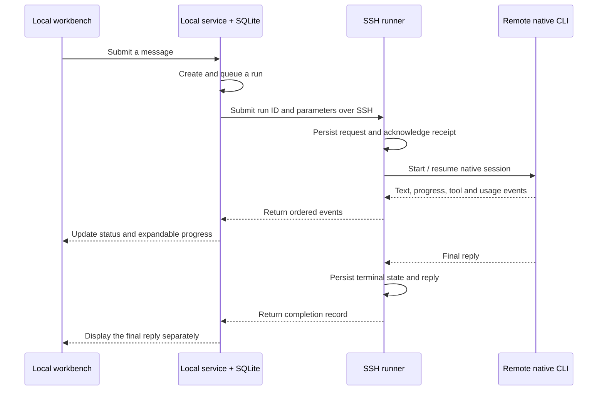

# SSH environments

**English** · [简体中文](SSH.zh-CN.md) · [Home](../README.md)

AgentDock stores workbench state locally and calls installed agent CLIs over SSH. Each agent belongs to one environment. Native sessions, working directories, model catalogs and quotas belong to that environment. A project can include agents on different hosts while the local service coordinates shared memory and task handoffs.

## Setup

1. Confirm that `ssh devbox` works without interaction and the host key is in `known_hosts`. Put custom ports, jump hosts and key paths in your system SSH configuration.
2. Open **Devices & connections → Add SSH device**. Enter a name, an SSH Host alias or `user@host`, and the remote Python command, then choose **Save device**.
3. Choose **Connect / check**. The host needs Python 3.9+ and an installed, authenticated native CLI. The connection check reads versions without submitting a model task.
4. Choose **Add agent on this device** on the device card to open the form with that device selected. Alternatively, use **Workspace → Add agent → Run on** to select a saved device. Models are discovered on that environment; an empty selection retains native settings. A blank workspace creates a private agent directory; an explicit directory must already exist.
5. Create a conversation and send a message. The status shows queued, running, completed or failed. Expand the status row to watch progress, or leave it collapsed. The final reply appears separately.

An agent's environment and provider stay fixed to prevent resuming a conversation on the wrong host. Projects are optional. When the project belongs to another environment, choose a separate working directory or use the agent's private directory.

## Communication

Register a physical host once and use consistent canonical workspace paths. Different SSH aliases and symbolic links are not automatically merged for workspace exclusion.

Acceptance means the request was saved. Completion requires a successful CLI terminal result and all preceding events to be received. Codex uses App Server; Claude Code uses bidirectional stream-json. The UI displays only progress text exposed by the CLI and does not synthesize thinking content.

The local controller initiates SSH requests. The workbench remains bound to local loopback; the remote MCP bridge also listens only on its host's loopback interface. Shared-memory queries, delegation and permission requests return as ordered control events; their responses go back to the matching request. The remote runner gets a per-run capability, never the local administrator token or local CLI credentials.

## Disconnection and shutdown

| Condition | Behavior |
| --- | --- |
| Brief SSH interruption | Show reconnection state and resume from the event cursor. Retrying the same run ID does not execute it twice. |
| Sustained disconnection | The controller stops retrying. The remote runner stops its CLI process group after its 90-second lease expires. |
| User cancellation | Request cancellation and stop owned child processes; the lease handles an unreachable host. |
| Collapsed progress or hidden window | Execution and event collection continue. |
| Quit / restart AgentDock | Stop owned tasks; never automatically replay uncertain work. A new message can resume a saved native session. |
| Remote process exit | Show failure or cancellation and retain events already received. |

Events and final state use private storage with bounded event sizes and counts. This protocol does not promise distributed exactly-once execution across machine crashes or replace idempotency in external systems called by a model.

## Data and identity

| Data | Location and behavior |
| --- | --- |
| Environments, agents, sessions and returned results | Local SQLite. Existing records migrate to This Mac with a database backup. |
| Runner | Remote `~/.local/share/agentdock/ssh/runtimes/<hash>`, installed by content version without sudo or a system service. |
| Requests and events | Remote `~/.local/share/agentdock/ssh/controllers/<controller>/<run>` with private permissions. Historical run directories are not automatically removed. |
| Default working directory | Remote `~/.local/share/agentdock/workspaces/<agent>`. Existing repositories and external worktrees are not cleaned up. |
| CLI credentials | Existing login on the selected host. SSH agent sockets, X11 and ports are not forwarded. The execution identity is the SSH user and that user's native CLI account. |
| Codex trust | App Server inherits its process working directory, avoiding the explicit directory change that can persist trust. AgentDock verifies the returned directory before sending a prompt and preserves existing trust choices. |
| Tokens and TPS | Remote accounting uses live events from AgentDock-managed turns, without scanning unrelated remote conversations. Environment-scoped identities avoid mixing local and remote sessions. |
| Usage and billing | Stored by environment and provider. Remote Codex queries its own App Server. Remote Claude currently remains unknown, without falling back to local data or reading credentials. |

The SSH component does not edit CLI, SSH or Git configuration or install system services. Native CLIs still save their own conversations and runtime records. Tool permissions follow CLI policy, sandboxing and user decisions. Working directories are not OS isolation; use a dedicated low-privilege account and separate workspace for production access.

## Verification

Offline checks exercise the real runner with both simulated native CLIs: session continuation, approval round trips, shared-memory control events, cancellation, expired leases, idempotent retries after lost acknowledgements, event replay and environment-scoped accounting.

Linux SSH checks verified model discovery, two-turn text conversations, native session continuation and usage events with Codex 0.155.1 and Claude Code 2.1.277. Configuration hashes were checked again after preventing Codex's automatic persistent trust writes. Long outages, host restarts, more CLI releases and complex tool tasks require deployment-specific validation.

The tested remote account did not return a valid Codex quota; it remains unknown. Remote quota availability is independent of successful CLI conversations.
