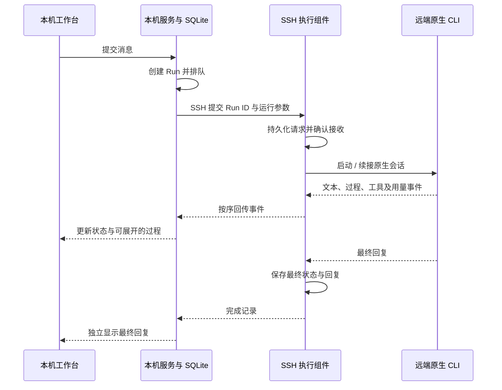

# SSH 运行环境

[English](SSH.md) · **简体中文** · [返回首页](../README.zh-CN.md)

AgentDock 在本机保存工作台状态，通过 SSH 调用远端已安装的 Agent CLI。Agent 绑定一个运行环境；原生会话、工作目录、模型列表和额度都属于该环境。同一项目可以包含不同环境的 Agent，项目记忆与任务交接仍由本机工作台管理。

## 配置

1. 先在终端确认 `ssh devbox` 可以无交互连接，主机密钥已加入 `known_hosts`。自定义端口、跳板机和私钥路径放在系统 SSH 配置中。
2. 打开 **协作工作台 → 添加 Agent**，选择服务并填写自定义名称。在 **运行位置**选择已有连接或 **新的 SSH 连接…**；新连接填写 SSH Host 别名或 `user@host`，需要时在 **高级连接设置**中指定 Python 命令。
3. 新连接点击 **连接并使用**；已有连接可点击 **连接 / 检查**。需要远端 Python 3.9+，以及已安装并正常登录的原生 CLI。连接检查安装私有执行组件并查询版本，不提交模型任务。
4. 连接后继续填写 Agent 配置，再点击 **创建 Agent**。模型列表从该环境读取，留空则沿用原生客户端设置。工作目录留空时，为该 Agent 创建私有目录；指定目录必须已存在。连接信息保留在 **Agent 设置**中，日常列表使用自定义名称；同名 Agent 仍各自绑定正确的连接与会话。
5. 创建会话并发送消息。任务状态会依次显示排队、执行中、完成或失败；点击状态行可以展开过程，再次点击即可收起。收起面板不影响任务，最终回复独立显示。

环境与提供方在创建 Agent 后固定，避免把同一会话意外续接到另一台机器。项目可选；关联了其他环境的项目时，需单独指定工作目录，或使用 Agent 的私有目录。

## 通信链路

同一台主机只登记一个环境，工作目录使用一致的规范路径。不同 SSH 别名和符号链接不会自动合并工作目录互斥范围。

任务确认接收只代表请求已保存。只有 CLI 确认完成、最终结果与前序事件均已读取后，工作台才显示完成。Codex 使用 App Server，Claude Code 使用双向 stream-json。界面只展示 CLI 公开返回的过程文本，不补造思考内容。

远端执行组件通过本机 SSH 发起的请求收发数据。AgentDock 工作台继续只监听本机回环地址；远端 MCP 桥也只监听远端回环地址。共享记忆查询、派工与权限请求通过带序号的控制事件返回本机，再将响应送回对应请求。远端拿到单次运行专用令牌，不会获得本机管理员令牌或本机 CLI 登录凭据。

## 断线与退出

| 场景 | 行为 |
| --- | --- |
| 短暂 SSH 中断 | 显示重连状态，按事件游标补读；以同一 Run ID 重试提交不会重复执行。 |
| 持续失联 | 工作台结束自动重试。远端超过 90 秒未收到续约后停止本次运行的 CLI 进程组。 |
| 用户取消 | 发送取消信号并停止本次运行的子进程；网络不可达时由租约兜底。 |
| 收起过程或隐藏主窗口 | 后台继续执行与读取事件。 |
| 退出 / 重启 AgentDock | 停止自有任务；不会自动重放未确认的任务。下一条消息可续接已保存的原生会话。 |
| 远端进程退出 | 显示失败或取消，保留已经回传的记录。 |

事件与最终状态保存在私有目录，事件读取有大小和条数限制。运行期间仅保留有界的过程内容；这套协议不承诺机器崩溃时的分布式恰好一次执行，也不替代模型调用外部系统时的业务幂等机制。

## 数据与身份

| 数据 | 位置与策略 |
| --- | --- |
| 环境、Agent、会话和回传结果 | 本机 SQLite；既有记录迁移到“本机”，迁移前备份已有数据库。 |
| 执行组件 | 远端 `~/.local/share/agentdock/ssh/runtimes/<hash>`，按内容版本安装，不需要 sudo 或后台服务。 |
| 运行请求与事件 | 远端 `~/.local/share/agentdock/ssh/controllers/<controller>/<run>`，私有目录权限。当前不自动删除历史运行目录。 |
| 默认工作目录 | 远端 `~/.local/share/agentdock/workspaces/<agent>`；不会清理已有仓库或外部工作树。 |
| CLI 凭据 | 沿用所选环境的已有登录；SSH 不转发本机 agent socket、X11 或端口。运行身份是 SSH 用户及其原生 CLI 账号。 |
| Codex 信任配置 | App Server 继承执行进程的工作目录，避免显式切换目录触发自动写入信任记录；发送提示词前核对返回的目录，既有信任选择保持不变。 |
| Token 与 TPS | 远端统计来自 AgentDock 管理的实时用量事件，不扫描远端其他会话。去重标识包含环境，避免与本机会话混合。 |
| 额度与订阅 | 按环境与提供方保存。远端 Codex 查询自身 App Server；远端 Claude 当前显示未知，不回退到本机快照或读取凭据。 |

SSH 组件不会更改 CLI、SSH、Git 的配置文件，也不会安装系统服务。原生 CLI 仍会保存自身会话和运行记录；执行权限受 CLI 配置、沙箱及用户批准控制。工作目录不是系统级隔离，生产环境应使用专用、低权限的运行账户与独立目录。

## 验证范围

离线测试覆盖真实执行组件、两种模拟 CLI、会话续接、授权往返、共享记忆控制事件、取消、租约到期、丢失确认后的幂等重试、事件补读及跨环境统计隔离。

Linux SSH 实机已验证 Codex 0.155.1、Claude Code 2.1.277 的模型发现、各两轮纯文本对话、原生会话续接和用量事件。修复 Codex 自动持久化信任记录的行为后再次核对配置哈希。长时间断网、远端系统重启、更多 CLI 版本及复杂工具任务仍需按部署环境验证。

测试使用的远端账号未返回有效 Codex 额度，保持显示未知。远端能正常对话，不代表一定能取得订阅额度。
