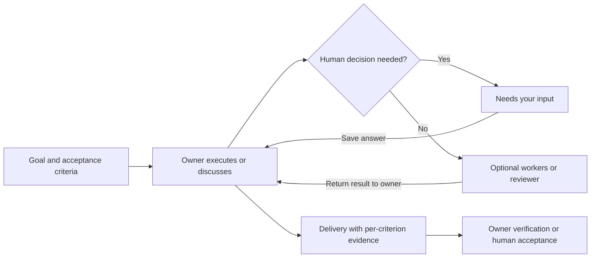

# Project tasks

[简体中文](TASKS.zh-CN.md) · [README](../README.md) · [API](API.md)

Projects open on Tasks. A task retains its goal, acceptance criteria, owner, human decisions and deliveries independently of native execution sessions. Completing one native turn does not complete the project task.

## Starting and continuing

Open **Projects → Tasks → New task**. Provide a goal, one acceptance criterion per line and an owner on the project's device. Select Execute, Discuss first or Save draft.

| Action | Behavior |
| --- | --- |
| Execute | Uses the owner's permission settings. Implementation needs explicit verification evidence. |
| Discuss first | Uses a separate planning conversation. Codex uses its read-only sandbox; Claude Code uses plan mode. No implementation delegation or final delivery. ACP requires an advertised plan/read-only mode, otherwise no prompt is sent. Pi currently cannot discuss or independently review. |
| Save note | Records input without starting a model or interrupting the current turn. |

Enter sends, Shift+Enter inserts a newline, and IME composition does not send. Input queues by default while work runs. Codex can **Adjust now** once it advertises an active turn ID. Delivery is tied to that turn and reports accepted, rejected or unknown; failure never silently queues or resends it. Other services support queueing or pausing and continuing.

Execution opens for active work and collapses after the turn, leaving the discussion result, progress report or delivery visible. Hidden execution unsubscribes from its event stream; users can reopen history at any time.

**Create task from conversation** copies a bounded reference from an everyday or same-project conversation into fresh task sessions. It does not move or rewrite the source conversation or its files. Cross-project imports are refused. Import covers at most the latest 20 turns; the source keeps its full history.

## Decisions, collaboration and acceptance

An Agent uses `task_ask` and finishes its turn when it needs a human decision. Questions appear in the project's **Needs your input** list. Answers are durable; once every question is answered, the owner continues. Open questions prevent queued turns from starting. Answering a paused or interrupted task does not restart it.

The owner handles small work directly or delegates bounded work to project members. Only the current owner can call `message_send` in a project task. Workers and reviewers use task-specific conversations and return results to the owner; workers cannot fan out further. Existing non-task collaboration remains in **Dispatch history**.

| Acceptance gate | Requirement |
| --- | --- |
| Current requirements | Delivery must match the current revision. New execution input or edited requirements invalidate the previous delivery. |
| Evidence | `task_deliver` covers every criterion exactly once with passed, failed or unverified status and evidence. All checks must pass. |
| Settlement | Runs, delegated results and open questions must settle. |
| Independent review | When required, another Agent must submit `task_review: approved` for the current revision. Changes requested, unverified reports or later delegated changes prevent acceptance. |
| Policy | The default accepts after owner verification; human acceptance instead waits for **Accept delivery**. |

Review and verification evidence are Agent reports. State checks do not replace tests or human judgment. An owner that edits files after review must request another review; AgentDock does not prove that arbitrary external file changes have been reviewed.

## Pause, recovery and storage

**Pause task** stops its active and queued work. **Continue task** can retain or replace the owner and creates a fresh native session with saved goals, decisions, reports and workspace locations. Recovery checks local or remote native process locks. An uncertain SSH response cannot authorize replacement execution. Failures, lost connections and app restarts do not automatically replay unfinished work. Recovery prompts require inspection of existing results and unknown side effects first.

Cancelled or completed tasks can reopen or archive. Archive preserves deliveries and files. Task conversations cannot be deleted while the task is open. Deleting a closed task's conversation removes its private session storage but keeps durable decisions, deliveries and final reports. Reassign or close an owner's tasks before deleting that Agent.

| Working files | Location and scheduling |
| --- | --- |
| Shared project directory, default | Private native histories; overlapping directories run sequentially. |
| Isolated Git worktrees | Requires a clean repository root. A task pins one starting commit and creates worktrees for the owner and workers. The owner integrates worker commits; the reviewer inspects the owner's workspace in read-only mode. |
| Local | Workspaces: `tasks/<task-id>/<agent-id>/workspace` under AgentDock data. Histories: `sessions/<session-id>`. |
| SSH | Corresponding directories under the remote `~/.local/share/agentdock/ssh/controllers/<controller-id>/`; remote project files are not created locally. |

Worktrees are not an additional OS sandbox. Files are never automatically merged, cleaned or published. Archiving or deleting a conversation retains task worktrees to protect unmerged results. Account, proxy and CLI configuration reuse keeps the existing native-history isolation behavior.

## Implementation and validation

`task_store.py` persists work and audit records; `task_runtime.py` reuses the dispatcher; `task_workspace.py` manages optional worktrees; `execution_lease.py` prevents overlapping replacement of native sessions. Context uses bounded summaries. Agents can retrieve complete durable records through paginated `task_history` and final reports through `task_result` (stored final text retains the last 120,000 UTF-8 bytes per run, including an explicit truncation marker when shortened).

Automated checks cover lifecycle, decision recovery, project boundaries, input idempotency, the native MCP question—review—delivery chain, Codex steering receipts, private SSH execution, process leases, worktree protection and UI interactions. Real-model behavior and long-running operation of the new task workflow still require live acceptance; fixtures do not establish compatibility with every CLI version.
