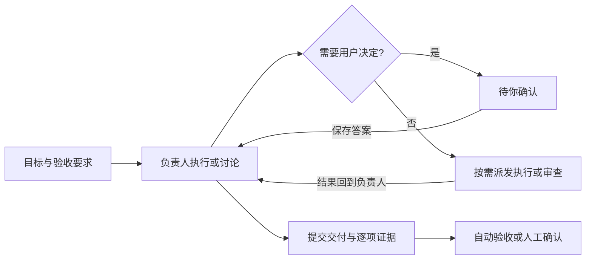

# 项目任务

[English](TASKS.md) · [返回首页](../README.zh-CN.md) · [接口](API.zh-CN.md)

项目以任务为入口。每项任务保存目标、验收要求、负责人、用户决定和交付记录；原生会话负责执行其中的轮次。原生轮次结束不会直接将项目任务标为完成。

## 创建与继续

进入 **项目 → 任务 → 新建任务**，填写目标、每行一项的验收要求和负责人。负责人必须属于当前项目，使用项目所在设备。默认直接执行，也可以先讨论或仅保存任务。

| 处理方式 | 行为 |
| --- | --- |
| 直接执行 | 沿用负责人权限设置，允许执行工作；结果需逐项验证。 |
| 先讨论 | 使用单独的规划会话。Codex 采用只读沙箱，Claude Code 采用 plan 模式；不派发实施任务或提交交付。ACP 服务需公布 plan/read-only 模式，否则在发送提示前停止。Pi 当前不能用于讨论或独立审查。 |
| 仅记录 | 保存补充信息，不启动模型，不中断当前轮次。 |

输入框支持 Enter 发送、Shift+Enter 换行，并保护输入法选字。运行中默认排队；Codex 提供活动轮次标识后，可以选择 **立即调整**。即时调整只作用于指定轮次，显示已送达、未送达或送达待核实；失败不会自动改成排队或重复提交。其他服务使用排队或暂停后接续。

任务执行时可以展开实时过程，收起后停止订阅该会话的事件流。轮次结束收起过程，保留讨论结果、当前进展或交付结果；仍可手动展开历史。

日常或同项目对话可通过 **转为项目任务**复制参考上下文，创建新的任务会话。原对话及工作目录不迁移；跨项目对话不能直接转入另一项目。来源摘要最多包含最近 20 轮，原对话保留完整历史。

## 问题、协作与验收

Agent 使用 `task_ask` 保存需要确认的问题后结束本轮。项目首页集中展示 **待你确认**；答案成为持久决定，所有问题回答后继续负责人。未答问题会阻止队列启动下一轮。暂停或中断期间保存的答案不会自动启动执行。

负责人可自行处理小任务，或选择同项目成员分派有限范围的工作。任务中的 `message_send` 只允许当前负责人调用；执行者与审查者使用专属会话，结果返回同一负责人。执行者不能继续扩散派工。原有非任务会话的协作能力保留在 **派工记录**。

| 验收条件 | 要求 |
| --- | --- |
| 最新要求 | 交付必须对应当前任务版本；补充执行要求或编辑目标、验收项会使旧交付失效。 |
| 逐项证据 | `task_deliver` 必须覆盖每条验收要求，记录通过、失败或未验证及证据；全部通过才可验收。 |
| 协作收尾 | 所有运行、队友结果和待答问题均需结束。 |
| 独立审查 | 勾选时，另一位 Agent 必须对当前要求提交 `task_review: approved`；未验证、要求修改或更新后的协作修改会阻止验收。 |
| 完成方式 | 默认由负责人验证后完成；可选 **验证后由我确认**，由用户点击验收。 |

审查结论和验收证据是 Agent 提交的报告，系统校验记录与状态，不代替代码测试或人工判断。负责人在审查后继续修改文件，应重新安排审查；系统不能证明任意外部文件修改均已审查。

## 暂停、恢复与存储

**暂停任务**会停止当前运行及排队的协作。**接续任务**可沿用负责人或换人，创建新原生会话，并带入已有目标、决定、报告及工作区位置。恢复前检查旧本机或远端执行锁；SSH 结果不确定时拒绝启动新任务。断线、失败或应用重启均不会自动重放未结束工作。恢复提示要求先核对已有结果和结果未知的操作。

**取消任务**结束执行；取消或完成后可重新打开，也可归档。归档保留交付及文件。未关闭任务的执行会话不可删除；已关闭任务的会话可以清理，其任务决定、交付及最终报告仍保留。删除负责人前需转交或关闭其任务。

| 工作文件 | 存储与调度 |
| --- | --- |
| 共用项目目录（默认） | 会话历史独立；目录重叠的运行串行。 |
| 独立 Git 工作区 | 源项目必须是干净的 Git 根目录。按任务固定起点，为负责人和执行成员创建独立 worktree；负责人整合成员提交。审查者以只读模式查看负责人工作区。 |
| 本机 | 任务工作区在 AgentDock 数据目录的 `tasks/<task-id>/<agent-id>/workspace`，会话记录在 `sessions/<session-id>`。 |
| SSH | 对应目录位于远端 `~/.local/share/agentdock/ssh/controllers/<controller-id>/` 下，不在本机创建远端工作文件。 |

worktree 不是额外系统沙箱，目录不会自动合并、清理或发布。归档与会话删除均保留任务工作区，避免删除尚未合入项目的成果。账号、代理与 CLI 配置仍按已有隔离机制复用，不修改原生客户端的会话归属。

## 实现与验证边界

`task_store.py` 保存任务及审计记录，`task_runtime.py` 复用执行队列，`task_workspace.py` 管理可选 worktree，`execution_lease.py` 防止旧进程未退出时重新占用会话。上下文采用有界摘要，Agent 可通过 `task_history` 分页读取完整持久记录，通过 `task_result` 读取最终报告（每轮保存上限 64,000 字符）。

自动验证覆盖任务生命周期、问题恢复、跨项目拒绝、幂等输入、原生 MCP 提问—审查—交付链路、Codex 调整回执、SSH 私有执行、进程锁和工作区保护，以及页面交互。新增任务流程的真实模型效果与长时间运行表现仍需实机验收；模拟测试不代表所有 CLI 版本均已实测。
