# User guide

[Quick start](../README.md) · [Experimental integrations](EXPERIMENTS.md)

## Workspace

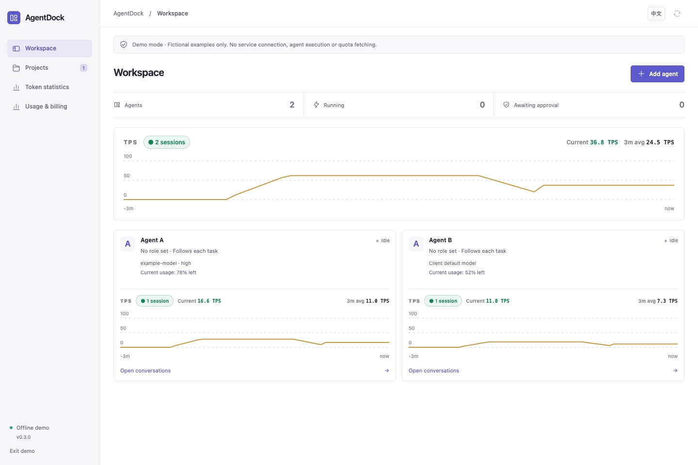

*Actual interface capture in offline demo mode. All projects, conversations, and usage readings shown are fictional. Agent A/B are example names with no preset roles; users define their names and responsibilities.*

Open **Projects** in the sidebar to create or select a project, then start in **Tasks**, or switch to **Agents / Memory**. Project memory is shared within that project. Independent agents remain available directly from Workspace.

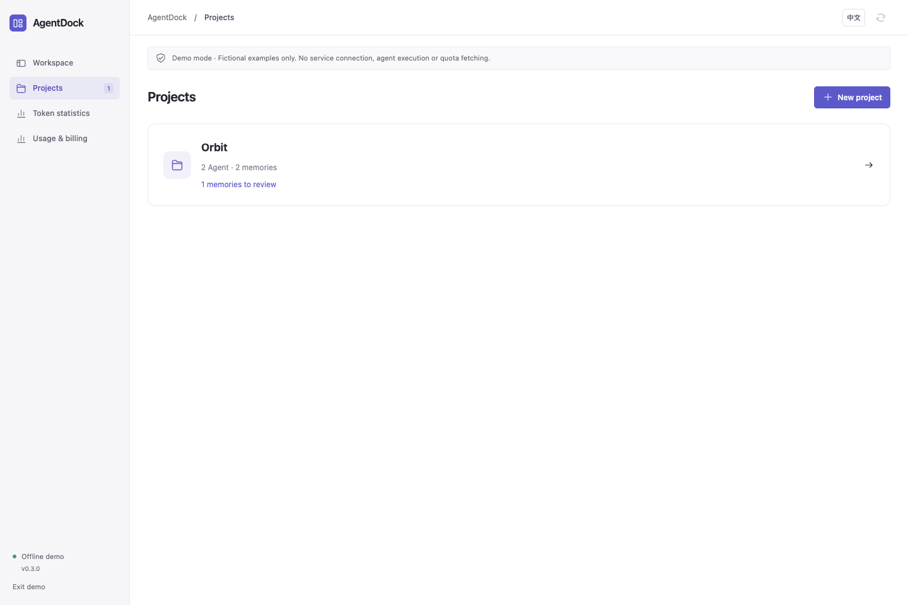

**One agent, multiple projects:** configure an agent in Workspace, then open **Projects → Agents → Add agent**, select it and set its project name and role. The same Codex can be `cr` in project A and `coding` in project B. Device, account policy, model, effort and permission defaults are copied when added; later edits stay independent. Conversations and project memory remain separate. Same-device members use the target project directory; cross-device members require an explicit directory on the agent's device. Existing everyday conversations are preserved. Project TPS includes only that project's members.

**Conversations** brings project and everyday chats into one sidebar entry. Search by title, agent or project, and filter by project or **Everyday chats**. The robot button filters by one or more agents, the timer shows only conversations active in the last 24 hours, and the layers button groups by agent. Click again to close the filter panel or turn a mode off. Filters combine, and conversations in each group follow recent activity. Identically named agents, project members and everyday agents remain separate; filtering keeps the open conversation and its draft. Select a conversation to follow progress, read the final reply or send another message. **New conversation** selects an everyday or project agent.

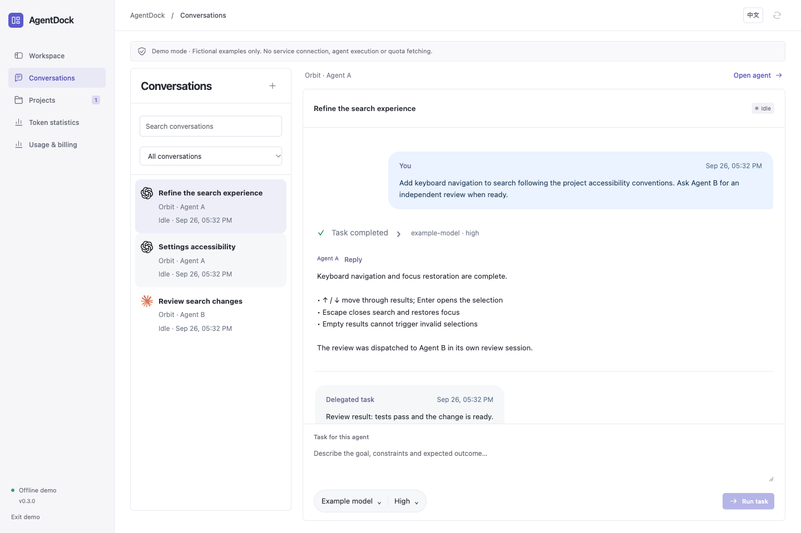

Configuration and context are isolated; using the same CLI account still shares provider quota. Tasks targeting overlapping directories remain serialized. Project separation is not an additional OS sandbox.

<details>
<summary>Role configuration, task handoffs, and usage monitoring</summary>

**Custom roles:** select an agent and choose **Agent settings** to change its name, describe its responsibilities, or clear the role. Provider selection is independent of the role.

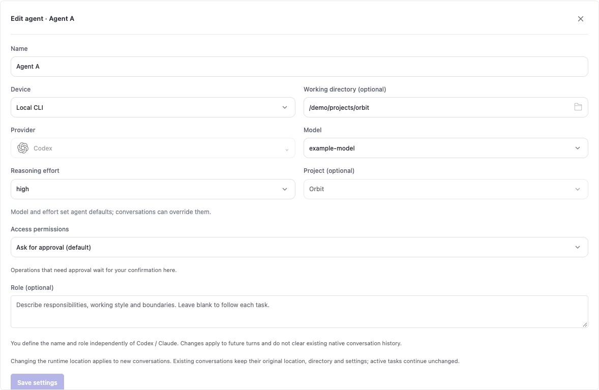

**Projects → Tasks:** retain goals, acceptance criteria and owners; answer pending decisions, coordinate optional workers/reviewers and inspect delivery evidence. Expand execution to follow progress.

**Dispatch history:** retains existing conversation handoffs and returned results.

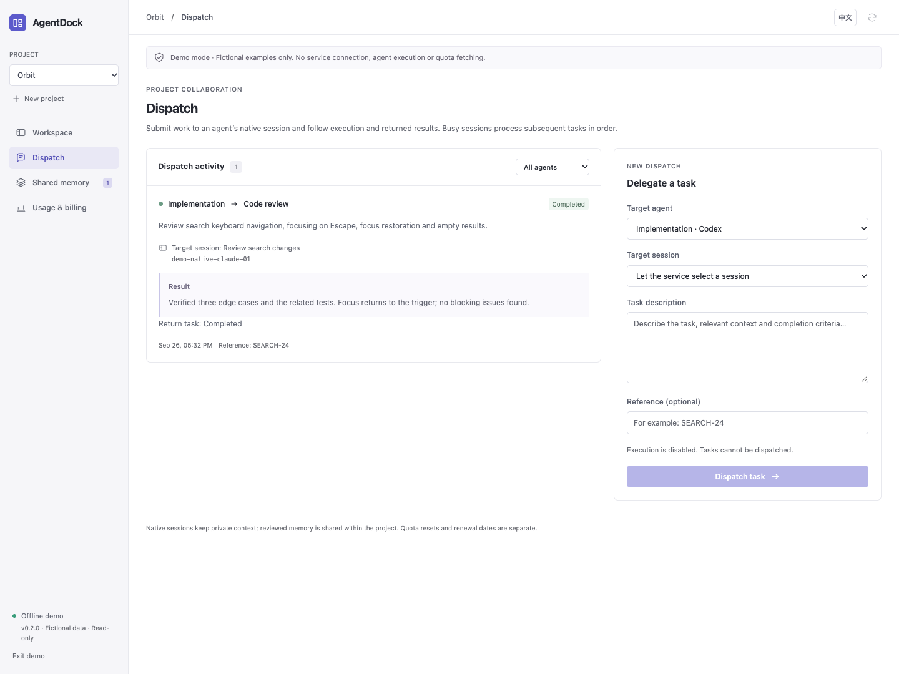

**Projects → Memory:** review and search knowledge shared within the selected project.

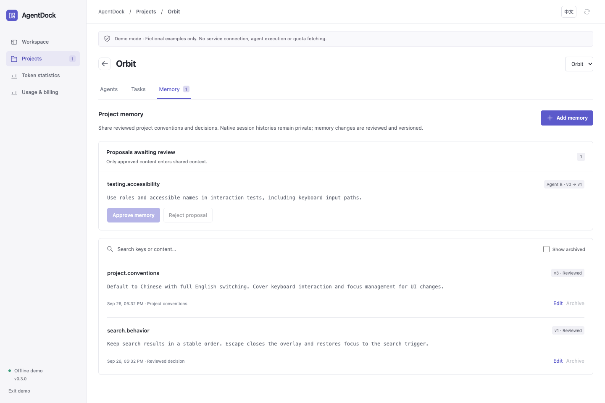

**Usage:** view quota windows for configured agents and reset times separately from subscription renewal records. These are fictional demo readings.

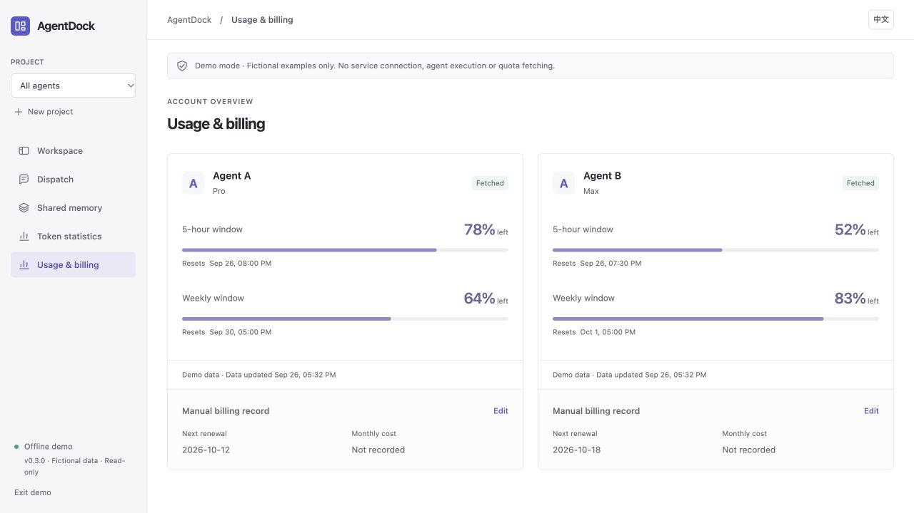

</details>

## Features

| Capability | What it does |
| --- | --- |
| Local and SSH connections | Choose a local CLI, reuse an SSH connection or configure a new one while adding an agent. Everyday views use custom names; sessions and quotas remain scoped to their actual connection. |
| Subscription accounts | Manage multiple Codex and Claude Code subscriptions on local or SSH devices. Choose a fixed account or automatic initial selection; guarded failover requires its separate experimental switch; see per-account quota, login status and measured tokens. |
| Independent agents | Create, choose a workspace, chat and resume without a project. Discover models and reasoning efforts from the selected environment. |
| TPS & tokens | Total and per-agent output throughput over three minutes. A dedicated page shows input, output and cache counters for registered agents’ conversations, deduplicated by native identity. |
| Custom roles | Define agent names and responsibilities independently of the provider, then edit or clear roles at any time. |
| Native conversations | Connects ten CLI services through native or ACP transports, retaining the native session ID for continuation. Shows live progress, tool execution, final replies and permission requests according to CLI capabilities. |
| Project tasks | Durable goals independent of native sessions: notes, discussion, execution, queued/steered input, decisions, owner recovery, independent review, acceptance and archive. Shared files by default, optional Git worktrees. |
| Task handoffs | Sends work to a named agent and conversation. Busy workspaces queue automatically; completed or failed tasks return their result to the requesting conversation. Tracks execution, deduplication, cancellation, and return runs. |
| Project memory | Keeps project knowledge separate from private conversations. Supports source attribution, versions, keyword search, reviewed agent proposals, and archive history. |
| Usage & subscriptions | Remaining quotas and reset times follow configured agents, with automatic updates and stale/error states. Renewal dates and subscription costs are recorded separately. |
| Local workbench | Compact project navigation, conversation and execution panels, Chinese/English switching, and a read-only demo that makes no API requests. |
| macOS menu bar | A persistent entry for opening the workbench, viewing remaining quotas and reset times by agent name, and quitting. Language follows the workbench. |

## macOS application

Requires macOS 14+, Python 3.11+, Node.js 20.19+, and Apple Command Line Tools. From the repository directory:

```bash
python3 scripts/install-macos.py
```

The installer creates `~/Applications/AgentDock.app`. Open it to connect without copying an access token. Its stacked-layers icon in the menu bar opens usage summaries and the workbench. Closing the main window hides it while the app and active tasks keep running. Choose **Quit AgentDock** or press `⌘Q` to stop the local service and active tasks. History and configuration remain in `~/.local/share/agentdock`.

The app enables execution, but agents run only after a task is submitted. Opening **Usage & billing** refreshes the providers of configured agents automatically. With no agents, that page stays empty and performs no device-login quota probes. Managed account refreshes are handled separately on Accounts. The local service also refreshes every 10 minutes, including while the main window is hidden. The menu displays these shared readings without a separate refresh action. The menu and workbench share the Chinese/English setting, and the desktop app remembers your selection.

For **Use device login**, Claude quota reads use only the snapshot saved by Claude Desktop, without Keychain or credential access. **Data updated** shows the source sample time; rereading the file does not advance it. The current format has no reset timestamps, so resets remain unknown. Signing into Claude Code alone does not guarantee a Desktop snapshot exists. Codex queries its local App Server, which handles its own authentication.

To migrate AgentMeter billing records, run `python3 scripts/install-macos.py --import-agentmeter`. Migration backs up the original preferences, preserves existing AgentDock records, and does not change provider logins or remove the old app.

To update, quit the app, run `git pull --ff-only`, and rerun the installer. Configuration and history are preserved; legacy databases are backed up before the 0.3 migration, and the previous app is saved under the data directory's `backups`. Builds are locally compiled and ad-hoc signed, not Apple-notarized.

## Getting started

Requires macOS or Linux, Python 3.11+, Node.js 20.19+, and npm. Execution also requires a compatible, separately installed [agent CLI or ACP adapter](PROVIDERS.md) with authentication configured on its device. The Mac application includes the usage reader; AgentMeter is not required. Linux quota reads require a separately configured compatible helper.

```bash
git clone https://github.com/NginxL/AgentDock.git
cd AgentDock
npm --prefix web ci --ignore-scripts
npm --prefix web run build
cp config.example.json config.local.json
python3 -m agentdock --config config.local.json
```

Open the printed loopback URL and enter the access token from the printed local file path. The service chooses an available loopback port; `--port 47831` explicitly requests a fixed port. The token is held only in UI memory, never in a URL or browser local storage. To explore fictional data, append `?demo=1`; demo mode has no execution or network actions.

The workbench starts in **review mode**. Creating projects and viewing saved state do not launch agents or fetch quotas. Enable execution explicitly when ready:

```bash
python3 -m agentdock --config config.local.json --enable-execution
```

Choose **Workspace → Add agent**, select a provider and enter a name. Under **Device**, choose **Local CLI**, **New SSH / Devbox connection…**, or a connection you saved. New SSH addresses start empty: enter your own `user@hostname` or SSH Host alias. Editing a saved address creates or reuses a connection without changing conversations on the original one. The folder button browses directories on the selected device. SSH workspace files and native histories stay on the remote host; local CLI workspaces stay on this Mac. Leaving the directory blank creates a private directory for each conversation on its device. Workbench configuration, messages and usage records remain in the local database. Associate a project when you need shared memory or task handoffs.

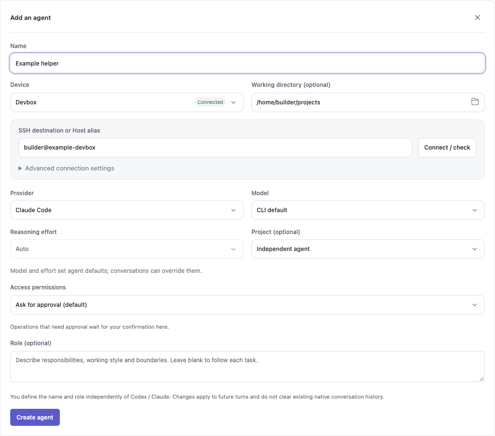

After enabling additional ACP agents in Accounts → Experimental features, the provider menu includes **Codex, Claude Code, Trae CLI, Pi, Cursor CLI, Antigravity, Grok Build, OpenCode, Gemini CLI and Qwen Code**, with bundled icons and availability on the selected device. Missing CLIs or adapters appear disabled. Pi requires `pi-acp` and explicit full access; Antigravity requires its ACP server. [Compatibility and setup](PROVIDERS.md) describes authentication, continuation, MCP and usage limits.

**Multiple subscriptions:** open **Accounts → Add account**, choose the service/device and complete official CLI authorization. Managed AgentDock conversations keep their own login and history. Codex and opt-in Claude quota reads use the account's own credentials; Claude inherits existing CLI networking. **Native clients**, enabled separately in Accounts → Experimental features, offers explicit save, switch and recovery for Codex CLI/macOS, Claude Code CLI and Claude macOS. Register each native login once; real switching is pending user acceptance. No proxy configuration is added or changed. See [account setup, switching and isolation](ACCOUNTS.md).

Names remain user-defined, without automatic device labels. Two agents can share a provider and even a name; their conversations remain bound to distinct identifiers. Multiple agents can reuse a connection; the device-login quota card groups their names, while managed subscription readings are shown per account. Official quota reads and measured token/TPS statistics currently cover Codex and Claude; ACP context occupancy is not counted as token consumption.

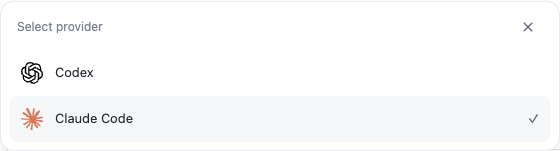

Click an **agent card** to open its dedicated conversation page. Switch or create conversations on the left, follow messages and execution details on the right, and compose messages at the bottom. Use the header to return to the agent list, open settings or delete the agent. Browser back and forward are supported. Moving between the list and conversation pages preserves each agent’s selected conversation and unsent drafts; drafts stay only in the current page’s memory.

Create a conversation and send a message to your agent. **Enter** sends; **Shift + Enter** inserts a new line. Confirming text with an input method does not send the draft. Your messages appear in right-aligned bubbles, with the agent's final reply on the left. Thinking summaries, progress and tool output expand automatically while awaiting the reply. When the final reply arrives, the process collapses and the reply remains separate. Click the task status to reopen or close the process; live updates preserve your manual choice. Failed, cancelled and approval-waiting tasks have distinct states. The process panel contains only what the CLI publishes; it does not generate additional reasoning.

Conversations stream execution progress and replies, reconnecting and catching up after brief interruptions. Model lists are preloaded for configured agents.

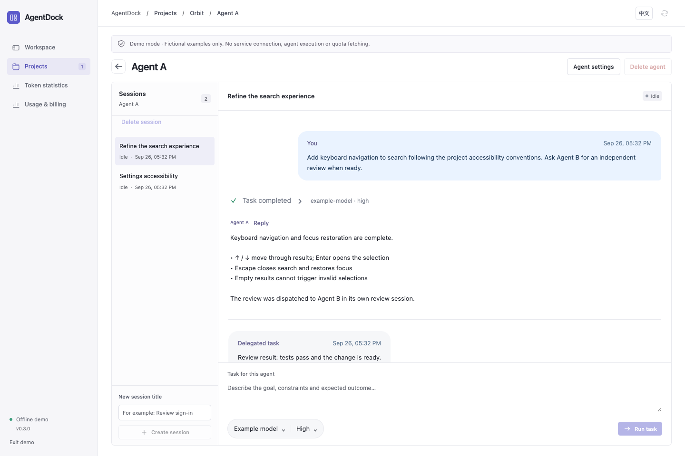

Click **Model** or **Reasoning effort** below the conversation input to choose from the conversation's original runtime location. Changes apply to future messages in this conversation. Submitted and queued messages retain their original choices. Changing models resets effort to Auto; **Use agent defaults** restores inheritance.

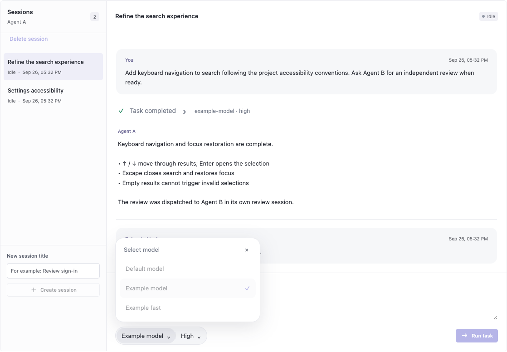

**Agent settings** lets you change the name, role, default model, effort and **Device** location. To switch between a local CLI and Devbox, select the new location and save; there is no need to delete the agent. New conversations use the new location and its working directory. Existing conversations keep their original location, native history, directory, model defaults and permissions; queued and active tasks continue unchanged. A conversation on the previous location uses **Use conversation defaults** to reset model overrides. Its original connection must remain available to continue or clean up a conversation that has run.

Each task shows the model identifier and reasoning effort reported by the CLI. An assistant’s self-description is not used as configuration evidence.

Each conversation has private Codex / Claude Code history, runtime state and caches, separate from the original client’s session list. Automatic working directories are also per conversation; explicitly selected project directories remain shared. In the agent page or **Conversations** list, hover over a conversation and click its **×**, then confirm to remove its records, private directory and SSH run files. The **×** also appears on keyboard focus and stays visible on touch devices. Stop active tasks first. Shared projects, native logins and other conversations are kept.

To remove a configured agent, open its card and choose **Delete agent** beside **Agent settings** at the top of its conversation page. Check the agent name and conversation count before confirming. This removes its conversations and private files while preserving shared project files, shared memory, native CLI settings and other agents. Unfinished tasks block deletion. Remote conversations that have never run can be deleted without SSH; existing remote records must be cleaned up before the conversation is removed from the list. App upgrades automatically prepare the cleanup runtime, and connection failures keep the records available for retry.

Choose **Access permissions** when adding an agent or opening **Agent settings**. Each local or SSH agent has its own setting:

| Access permissions | Behavior |
| --- | --- |
| Ask for approval (default) | Keep controlled execution; operations requiring approval wait in the workbench. Existing agents without a saved permission setting use this default. |
| Full access | Disable routine CLI permission prompts for file changes, commands and network access in the selected environment. System account and organization policies still apply. |

Permission changes apply to future messages in conversations still inheriting agent defaults. Conversations retained during a location change keep their original permissions. Changing permissions at the same location requires queued and active tasks to finish; switching location can set separate permissions for new conversations.

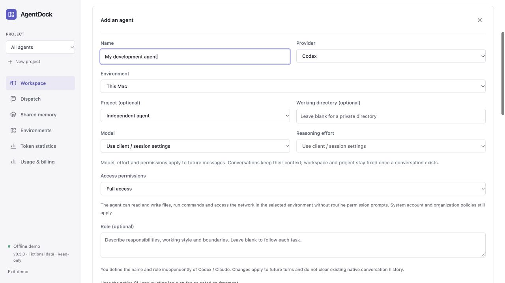

Teammate dispatches and result-return turns execute while execution is enabled; project settings can require human approval before delegation. When a usage helper is configured, quotas refresh every 10 minutes and whenever you select **Usage & billing**. The first scheduled refresh occurs 10 minutes after service startup.

Click an add, settings or edit button again to collapse its panel, or use × to close it. Collapsing execution details keeps the task running and leaves the final reply visible.

## SSH environments

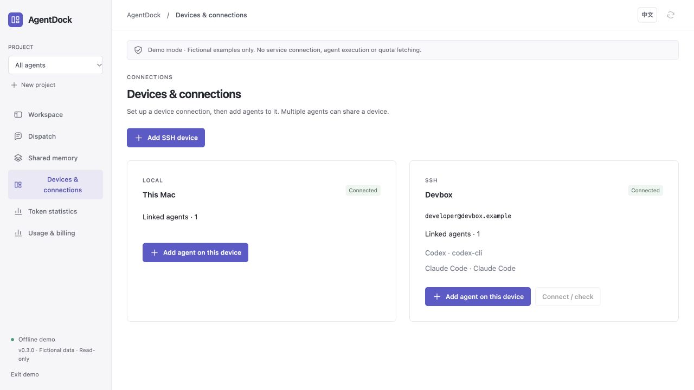

Open **Workspace → Add agent → Device → New SSH / Devbox connection…**, enter a system SSH Host alias or `user@host`, and choose **Connect and use**. **Advanced connection settings** lets you specify the remote Python command. The remote host needs Python 3.11+ and an installed, authenticated agent CLI. AgentDock installs its runner under the remote user's private data directory; it does not install a system service or export local credentials.

After connecting, choose the model, role and permissions, then select **Create agent**. Other agents can reuse the saved connection. **Agent settings** shows connection details and offers **Connect / check** after creation. Progress can stay collapsed or be expanded while the task runs; the final reply appears separately. Brief network interruptions resume from the last event cursor. Cancellation and a 90-second lease stop owned remote tasks when the controller disappears. See [SSH setup and recovery](SSH.md).

## Tokens and throughput

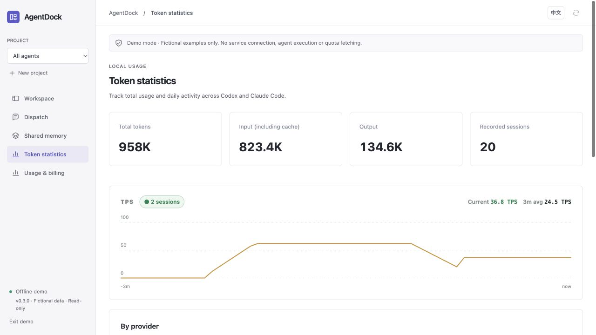

Token statistics include only native conversations linked to registered agents. Total, provider, per-agent, TPS and daily activity views use the same scope. The index stores counters, timestamps and deduplication identifiers, not external conversation text. It reads each AgentDock conversation’s private records and still recognizes bound legacy transcripts during upgrades. Values use K (thousand), M (million) and B (billion), with up to two decimals; hover for the exact count. Missing, damaged or unsupported history can make totals incomplete. These counters are not a provider bill. Cache counts are a subset of input, not extra tokens.

**Daily activity** shows a calendar heatmap for the last year, six months or three months. Darker squares indicate higher daily token usage. Hover over a square to see its date and count.

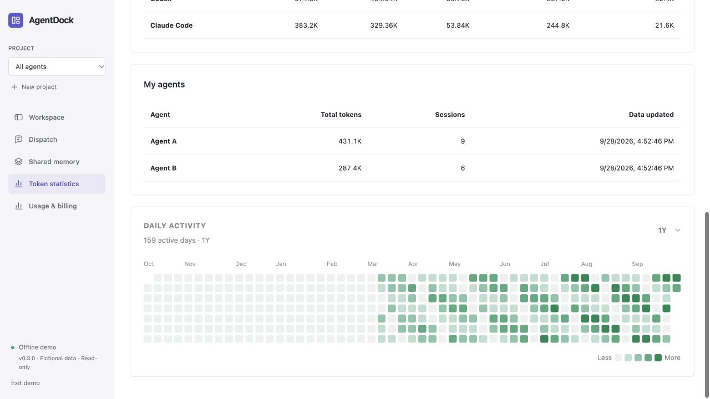

TPS uses reported output-token increments over their measured intervals, including waiting and tool time. Current TPS is a 15-second average; the three-minute average includes idle time. Batched client reporting can delay the chart. Active tasks without a valid sample show “—”; idle activity shows 0. Unlinked local conversations are excluded; adding an agent does not import a provider’s entire history.

## Configuration

[`config.example.json`](../config.example.json) contains the complete public configuration surface:

```json
{
  "commands": {
    "codex": ["codex", "app-server"],
    "claude": ["claude"]
  },
  "quota_command": ["/absolute/path/to/AgentDockUsage"]
}
```

Use absolute executable paths if the CLIs are not on the server's `PATH`. Keep machine-specific configuration in the ignored `config.local.json`. Provider commands cannot be supplied by the UI or an agent.

AgentDock uses Codex App Server, the Claude CLI's bidirectional JSON stream, and ACP v1 for the other registered services. Tasks use the selected managed subscription profile, or the original CLI configuration with Use device login. The device-login usage helper does not read Claude credentials; managed accounts use native CLI account operations. Authentication, model selection, account eligibility, and charges remain with the native CLI and its configured provider. Reading a quota does not itself authorize execution. See [compatibility and validation](PROVIDERS.md).

## How collaboration works

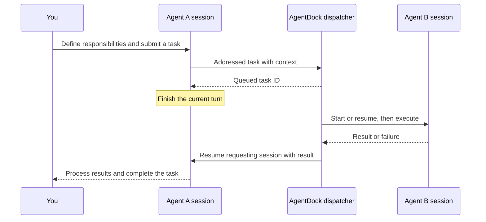

Sessions sharing a managed account, belonging to the same agent, or using equal/overlapping working directories execute sequentially. Independent workspaces can run in parallel. A collaboration chain is bounded to 16 runs and three delegation levels. Cancelling a task also cancels its descendants. Application restart marks unfinished work interrupted and does not replay it automatically.

## Data and boundaries

State is stored in `~/.local/share/agentdock`; only one instance can own the database. History, task records, and shared memory are local. Running an agent sends task context to its configured model service; quota refresh may contact provider services.

This version manages **sessions created by AgentDock**, locally and over SSH. Attaching existing desktop/terminal conversations and multi-user access are not implemented. In Ask for approval mode, provider permission requests appear in the UI; the workbench itself is not an OS sandbox. Credentials stay on the selected device, and per-run MCP tokens expire and are revoked after execution.

Remote token statistics use usage events from AgentDock-managed runs, without scanning unrelated remote history. Device-login quotas and billing records stay separated by environment/provider; managed quotas and measured tokens are per account. Remote Codex queries its own App Server. Managed Claude queries its own OAuth usage; device-login limits use native observations. Missing readings remain unknown, never substituted with another device's snapshot.

When upgrading from 0.1, replace ACP commands with the native commands above. Historical messages remain readable as legacy records and are never dispatched automatically. Sessions without a native binding start a new provider conversation; old stored text is not silently replayed as native history.

## Development

```bash
python3 -m unittest discover -s tests -v
python3 -m compileall -q agentdock tests
npm --prefix web test
npm --prefix web run build
```

Tests use temporary stores, fake CLI processes, and fictional UI data. They do not invoke real coding agents or quota services. See [validation](REVIEW.md) for coverage and the remaining live acceptance work. Keep English and Chinese documentation aligned, and include sanitized reproduction steps when reporting bugs.

## License

[MIT](../LICENSE). External CLIs are separately installed programs with their own licenses and service terms. See [notices](../NOTICE.md).

---

**English** · [简体中文](USER_GUIDE.zh-CN.md)
