# 使用指南

[快速开始](../README.zh-CN.md) · [实验功能与边界](EXPERIMENTS.md)

账号页的实验功能开关分别控制自动换号、本机换号、更多 ACP Agent ，新安装与旧库升级默认均关闭。项目可要求派工前人工确认。

## 工作台

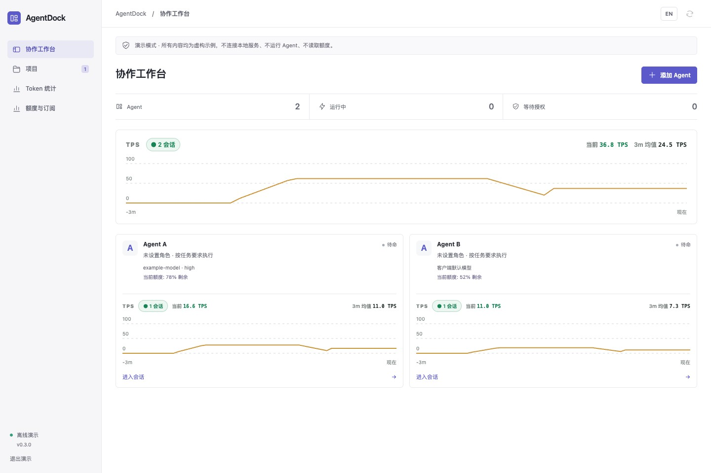

*离线演示模式下的实际界面截图。图中的项目、对话和额度均为虚构数据。Agent A／B 为示例名称，未预设角色；名称与职责由用户定义。*

侧栏的 **项目**统一管理项目协作。选择项目后默认进入 **任务**，也可切换到 **Agent / 记忆**；项目记忆可由该项目的 Agent 复用。创建或切换项目都在此入口完成，独立 Agent 可直接在工作台使用。

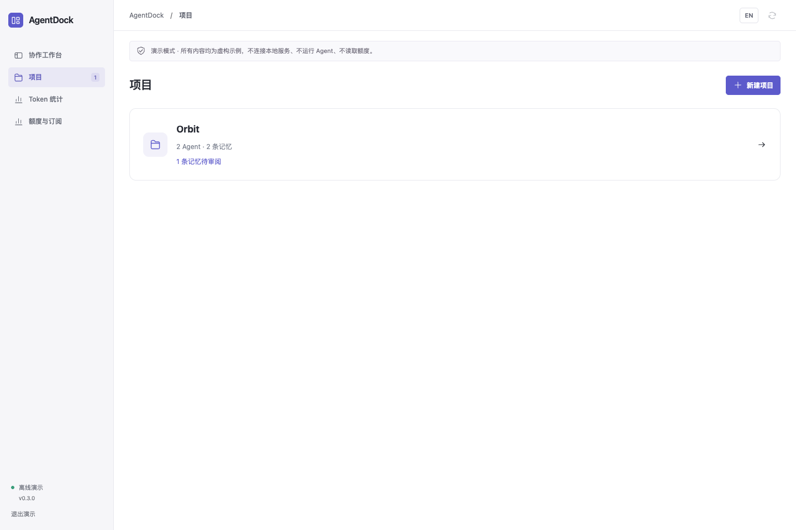

**同一 Agent，多个项目：**在工作台配置 Agent 后，进入 **项目 → Agent → 添加 Agent**，选择已有 Agent，设置项目内名称和职责。例如同一 Codex 在 A 项目叫 `cr`，在 B 项目叫 `coding`。加入时复制设备、账号策略、模型、思考强度及权限默认值；以后各自修改，互不联动。会话和项目记忆分别保存，同设备默认使用目标项目目录；跨设备需填写该项目在 Agent 设备上的目录。日常独立会话原样保留。项目 TPS 只汇总该项目成员。

**对话：**侧栏集中展示各项目及日常会话，可搜索标题、Agent 或项目，并按项目或“日常对话”筛选。顶部机器人按钮可筛选一个或多个 Agent，时钟按钮仅显示最近 24 小时活跃的对话，图层按钮按 Agent 分组；再次点击可关闭筛选面板或取消对应模式。筛选条件可叠加，分组内按最近活动排序。同名 Agent、项目成员和日常 Agent 分别显示，筛选不会关闭正在阅读的会话或清空草稿。点选会话可查看实时进度、最终回复并继续发送消息；“新建对话”选择日常或具体项目及对应 Agent。

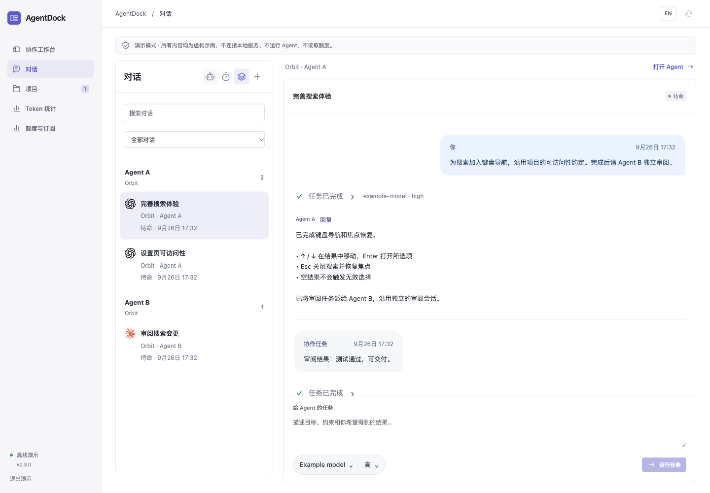

隔离的是配置和会话上下文；复用同一 CLI 账号仍共用服务商额度。指向同一目录的任务保持串行，项目隔离不是额外的系统沙箱。

<details>
<summary>查看角色配置、任务派工与额度界面</summary>

**自定义角色：**选择 Agent 后点击“Agent 设置”，修改名称、职责或清空角色说明。服务选择与角色定义独立。

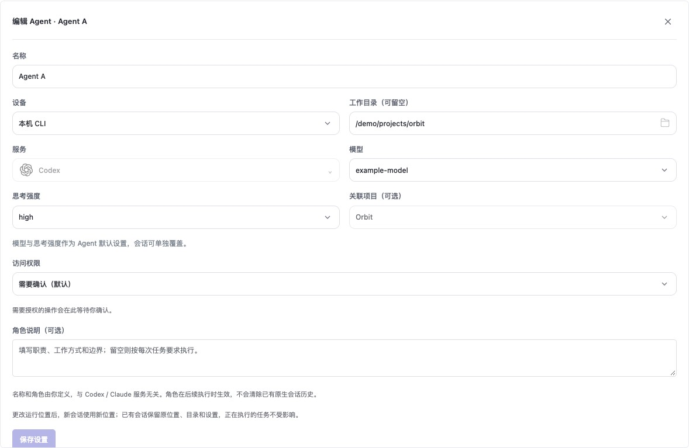

**项目 → 任务：**保存目标、验收要求和负责人；集中处理待确认问题，按需分工审查，查看交付及逐项验证证据。运行过程可展开查看。

**派工记录：**保留原有会话的派工与结果回传。

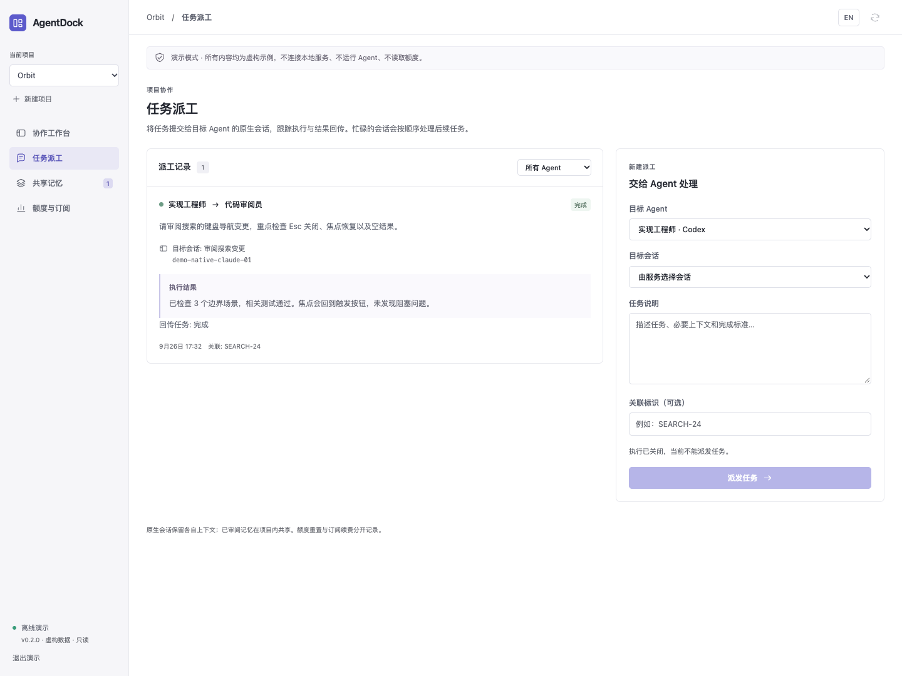

**项目 → 记忆：**管理已确认的项目约定与结论，并审阅 Agent 提出的更新。

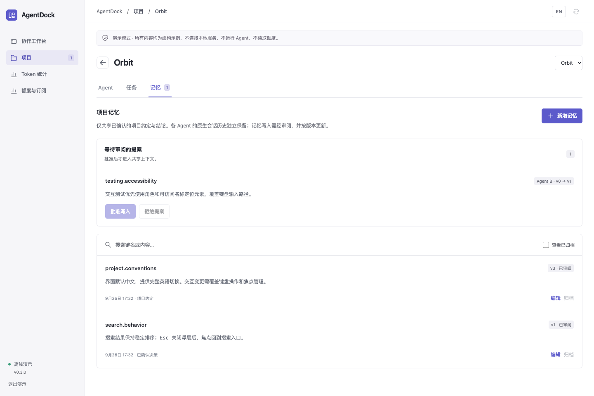

**额度与订阅：**展示已配置 Agent 的额度窗口及重置时间，订阅续费记录单独呈现。图中数值均为虚构演示数据。

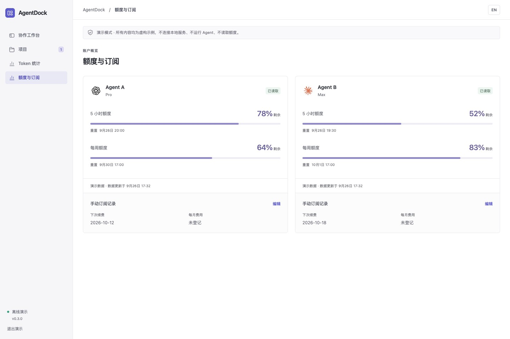

</details>

## 功能

| 能力 | 说明 |
| --- | --- |
| 本机与 SSH 连接 | 在添加 Agent 时选择本机 CLI、已有 SSH 连接或配置新连接；日常界面使用自定义名称，会话与额度按实际连接区分。 |
| 订阅账号 | 管理本机或 SSH 设备上的多个 Codex、Claude Code 订阅；支持固定账号、首次自动选择及受控切换，分别查看额度、登录状态与实测 Token。 |
| 独立 Agent | 无需项目即可创建、指定工作目录、聊天与续接上下文；模型和思考强度从所选环境发现。 |
| TPS 与 Token | 总计及每个 Agent 的三分钟输出吞吐曲线；单独页面查看已配置 Agent 关联会话的累计 Token、输入、输出和缓存明细，按原生标识去重。 |
| 自定义角色 | 独立于服务定义 Agent 名称和职责，支持创建后编辑或清空角色。 |
| 原生会话 | 通过原生或 ACP 协议连接十种 CLI 服务，保存原生会话 ID 用于续聊；按 CLI 能力展示实时进展、工具执行、最终回复和权限请求。 |
| 项目任务 | 任务与执行会话分开保存；支持记录、讨论、执行、补充输入、待确认问题、负责人交接、独立审查、验收和归档。默认共用项目目录，可选独立 Git 工作区。 |
| 任务交接 | 向指定智能体和会话派工；工作目录繁忙时自动排队，任务完成或失败后将结果送回发起会话；记录执行、去重、取消与回传任务。 |
| 项目记忆 | 项目知识与私有对话分开管理；支持来源、版本、关键词检索、智能体提议审核和归档历史。 |
| 额度与订阅 | 额度随已配置 Agent 联动，自动更新剩余额度、重置时间及过期或错误状态；续费日期与订阅费用单独记录。 |
| 本地工作台 | 紧凑项目导航、会话与执行记录面板、中英文切换，以及不发送接口请求的只读演示。 |
| macOS 菜单栏 | 常驻入口可打开工作台、按 Agent 名称查看剩余额度和重置时间，或退出应用；语言跟随工作台。 |

## macOS 应用

需要 macOS 14+、Python 3.11+、Node.js 20.19+ 和 Apple Command Line Tools。在仓库目录运行：

```bash
python3 scripts/install-macos.py
```

应用安装到 `~/Applications/AgentDock.app`。双击打开即可连接本机工作台，无需复制访问令牌。顶部菜单栏显示 AgentDock 的叠层图标，点击可查看额度摘要或打开工作台。关闭主窗口会隐藏窗口，应用与正在运行的任务继续保留；选择“退出 AgentDock”或按 `⌘Q` 才会停止本地服务及正在执行的任务。历史与配置保存在 `~/.local/share/agentdock`。

应用启用任务执行能力，但只有提交任务才会调用 Agent。每次点击“额度与订阅”时，只刷新已配置 Agent 使用的服务；未添加 Agent 时该页显示空状态，不发起设备登录额度查询；托管账号在账号页独立刷新。本地服务运行期间每 10 分钟也会更新一次，主窗口隐藏后仍会继续；这些定时读取仅针对 Codex。菜单直接展示共用数据，无需单独刷新。菜单与工作台共用中英文设置，桌面版会记住语言选择。

Claude 的设备登录和托管账号额度都只来自运行中的 Claude Code。页面显示来源和采样时间，刷新不查询 Claude，也不改变该时间。没有运行数据时显示未知，CLI 没有提供恢复时间时保持未知。升级前保留的数值单独标注；Codex 查询自己的 App Server，认证由 CLI 处理。

从 AgentMeter 迁移订阅记录可运行 `python3 scripts/install-macos.py --import-agentmeter`。迁移会备份原配置、保留已有 AgentDock 记录，不修改提供方登录或删除旧应用。

更新时退出应用，在仓库运行 `git pull --ff-only`，然后重新执行安装命令。配置和历史保留；旧数据库在 0.3 迁移前备份，原应用副本也保存到数据目录的 `backups`。当前安装包在本机构建并临时签名，未经过 Apple 公证。

## 快速开始

需要 macOS 或 Linux、Python 3.11+、Node.js 20.19+ 和 npm。执行任务还需要单独安装兼容的 [Agent CLI 或 ACP 适配器](PROVIDERS.zh-CN.md)，并在对应设备完成认证。Mac 安装版内置额度读取组件，不需要 AgentMeter。Linux 的额度读取需要另外配置兼容的本地查询命令。

```bash
git clone https://github.com/NginxL/AgentDock.git
cd AgentDock
npm --prefix web ci --ignore-scripts
npm --prefix web run build
cp config.example.json config.local.json
python3 -m agentdock --config config.local.json
```

打开终端显示的本机地址，读取终端提示的本地令牌文件并输入令牌。服务自动选择空闲本机端口；可用 `--port 47831` 显式指定固定端口。令牌仅保存在界面内存中，不放入网址或浏览器本地存储。地址加上 `?demo=1` 可查看虚构数据，演示模式不执行任务、不请求接口。

工作台默认处于**评审模式**。创建项目、查看已有数据不会启动智能体或读取额度。准备就绪后，可显式开启执行：

```bash
python3 -m agentdock --config config.local.json --enable-execution
```

在**协作工作台 → 添加 Agent**中选择服务、填写名称，在**设备**中选择 **本机 CLI**、**新建 SSH / Devbox 连接…** 或自己保存的连接。新 SSH 地址为空，由你填写 `user@hostname` 或 SSH Host 别名；编辑已保存地址时会另建或复用连接，不改变原连接上的会话。点击工作目录旁的文件夹图标，可浏览所选设备的目录。SSH 会话的工作文件及原生记录保存在远端，本机会话保存在本机；留空则在对应设备上创建会话专属目录。工作台的配置、消息与统计仍保存在本机数据库中。需要项目共享记忆或派工时，再选择关联项目。

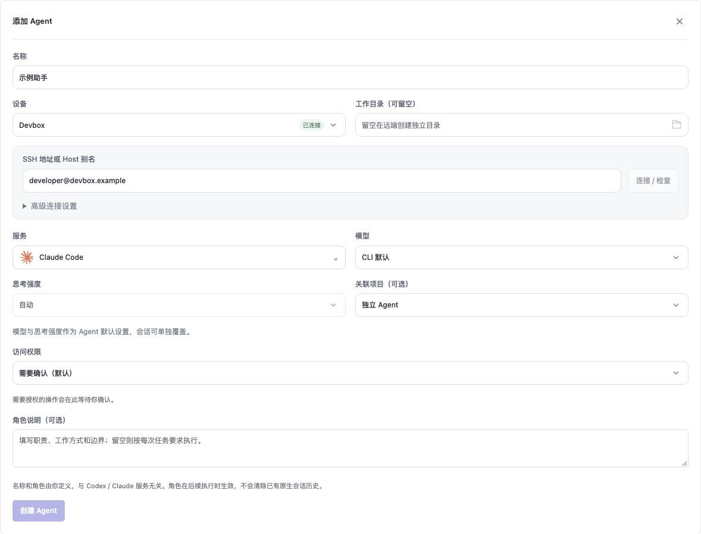

服务菜单包含 **Codex、Claude Code、Trae CLI、Pi、Cursor CLI、Antigravity、Grok Build、OpenCode、Gemini CLI、Qwen Code**，使用随应用打包的图标，并按所选设备检测可用性。缺少 CLI 或适配器的条目不可选；Pi 需要 `pi-acp` 和明确选择完全访问，Antigravity 需要 ACP 服务程序。[接入与兼容性](PROVIDERS.zh-CN.md)说明认证、续聊、MCP 及用量边界。

**多个订阅账号：**进入 **账号 → 添加账号**，选择服务和设备并完成官方 CLI 授权。AgentDock 会话的登录与历史保持独立。Codex 查询自己的原生额度；Claude 仅记录实际运行的额度事件，并沿用现有 CLI 网络设置。**本机客户端**另提供 Codex CLI／macOS 的显式保存、切换及恢复入口；首次各自登记原生登录，真实换号待用户验收。不新增或修改代理配置。详见[账号配置、换号与隔离](ACCOUNTS.zh-CN.md)。

名称仍由用户定义，不自动附加设备标签。两个 Agent 可以使用相同的服务与名称；各自会话仍按独立标识管理。同一连接可被多个 Agent 复用；沿用设备登录的额度卡片合并展示其名称，托管订阅额度按账号展示。目前官方额度读取及实测 Token/TPS 覆盖 Codex、Claude；ACP 上下文占用不计入 Token 消耗。

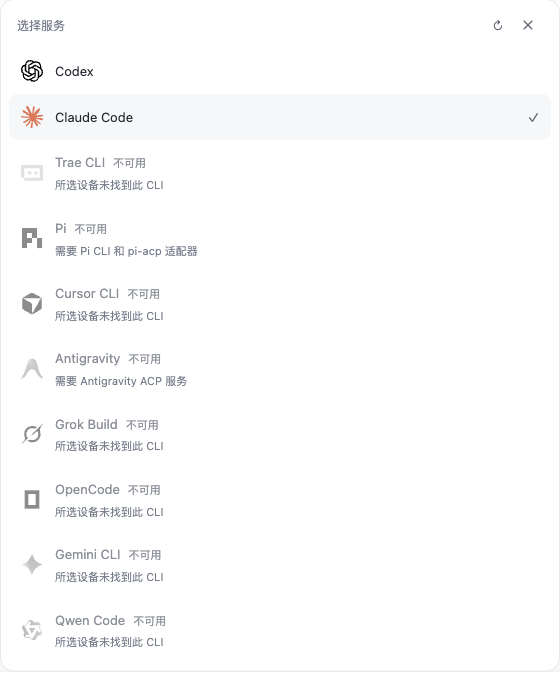

点击工作台中的 **Agent 卡片**，进入该 Agent 的独立会话页。左侧切换或创建会话，右侧查看消息与执行过程，输入框保持在页面底部。顶部可返回 Agent 列表、打开设置或删除 Agent；支持浏览器后退与前进。在列表与会话页之间切换时，会保留各 Agent 的会话选择和未发送草稿，草稿仅保存在当前页面内存中。

创建会话后即可向 Agent 发送消息。**Enter** 发送，**Shift + Enter** 换行；中文输入法确认文字不会触发发送。你的消息显示在右侧气泡中，Agent 的最终回复显示在左侧。回复前自动展开实时思考摘要、进展和工具输出；最终回复到达后，过程自动收起，回复独立保留。点击任务状态可反复展开或收起过程，实时更新不会覆盖手动选择。失败、取消和等待授权分别显示对应状态。执行过程只展示 CLI 实际提供的内容，不生成额外的推理记录。

会话实时显示执行过程与回复；短暂断线后自动重连并补齐进度。模型列表会为已配置的 Agent 提前加载。

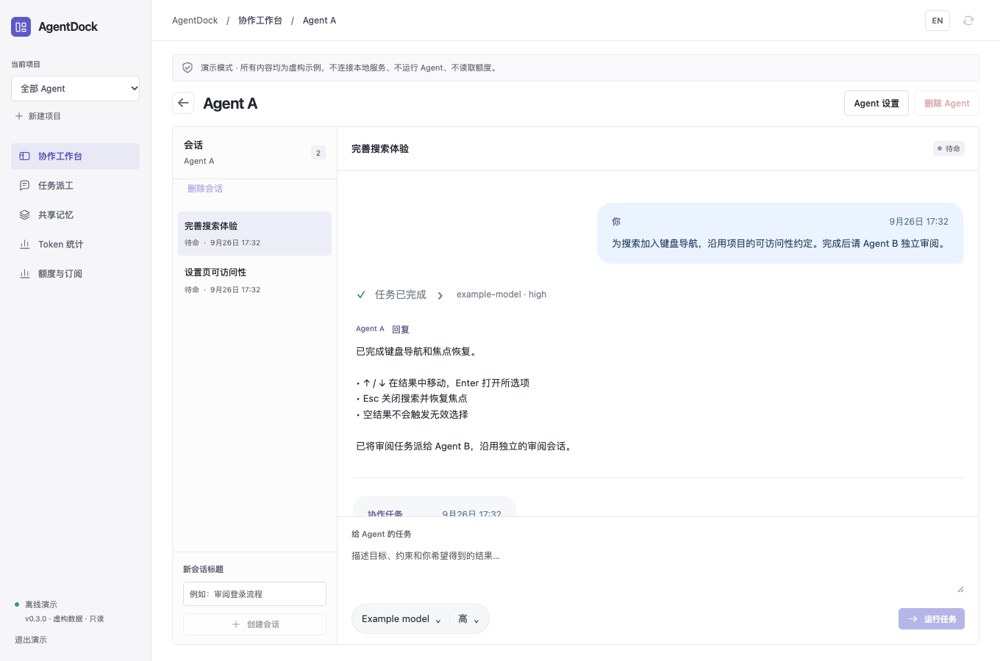

在会话输入框下方点击 **模型** 或 **推理等级**，从当前会话原运行位置返回的可用选项中选择。设置只影响当前会话的后续消息；已提交或排队的消息保留提交时的选择。切换模型会将推理等级恢复为自动，菜单中可选择 **使用 Agent 默认设置**。

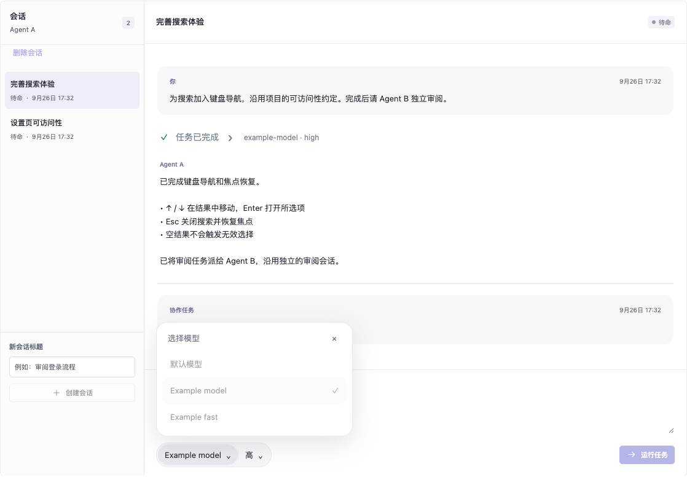

**Agent 设置**可修改名称、角色、默认模型、思考强度和**设备**。从本机 CLI 切换到 Devbox，或从 Devbox 切回本机，选择新位置并保存即可，无需删除 Agent。新建会话使用新位置及其工作目录；已有会话保留原位置、原生历史、目录、模型默认值和权限，排队及执行中的任务不受影响。旧位置会话可通过**使用会话默认设置**重置模型覆盖。续聊或清理已运行会话时，其原连接仍须可用。

任务旁显示客户端返回的模型标识与思考强度；模型在回复中的自我介绍不作为配置依据。

每个会话拥有独立的 Codex／Claude Code 记录、运行状态与缓存，不加入原客户端的会话列表。默认工作目录也按会话隔离；手动指定的项目目录保持共用。在 Agent 会话页或“对话”列表中，将鼠标移到会话上，点击右侧 **×** 并确认，即可清理其记录、专属目录及 SSH 运行文件。键盘聚焦时也显示 **×**，触屏设备直接显示。运行中的任务须先停止，共用项目、CLI 登录与其他会话保留。

点击 Agent 卡片进入会话页，在页面顶部点击 **Agent 设置**旁的 **删除 Agent**，核对名称和会话数量后确认，可删除该 Agent 及其全部会话和私有文件。共用项目文件、共享记忆、原生 CLI 配置和其他 Agent 保留。有未完成任务时阻止删除。从未运行的远端会话无需 SSH 即可删除；已有远端记录须清理成功后才从列表移除。应用升级后会自动准备所需清理程序，连接失败则保留记录供重试。

添加 Agent 或打开 **Agent 设置 → 访问权限**，可为每个本机或 SSH Agent 独立选择权限：

| 访问权限 | 行为 |
| --- | --- |
| 需要确认（默认） | 沿用受控执行方式，需要授权的操作在工作台等待确认。未配置权限的已有 Agent 升级后使用此设置。 |
| 完全访问 | 取消 CLI 的常规权限确认，允许在所选环境中读写文件、执行命令和联网；仍受系统账户和组织策略限制。 |

权限变更用于仍继承 Agent 默认设置的会话后续消息，保留已有上下文；切换运行位置时保留下来的会话继续使用原权限。在同一位置修改权限须等待排队及运行任务结束；切换位置时可单独为新会话设置权限。

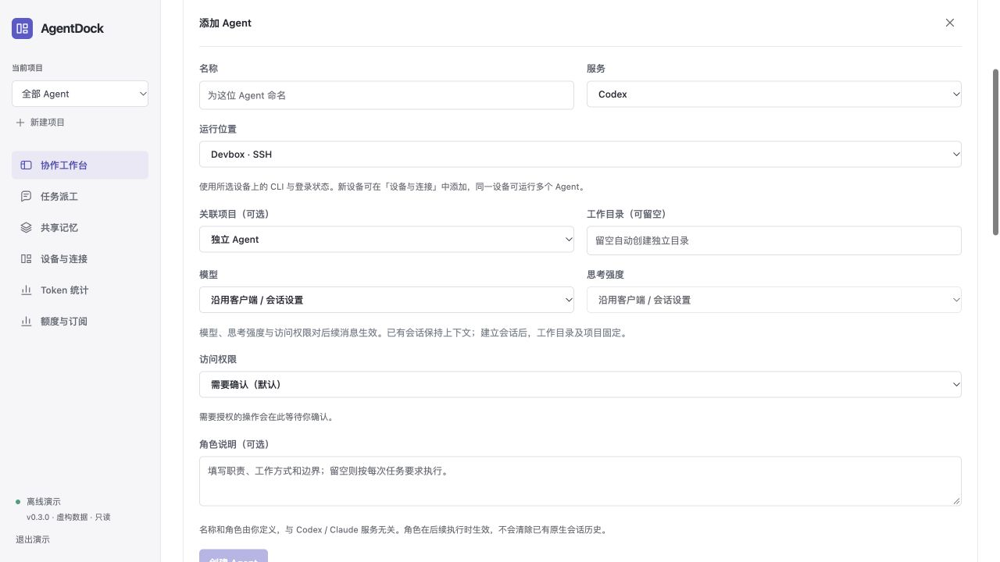

添加、设置和编辑面板均可再次点击原按钮收起，也可使用 × 关闭。收起执行过程不影响任务运行，最终回复仍会展示。

开启执行期间，同伴派工和结果回传轮次会自动执行；配置额度组件后，服务每 10 分钟自动刷新额度，首次定时刷新在启动 10 分钟后执行；点击“额度与订阅”会立即发起刷新。

## SSH 运行环境

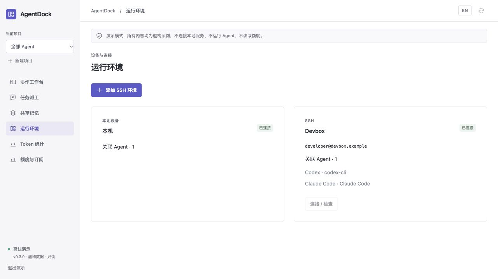

打开 **协作工作台 → 添加 Agent → 设备 → 新建 SSH / Devbox 连接…**，填写系统 SSH Host 别名或 `user@host`，点击 **连接并使用**。可在 **高级连接设置**中指定远端 Python 命令。远端需要 Python 3.11+，以及已安装并登录的 Agent CLI。执行组件安装在远端用户的私有数据目录中，不安装系统服务，不传送本机登录凭据。

成功连接后继续设置 Agent 的模型、角色和权限，再点击 **创建 Agent**。其他 Agent 可直接复用已有连接；创建后可在 **Agent 设置**中查看连接信息并点击 **连接 / 检查**。任务执行时可展开查看过程，也可保持收起；最终回复独立显示。短暂断线后按事件游标接续，取消请求与 90 秒租约负责停止失去控制端的远端任务。详见 [SSH 配置与恢复](SSH.zh-CN.md)。

## Token 与吞吐统计

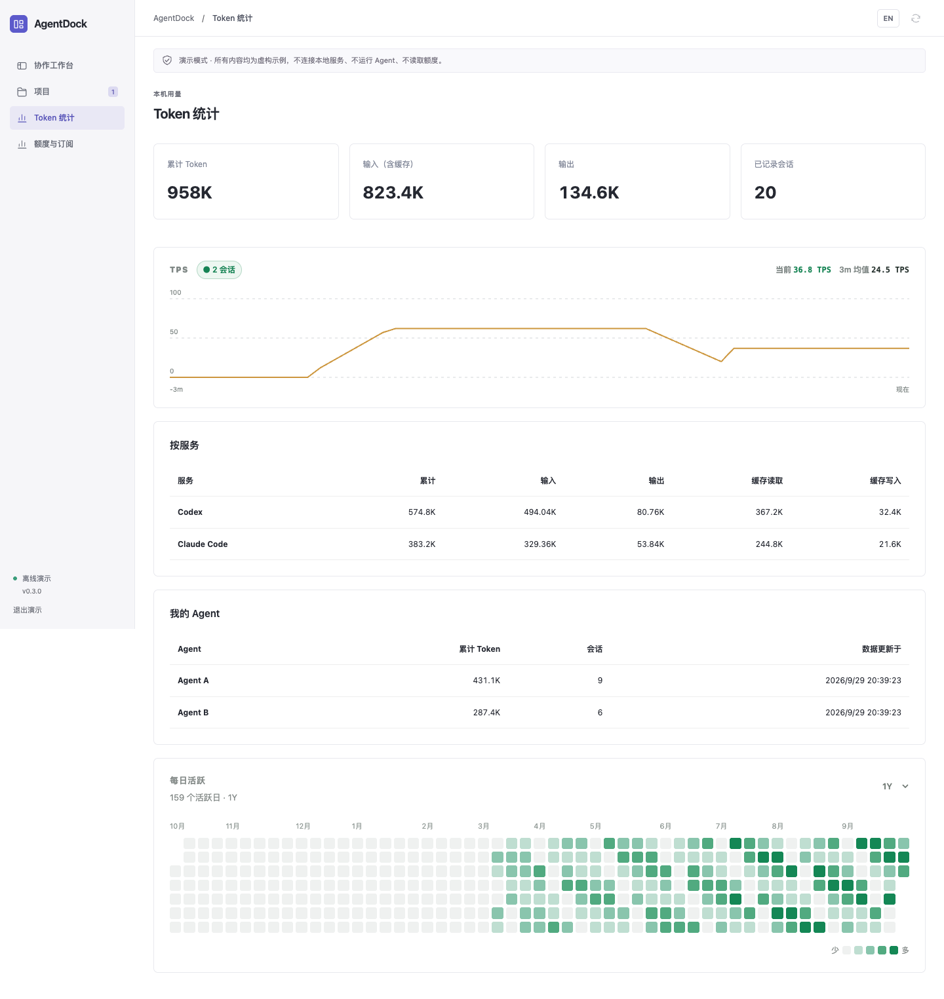

Token 统计只包含已配置 Agent 关联的原生会话。总量、按服务、按 Agent、TPS 和每日活跃使用同一统计范围。索引只保存计数、时间及去重标识，不复制外部对话正文。读取 AgentDock 各会话的专属记录；兼容升级前绑定的原生历史目录，仍按会话归属过滤。数值按 K（千）、M（百万）、B（十亿）缩写，最多两位小数；悬停可查看完整计数。历史文件缺失、损坏或格式不支持时，累计值可能不完整；统计不是服务商账单。缓存属于输入的子集，不重复累加。

**每日活跃**以方块热力图展示最近一年、半年或三个月的用量，颜色越深表示当天 Token 用量越高。悬停方块可查看日期和计数。

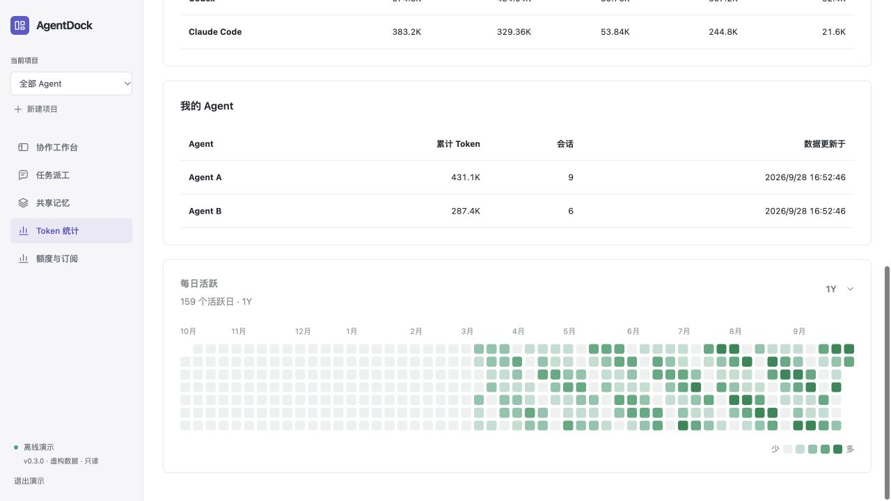

TPS 使用真实输出 Token 增量及其采样区间，包含等待和工具耗时；当前值为最近 15 秒均值，三分钟均值包含空闲时间。原生客户端批量上报可能造成延迟。活跃任务尚未收到有效采样时显示“—”，空闲时显示 0。未关联的本机会话不参与统计；添加 Agent 不会导入该服务的全部历史。

## 配置

[`config.example.json`](../config.example.json) 包含全部公开配置项：

```json
{
  "commands": {
    "codex": ["codex", "app-server"],
    "claude": ["claude"]
  },
  "quota_command": ["/absolute/path/to/AgentDockUsage"]
}
```

如果服务的 `PATH` 中没有相应 CLI，请使用可执行文件的绝对路径。机器专属配置保存在 Git 忽略的 `config.local.json` 中。界面和智能体均不能指定执行命令。

AgentDock 使用 Codex App Server、Claude CLI 的双向 JSON 流，并通过 ACP v1 连接其他已登记服务。执行认证使用所选托管订阅配置；选择“沿用设备登录”时继续使用各 CLI 原有配置。设备登录的额度组件不读取 Claude 凭据；托管账号调用原生 CLI 的账号操作。登录、模型选择、账号资格和费用由原生 CLI 及其配置的服务决定。展示额度不等于授予执行权限。详见[兼容性与验证](PROVIDERS.zh-CN.md)。

## 协作流程

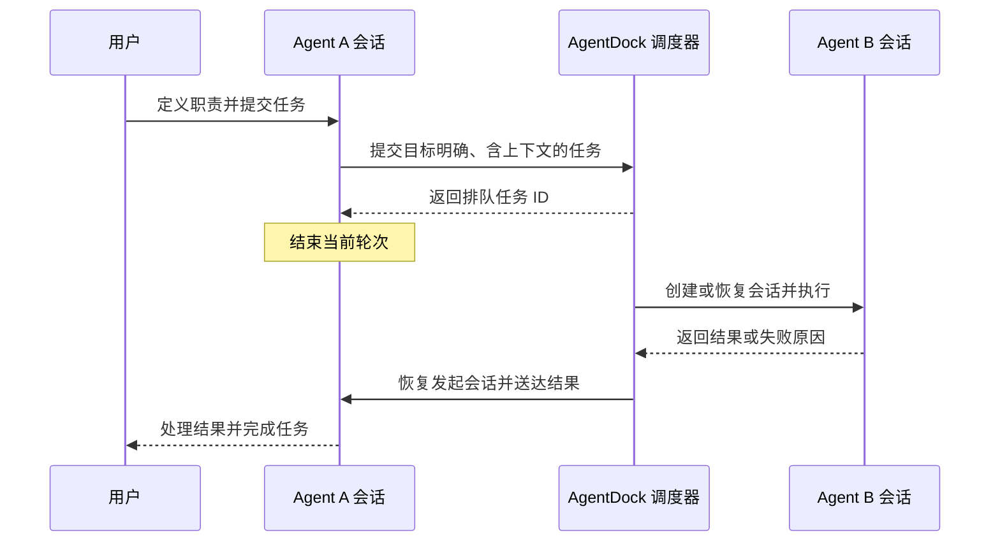

共用托管账号、同一智能体，以及使用相同或父子目录的任务，按顺序执行；不同账号和独立工作目录可以并行。每条协作链最多包含 16 个执行任务，派工深度最多三层。取消任务会同时取消其后续派生任务。应用重启将未完成任务标记为中断，不自动重放。

## 数据与边界

状态保存在 `~/.local/share/agentdock`，同一数据库只允许一个实例占用。历史、任务记录和共享记忆存储在本地。执行智能体会将任务上下文发送到其配置的模型服务；刷新额度也可能访问提供方服务。

当前版本管理**由 AgentDock 创建的本机和 SSH 会话**，尚未接入已有桌面或终端会话及多用户访问。“需要确认”模式下，提供方权限请求会显示在界面中；工作台本身不提供操作系统沙箱。凭据保留在所选设备上，每次执行的 MCP 令牌会过期，并在执行结束后撤销。

远端 Token 统计来自 AgentDock 托管任务的用量事件，不扫描其他历史。设备登录额度和账单按环境／提供方区分，托管订阅额度和实测 Token 按账号展示。远端 Codex 查询自己的 App Server；托管 Claude 和设备登录都从实际运行的 CLI 事件被动记录额度。没有读数时保持未知，不使用其他设备的快照代替。

从 0.1 升级时，需要将 ACP 命令改为上述原生命令。历史消息保留为旧版记录，不会自动派发。尚无原生绑定的会话会建立新的提供方会话，旧存储文本不会被静默重放为原生历史。

## 开发与贡献

```bash
python3 -m unittest discover -s tests -v
python3 -m compileall -q agentdock tests
npm --prefix web test
npm --prefix web run build
```

测试使用临时数据库、模拟 CLI 进程和虚构界面数据，不调用真实编码智能体或额度服务。[验证文档](REVIEW.zh-CN.md)列出了覆盖范围与真实环境待验收项。提交问题时请附脱敏复现步骤，并保持中英文文档一致。

## 许可证

采用 [MIT 许可证](../LICENSE)。外部 CLI 需要单独安装，适用各自的许可证和服务条款，详见[声明](../NOTICE.zh-CN.md)。

---

[English](USER_GUIDE.md) · **简体中文**
